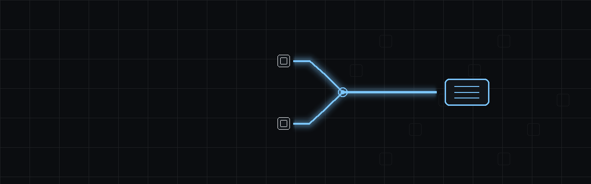
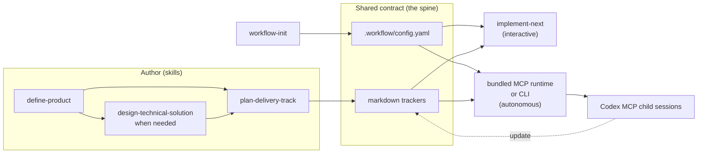
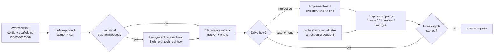

<p align="center">
  
</p>

[](https://github.com/aryeko/agentic-workflow-kit/actions/workflows/ci.yml) [](LICENSE) [](https://nodejs.org)

A generic, OSS Claude Code + Codex plugin, with a bundled MCP runtime and optional standalone CLI,
that turns any repo into a
**tracker-driven, spec-first delivery pipeline** — and makes the per-repo differences (most
notably PR/merge gating) **declarative config** rather than forked skills.

The core idea: one **markdown tracker** (a status matrix + dependency graph) plus one
**`.workflow/config.yaml`** form a single contract that two interchangeable drivers read — an
**interactive** "one story at a time" skill and an **autonomous** multi-session orchestrator.

## Architecture



`workflow-init` scaffolds the config; `define-product`, `design-technical-solution` when needed, and
`plan-delivery-track` produce the PRD, technical solution, and tracker.
That config + tracker is the single contract both drivers consume. Completion authority is always
the tracker row — never a child session's prose. Full detail and more diagrams in
[docs/architecture.md](docs/architecture.md).

## How it works



1. **Set up once** — `/workflow-init` detects your package manager, CI, default branch, and branch
   protection, picks a PR/merge preset, writes `.workflow/config.yaml`, and scaffolds a tracks
   index plus an example tracker.
2. **Plan the product** — `/define-product` runs a guided interview into a multi-file PRD.
3. **Design the technical solution when needed** — `/design-technical-solution` turns complex PRDs into a
   technical solution document before story slicing.
4. **Decompose into a tracker** — `/plan-delivery-track` turns the PRD, and technical solution when present, into a
   tracker plus story briefs.
5. **Implement** — `/implement-next` takes one eligible story end-to-end (isolate → spec review →
   plan → implement → review → verify → ship), or `workflow-autopilot` uses the bundled MCP runtime
   to fan eligible stories out to Codex child sessions autonomously. The CLI provides the same
   runtime for local development, CI, and troubleshooting.
6. **Ship** — under the declarative `pr:` policy (open a PR, wait on CI/review, auto-merge — or
   not), then repeat until the tracker is drained.

## PR/merge presets

The one block that genuinely differs between repos is `pr:`. Pick a preset and go:

| Preset | Waits on CI | Waits on review | Auto-merge | Mirrors |
| --- | --- | --- | --- | --- |
| `push-and-merge` | no | no | yes (squash) | a repo that ships fast |
| `gated-automerge` | yes | bot (e.g. codex) | yes (squash) | a repo with CI + bot review |
| `push-only` | no | no | no (open PR, stop) | a repo with human review gates |

Switch behavior by editing the `pr:` block in `.workflow/config.yaml`. See
[references/config-schema.md](references/config-schema.md).

For the `gated-automerge` preset, `pr.review.wait: bot` with `pr.review.bot: codex` waits on
Codex's GitHub reaction/comment signal: eyes means started or pending, thumbs-up means clear/no
findings, and Codex PR review comments or PR comments are findings to triage when
`triageComments: true`. It does not require Codex to submit a native GitHub approval.

## Documentation

- [docs/README.md](docs/README.md) — documentation hub (using vs developing)
- [docs/architecture.md](docs/architecture.md) — architecture, flows, and runtime diagrams
- [docs/getting-started.md](docs/getting-started.md) — a guided walkthrough using the Linkly example
- [references/config-schema.md](references/config-schema.md) — the `.workflow/config.yaml` reference
- [references/tracker-contract.md](references/tracker-contract.md) — the tracker format + status vocabulary
- [references/prd-contract.md](references/prd-contract.md) — the PRD format
- [references/technical-solution-contract.md](references/technical-solution-contract.md) — the technical solution gate format
- [references/story-brief-contract.md](references/story-brief-contract.md) — the lightweight story brief format
- [references/detailed-story-spec-contract.md](references/detailed-story-spec-contract.md) — the pre-code detailed story spec format
- [examples/](examples/) — a worked PRD and tracker (Linkly)
- [CONTRIBUTING.md](CONTRIBUTING.md) — how to develop and contribute
- [docs/brand.md](docs/brand.md) — the visual identity (logo, color, type, social/SEO kit)

## Install

### Claude Code plugin

```text
/plugin marketplace add aryeko/agentic-workflow-kit
/plugin install agentic-workflow-kit@agentic-workflow-kit
```

### Codex plugin

Add the marketplace from the CLI ([Codex docs](https://developers.openai.com/codex/plugins/build#add-a-marketplace-from-the-cli)),
then install from the Codex plugin directory:

```bash
codex plugin marketplace add aryeko/agentic-workflow-kit
```

Restart Codex, then open the plugin directory, select the `agentic-workflow-kit` marketplace, and install
the `agentic-workflow-kit` plugin (CLI equivalent: `codex plugin add agentic-workflow-kit@agentic-workflow-kit`).

### Optional standalone CLI

```text
pnpm add -D @agentic-workflow-kit/orchestrator
```

## Local development

```bash
pnpm install
pnpm check
pnpm agentic-workflow-kit -- --help
```

Optional local Codex plugin smoke requires the Codex CLI. It is intentionally outside `pnpm check`
so the default development gate works on machines that only have the package toolchain installed.

## Local plugin testing

The repository includes local-only plugin metadata for development testing:

- Claude Code: load this repo with `claude --plugin-dir ./`, then invoke namespaced skills such as
  `/agentic-workflow-kit:workflow-init`; the root `.mcp.json` wires the bundled MCP runtime.
- Codex: `.agents/plugins/marketplace.json` is the marketplace manifest — the same one a public
  `codex plugin marketplace add aryeko/agentic-workflow-kit` reads. Locally you add it from the repo
  directory; it points at the materialized fixture at `./plugins/agentic-workflow-kit`, including
  the fixture-specific `.mcp.json` and bundled `mcp/server.mjs`. The Codex plugin manifest declares
  `mcpServers: "./.mcp.json"`; the root `.mcp.json` and fixture `.mcp.json` both use Codex's
  `mcpServers` shape so Codex can launch the server from the installed plugin. The Codex entries
  intentionally do not set `cwd`, preserving the active target repo as the MCP
  working directory. If a host cannot provide that repo context, workflow MCP tools return an
  actionable error asking the caller to pass `cwd` explicitly.

```bash
tmp_home="$(mktemp -d)"
CODEX_HOME="$tmp_home" codex plugin marketplace add .
CODEX_HOME="$tmp_home" codex plugin list
CODEX_HOME="$tmp_home" codex plugin add agentic-workflow-kit@agentic-workflow-kit
CODEX_HOME="$tmp_home" codex plugin list
```

The same Codex install and prompt-visibility check is available as:

```bash
pnpm smoke:codex-plugin
```

Keep manual plugin smokes pending until they are run in the relevant tool environment.

## Layout

- `skills/` — the plugin's instructions and slash-command entry points.
- `references/` — the config schema (human + machine), tracker, PRD, technical solution contracts, and templates.
- `presets/` — the three starter configs.
- `examples/` — a worked PRD and tracker.
- `mcp/server.mjs` — the bundled MCP runtime used by plugin installs.
- `packages/orchestrator/` — the TypeScript runtime source: the config schema, loader, presets, MCP server adapter, autonomous multi-session orchestrator, and standalone CLI.
- `docs/` — architecture, the docs hub, and the getting-started guide.

## Project status

agentic-workflow-kit is published as **v0.1.0**: the six skills (`workflow-init`, `define-product`,
`design-technical-solution`, `plan-delivery-track`, `implement-next`, `workflow-autopilot`), the bundled MCP runtime, the contracts, the
three presets, the worked examples, and the optional standalone `@agentic-workflow-kit/orchestrator`
CLI package (on npm) are implemented and covered by the test suite (`pnpm check`).

It is an early **0.x** release — the install paths above are live. Feedback and issues are welcome as the
agent-driven skills get broader real-world mileage.
