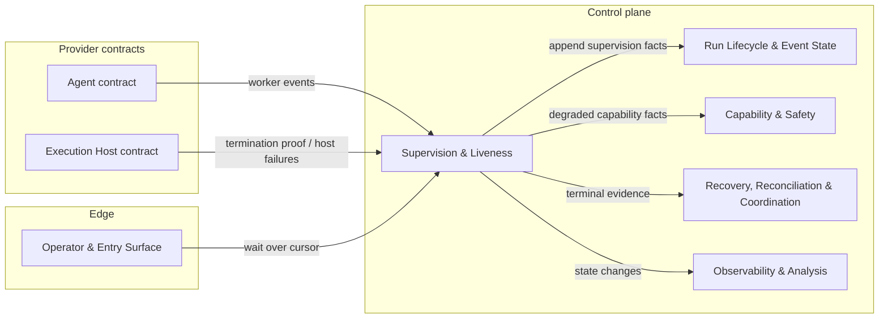
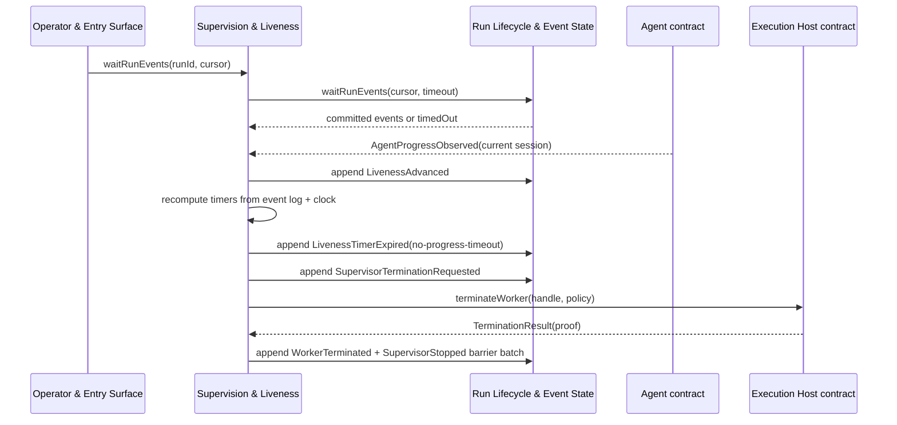

# Supervision & Liveness - design

## Mandate

**Purpose.** Know whether a worker is *really* making progress, from real worker events — and drive
termination when it is not.

### Responsibilities (in scope)
- Liveness derived from real worker events (progress / tool / phase), explicitly **not** from parent
  polling, watch reconnects, or projection reads.
- The timer set (startup, idle, no-progress, per-tool, approval-SLA, max-runtime) and the liveness
  projection/states.
- The host-neutral **wait primitive** over the event cursor (long-poll on sequence), so an operator
  can block-wait without external tooling.

### Out of scope
- The actual interrupt/kill mechanics and containment (Execution Host, prov-04).
- Emission of the worker events themselves (the Agent driver emits; this consumes).

### Requirements owned
FR-5 (live supervision), NFR-OBS, NFR-DET.

### Dependencies (Dependency Rule)
- Depends on: core-01 (event cursor), the **Agent contract** (progress events), and **Execution Host** (termination).
- Must NOT: depend on the Codex driver.

### Required reading
Standard set + [core-01](../core-01-run-lifecycle-and-state/README.md) and the Agent contract in
[prov-01](../../providers/prov-01-agent-execution/README.md).

### Deliverable
`README.md` defining: which event classes advance liveness (and which never do); the timers + proposed
defaults; the `waitRunEvents` primitive; the liveness states.

### Definition of done (domain-specific)
- Staleness derives from real progress; a stale worker can never look active.
- Parent polls never refresh liveness; a terminated run stops emitting supervisor events.

### Open questions
- Concrete timeout defaults; the "decision delivered but not consumed" gap.

## 1. Purpose & boundaries

Supervision & Liveness determines whether the current Agent worker for a Run is really making
progress, records liveness state changes as run events, exposes a host-neutral wait primitive over
the core-01 event cursor, and hands stale owned workers to the Execution Host for termination.

Out of scope: Agent protocol event emission, approval adjudication, process signalling, containment,
reap/prove-empty mechanics, recovery action selection, completion gates, Forge operations, Work
Source status writes, and concrete Codex or Local driver behavior. This domain consumes the Agent and
Execution Host contracts only.

Owned requirements: FR-5, NFR-OBS, NFR-DET, and NFR-TEST.

## 2. Required reading

Read: [README.md](../../../README.md), [requirements.md](../../../requirements.md),
[decisions.md](../../../decisions.md), [architecture.md](../../../architecture.md),
[conventions.md](../../../conventions.md), [glossary.md](../../../glossary.md),
[_templates/domain-design-template.md](../../../_templates/domain-design-template.md),
[README.md#mandate](README.md#mandate), approved [core-01 design](../core-01-run-lifecycle-and-state/README.md)
and subfiles, approved [prov-01 Agent Execution design](../../providers/prov-01-agent-execution/README.md) and
contract subfiles, and approved [prov-04 Execution Host design](../../providers/prov-04-execution-host/README.md)
and contract subfiles. No core-03 draft, later core-domain draft, concrete Codex driver, concrete
Local driver, or material outside the allowed source set is a design input.

## 3. Context diagram



## 4. Design

The normative low-level model is split into [Liveness Model](liveness-model.md). The key
decisions are:

- Liveness is a pure fold over committed run events plus an explicit clock input.
- Only current-session Agent worker events advance liveness: startup linkage, progress, structured
  tool completion, approval request, and terminal observation.
- Parent polls, `waitRunEvents`, watch reconnects, projection reads, lifecycle transitions alone,
  Operator decisions, runner-owned command events, Forge events, Work Source events, and raw host
  output never refresh liveness.
- Timers are `startup`, `idle`, `no-progress`, `per-tool`, `approval-SLA`, and `max-runtime`; proposed
  defaults are 120 seconds, 15 minutes, 45 minutes, 30 minutes, 24 hours, and 8 hours.
- Liveness states are `not-started`, `starting`, `active`, `waiting-for-approval`,
  `approval-overdue`, `stale`, `supervision-lost`, `termination-requested`, and `terminated`.
- Missing Agent progress guarantees, a missing cursor, ambiguous session linkage, unavailable
  termination capability, and unproven termination fail closed to named reasons.
- Termination is a handoff to `ExecutionHost.terminateWorker`; this domain does not signal, kill,
  reap, or prove-empty directly.
- `SupervisorStopped` is the single allowed terminal-summary fact. It is a non-lifecycle event
  justified by core-01's ratified post-terminal append rule (reuse the terminal epoch until lease
  expiry); it does not advance liveness, refresh timers, request termination, or mutate core-01
  lifecycle state.
- `WorkerTerminated` must be recorded before terminal lifecycle closure or in the same barrier batch
  that closes supervision. It is not a permitted post-terminal append.
- After `SupervisorStopped`, core-04 emits no more supervisor, liveness, progress, timer,
  termination, or terminal-summary facts for the Run.

## 5. Contracts & interfaces

Core-04 consumes:

```ts
interface SupervisionInputs { runLog: RunEventLog; agentEvents: AsyncIterable<AgentEvent>;
  host: ExecutionHost; clock: Clock; timers: SupervisionTimerPolicy; }
interface SupervisionTimerPolicy { startupMs: number; idleMs: number; noProgressMs: number;
  perToolMs: number; approvalSlaMs: number; maxRuntimeMs: number; }
interface SupervisionWaitRequest { runId: string; cursor: RunEventCursor; timeoutMs: number;
  maxEvents?: number; }
```

`waitRunEvents(request)` is a thin wrapper over core-01 `RunEventLog.waitRunEvents`. It validates that
`cursor.runId` matches the request, delegates to core-01, and returns committed events after
`cursor.afterSequence` or `timedOut = true`. It never renews leases, appends events, reads
projections, refreshes liveness, or treats a successful wait as proof that the worker is alive.
Missing or failed cursor access is `event-cursor-unavailable`.

## 6. Events & data

Core-04 emits through `RunWriter`:

| Event | Durability | Meaning |
|---|---|---|
| `SupervisorStarted` | `durable` | A supervisor began observing a Run from a cursor and session expectation. |
| `LivenessAdvanced` | `durable` | A current-session worker event refreshed liveness; records source sequence and class. |
| `LivenessTimerExpired` | `durable` | A timer deadline was exceeded from recorded evidence and clock input. |
| `LivenessStateChanged` | `durable` | Projection-visible transition among liveness states. |
| `SupervisionLost` | `barrier` | Liveness cannot be proven; includes the fail-closed reason. |
| `SupervisorTerminationRequested` | `barrier` | Termination handed to Execution Host for an owned worker. |
| `WorkerTerminated` | `barrier` | Agent/Host terminal observation or Host termination proof recorded before terminal lifecycle closure. |
| `SupervisorStopped` | `barrier` | Single terminal-summary fact for core-04, allowed post-terminal only as a non-lifecycle summary under core-01's ratified terminal-epoch reuse semantics. |

Consumed events include current-session Agent events, core-01 lifecycle/linkage events, and Execution
Host termination proof or failure events. Core-04 contributes the `liveness` projection; core-01
continues to own `state`, `summary`, `metrics`, and `launch`.

`SupervisorStopped` cites the terminal source event ids it summarizes. If supervision and termination
close in core-04, `WorkerTerminated` and `SupervisorStopped` SHOULD be appended in one barrier batch.
If another domain has already recorded a terminal lifecycle transition, core-04 MAY append only
`SupervisorStopped` as a post-terminal non-lifecycle summary; no other core-04 event is allowed after
that terminal lifecycle transition.

## 7. Behavior diagram



## 8. Failure & degraded modes

- `event-cursor-unavailable`, `session-linkage-ambiguous`, or `agent-progress-unobservable`: core-04
  cannot prove current worker liveness; state is `supervision-lost`.
- `tool-tracking-unavailable`: a tool cannot be correlated to a current-session item; per-tool
  coverage is not claimed and broader timers remain active.
- `startup-timeout`, `idle-timeout`, `no-progress-timeout`, `tool-timeout`, or
  `max-runtime-exceeded`: state is `stale`, then `termination-requested` when an owned worker and
  positive termination capability are available.
- `approval-sla-exceeded`: state is `approval-overdue`; it alerts/blocks for Operator attention but
  does not by itself prove the worker stale.
- `termination-unavailable` or `termination-unproven`: `canKill`/ownership is missing, or the
  Execution Host did not prove containment empty; state is `supervision-lost`.

Capability gates must treat `stale`, `supervision-lost`, `approval-overdue`, missing projections,
wrong-scope attestations, ambiguous linkage, or unproven termination as autonomous capabilities absent.

## 9. Testing strategy

NFR-TEST: core-04 tests use an in-memory core-01 run log, a mock Agent event stream, a mock Execution
Host, and a deterministic fake clock. No real processes, network, filesystem, Forge, Work Source, or
concrete Agent/Host driver is used.

Required tests: property-test deterministic replay from generated logs and clock samples; prove polls,
waits, reconnects, projection reads, lifecycle-only events, and Operator decisions never refresh
liveness; cover every timer default and override; fail closed for missing cursor, ambiguous linkage,
missing Agent progress guarantee, missing `itemId`, missing `canKill`, observe-only ownership, and
`termination-unproven`; prove termination handoff calls only the Execution Host contract; prove
`WorkerTerminated` is never appended post-terminal; prove `SupervisorStopped` is the only allowed
post-terminal core-04 event and no core-04 events append after it.

FR-5 is satisfied by liveness from real worker events and host-neutral termination handoff. NFR-OBS is
satisfied because every liveness state change, stale/supervision-lost transition, and termination
handoff is an event. NFR-DET is satisfied because projection and timer decisions are pure functions of
recorded events plus an explicit clock input.

## 10. Open questions

- Are the proposed defaults acceptable for v1, especially `approval-SLA = 24 hours` and
  `max-runtime = 8 hours`?
- Should a recorded approval answer start a short "decision delivered but not consumed" timer, or is
  the existing idle/no-progress coverage sufficient until a current-session worker event follows?
- Resolved for v1: the per-tool timer keys off `AgentToolObserved.itemId`. When `itemId` is absent
  or unstable, core-04 fails closed to `tool-tracking-unavailable`; idle, no-progress, and
  max-runtime timers remain active. No new Agent tool-start event is required in v1.

## 11. Definition of done

- [x] All sections complete; guidance notes removed.
- [x] Files are focused; low-level liveness detail is split into `liveness-model.md`.
- [x] Complies with the Dependency Rule; dependencies listed and justified.
- [x] Uses glossary vocabulary.
- [x] States the FR/NFR ids satisfied; shows how NFR-TEST is met.
- [x] Failure/degraded modes defined (fail-closed).
- [x] Provider-domain validation is not applicable to this core domain.
- [x] Diagrams present and consistent with architecture.md naming.
- [x] Open questions captured, not silently resolved.
