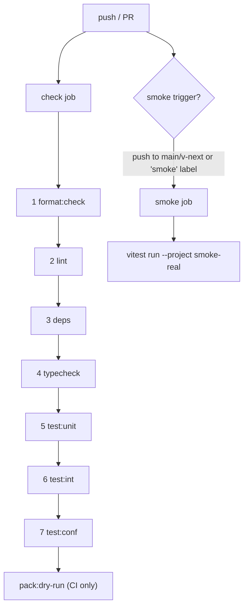

# The Verify Gate

`pnpm check` is the required gate that every implementation story must pass.
It runs seven steps in sequence, fail-fast, cheapest first. Nothing merges
to `v-next` without a green gate.

## Step composition

| # | Script | Tool | What it checks |
|---|---|---|---|
| 1 | `format:check` | `biome format --check .` | Formatting — catches whitespace/style before anything compiles |
| 2 | `lint` | `biome lint .` | Lint rules — catches obvious errors early |
| 3 | `deps` | `depcruise --config .dependency-cruiser.cjs packages tooling tests` | Dependency-graph rules — no cycles, no orphans, and (once activated) layer violations |
| 4 | `typecheck` | `tsc -b` | TypeScript project references — full compilation of all composite projects |
| 5 | `test:unit` | `vitest run --project unit` | Hermetic unit tests |
| 6 | `test:int` | `vitest run --project integration` | Integration tests (real filesystem, no network) |
| 7 | `test:conf` | `vitest run --project conformance-mock` | Conformance suites against mock drivers (hermetic) |

**Ordering rationale:** steps are arranged cheapest-first so that the most
common mistakes (formatting, lint) are caught in under a second, before the
type-checker or test runner is invoked. A failure in step 1 saves the full
cost of steps 2–7.

## Local inner loop

Run `pnpm check` locally before pushing. All seven steps run. The gate
completes in seconds when packages are small and hermetic lanes have no real
I/O. Smoke tests and pack dry-run are intentionally excluded so the local
loop stays fast.

## CI split

The `check` job (all seven steps + `pack:dry-run`) is a required branch
protection check. `pack:dry-run` runs only in CI because it exercises
packaging metadata that is meaningless before `pnpm install` with a lockfile.

The `smoke` job runs `vitest run --project smoke-real`. It is gated — it
fires on pushes to `main` or `v-next`, or on PRs labelled `smoke`. It is
**not** in branch-protection required checks yet; it is inert until real
drivers and the native containment helper land (all smoke tests currently
pass via `passWithNoTests: true`).

## Every implementation story is gated

When implementation begins (roadmap Step 5), all new packages are built
behind this gate. A story is not done until `pnpm check` passes end-to-end
without modification to the gate itself.
