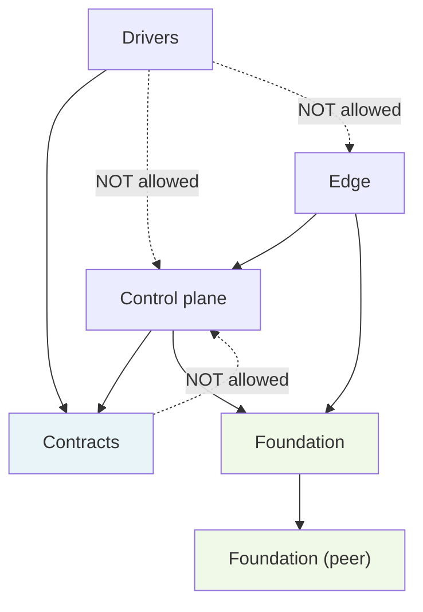

# Dependency Rule Enforcement

## The Dependency Rule

The architecture states (cited, not re-decided here):

> Edge -> Control plane -> Contracts.
> Drivers -> Contracts.
> Everything -> Foundation.
> Nothing depends on a concrete driver.
> Contracts never depend on the core.
> Foundation depends on nothing above it; intra-foundation peer dependencies
> are allowed (e.g. a credentials foundation lib may depend on a config
> foundation lib).

This rule is enforced by two independent guards. Violations must be caught
before code reaches the `v-next` branch.

## Guard 1 — dependency-cruiser (`pnpm deps`)

dependency-cruiser analyses the import graph at runtime (after compilation)
and reports violations as errors that fail `pnpm check`. It is configured in
`.dependency-cruiser.cjs` and runs against `packages`, `tooling`, and `tests`.

### Committed baseline (active now)

Two rules are active from the start, before any packages exist:

| Rule | What it forbids |
|---|---|
| `no-circular` | Any import cycle of any length |
| `no-orphans` | Modules with no imports and no importers (excludes `*.test.*`, `*.d.ts`, `tooling/`, `tests/`, `*.config.*`, `*.cjs`) |

These rules apply immediately and will catch graph hygiene problems as soon as
the first packages are added.

### Layer-rule template (design-owned — not yet active)

The following rules are provided as a template. Design owners activate them
in `.dependency-cruiser.cjs` once the package decomposition is finalised and
real package paths are known. Do NOT activate them before packages exist;
pattern mismatches against an empty `packages/` directory produce false
positives.

**Checklist for design owners:**

- [ ] **Core must not import a driver adapter.**
  `from: { path: '^packages/core' }` → `to: { path: '^packages/driver-' }`

- [ ] **Contracts must not depend on core, edge, drivers, or foundation.**
  Contracts are the pure type/interface layer; they must remain
  dependency-free of any implementation.
  `from: { path: '^packages/contracts' }` → `to: { path: '^packages/(core|edge|driver-|foundation)' }`

- [ ] **Foundation must not depend on layers above it.**
  Intra-foundation peer edges (foundation-a importing foundation-b) are
  explicitly allowed; edges from foundation to core, control plane, edge, or
  drivers are not.
  `from: { path: '^packages/foundation' }` → `to: { path: '^packages/(core|edge|driver-|contracts)' }` *(but NOT intra-foundation)*

- [ ] **A driver must not import core, edge, or another driver's contract.**
  Drivers implement a contract; they must not reach into the control plane or
  peer drivers.
  `from: { path: '^packages/driver-' }` → `to: { path: '^packages/(core|edge|driver-)' }`

- [ ] **Edge must not import drivers directly.**
  Edge speaks only to the control plane; driver selection is the control
  plane's responsibility.
  `from: { path: '^packages/edge' }` → `to: { path: '^packages/driver-' }`

- [ ] **Production source must not import test-only fixtures or harnesses.**
  `from: { pathNot: '\\.(test|spec)\\.' }` → `to: { path: '(^|/)__fixtures__/|(^|/)test-helpers/' }`

Bind these templates to real package path patterns once the decomposition is
finalised. The `.dependency-cruiser.cjs` file includes comments pointing to
this document.

## Guard 2 — TypeScript project references

`tsconfig.json` is a solution file. It references `tsconfig.infra.json`.
Design owners add per-package `tsconfig.json` files with `"composite": true`
and reference them from the root solution file (or via a per-layer solution).

Project references enforce at compile time that a package can only import
another package that is explicitly declared as a reference. A missing
reference means `tsc -b` either cannot find the types or reports a
`TS6305`/`TS6307` error. This is independent of dependency-cruiser and
catches violations before the test runner runs.

**Pattern for new packages (to be expanded by design owners):**

```jsonc
// packages/my-package/tsconfig.json
{
  "extends": "../../tsconfig.base.json",
  "compilerOptions": {
    "outDir": "./dist",
    "rootDir": "./src",
    "composite": true
  },
  "include": ["src"],
  "references": [
    // Only packages this package is allowed to import:
    { "path": "../contracts" },
    { "path": "../foundation-config" }
  ]
}
```

## Allowed layer dependency graph



*Solid arrows: allowed import direction. Dashed arrows: explicitly forbidden.*

## How the two guards relate

dependency-cruiser catches import-graph violations in the compiled output.
TypeScript project references catch them earlier, at compile time, by
refusing to resolve types across undeclared references. Having both means a
violation must defeat two independent checks to reach the verify gate's test
steps — it will not.
