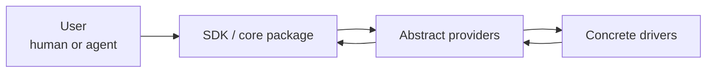

# agentic-workflow-kit docs

This docs set is organized for a reader who wants to understand the system from high level to low level without reading the entire corpus first.

## Recommended path

1. [Design overview](design/README.md) — the product intent and design reading path.
2. [Orientation](design/00-orientation/README.md) — mission, scope, requirements, vocabulary, and conventions.
3. [Architecture](design/10-architecture/README.md) — the runtime model, state model, provider seams, gates, recovery, and observability.
4. [SDK and packaging](design/20-sdk-and-packaging/README.md) — the agreed vNext packaging target and dependency rules.
5. [Domain reference](design/30-domain-reference/README.md) — the full low-level domain specs, migrated from the current design corpus.
6. [Engineering](engineering/README.md) — the verification and dependency policies for implementation work.

## What is included

This bundle intentionally excludes implementation waves, reviews, and history. It keeps the design corpus and adds reader-oriented navigation and packaging clarification.

## What is authoritative

The files under `design/30-domain-reference/` contain the full detailed domain specs from the current design corpus. The higher-level architecture and packaging files introduce the reader path and capture reconciliation decisions that should become the new source of truth.

## High-level model

The key rule is simple: the SDK owns orchestration and provider interfaces; concrete provider packages implement those interfaces.
