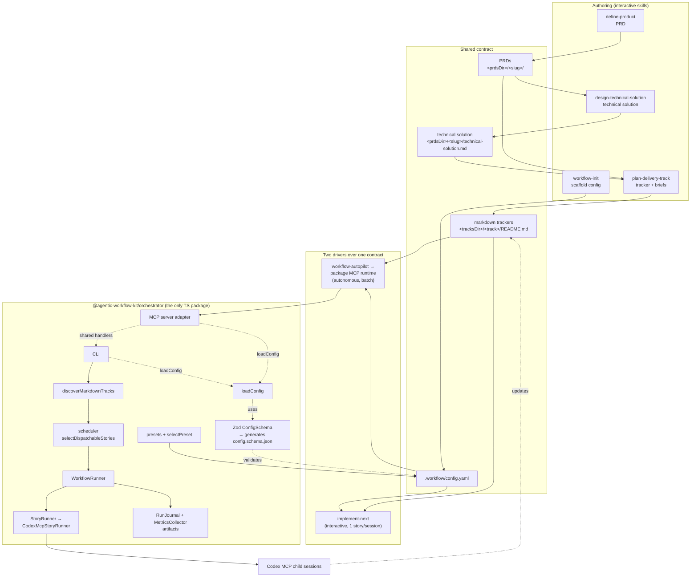
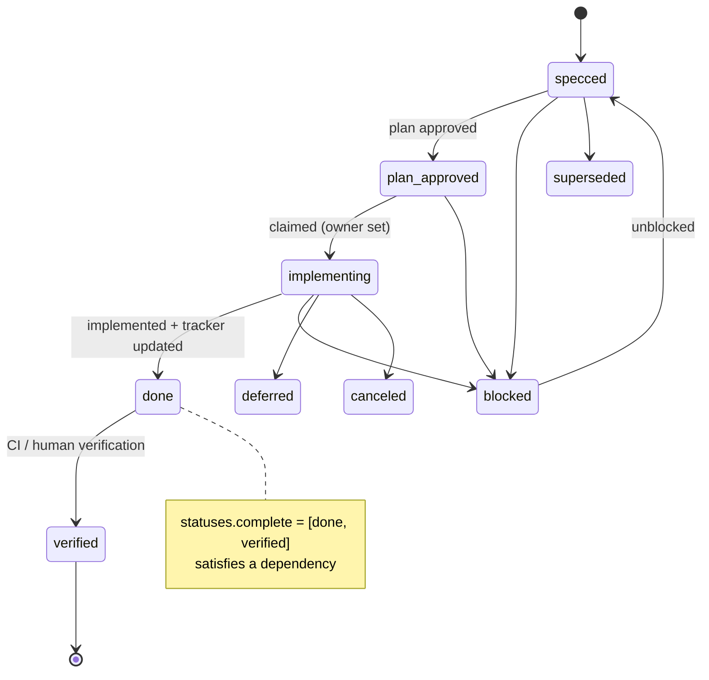
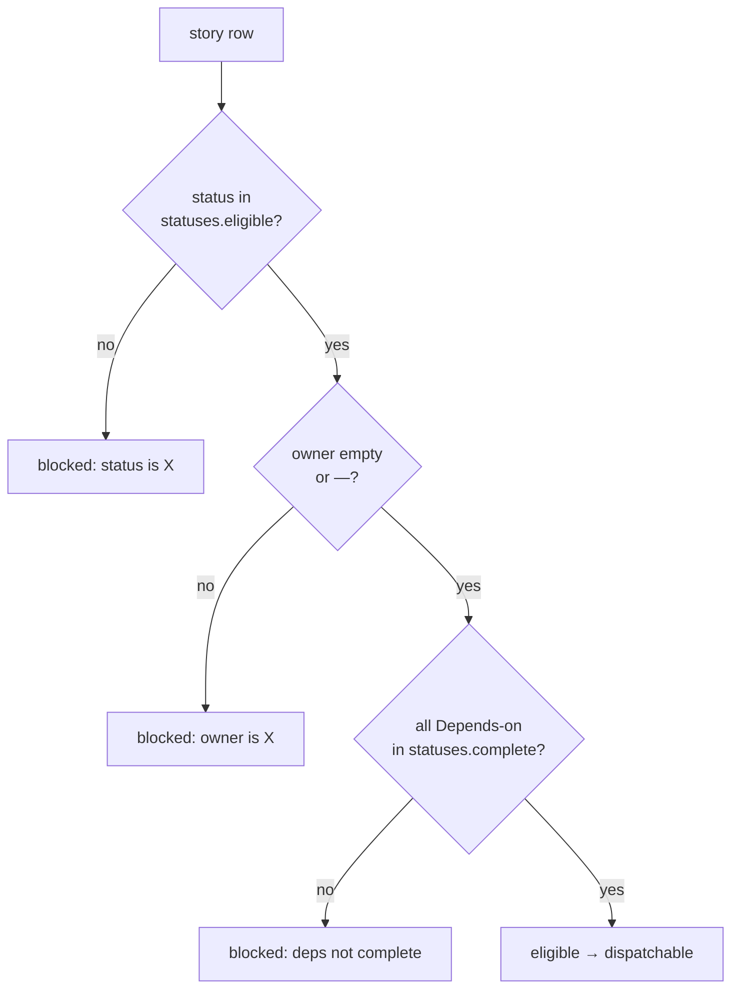
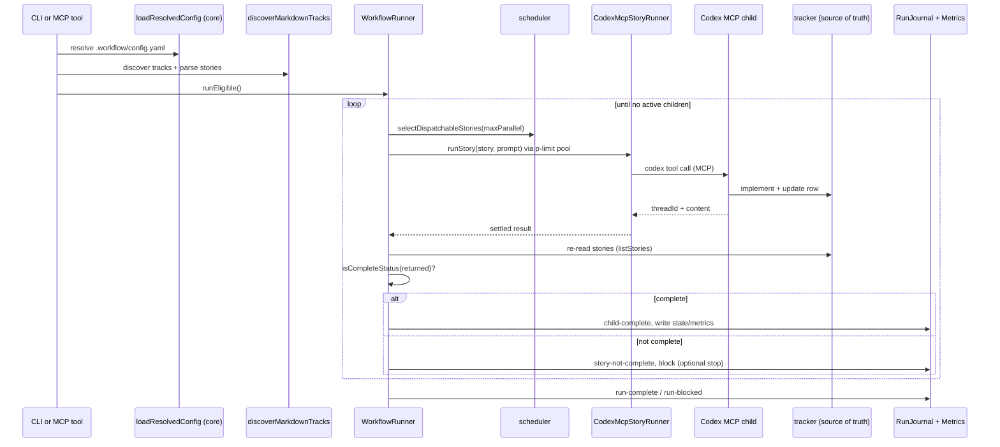

# Architecture

> The living architecture reference for agentic-workflow-kit. Packaging and publish status live with the maintainers; the phase-by-phase build history lives in git.

## In one sentence

agentic-workflow-kit turns any repo into a tracker-driven, spec-first delivery pipeline: a single
**markdown tracker** plus a single **`.workflow/config.yaml`** form one contract that two
interchangeable drivers read — an **interactive** skill that takes one story end-to-end, and an
**autonomous** runtime that fans stories out to child sessions through a plugin-provided MCP server
or the standalone CLI.

## The shared contract (the spine)

Everything reads and writes the same two things, parameterized by config:

- **`.workflow/config.yaml`** — paths, status vocabulary buckets, verification commands, git
  strategy, and PR/merge policy. Reference: [config-schema.md](../references/config-schema.md).
- **Markdown trackers** at `<tracksDir>/<track>/README.md` — the single source of truth for what
  work exists, what is claimed, what is done, and what is unblocked. Reference:
  [tracker-contract.md](../references/tracker-contract.md).

A **PRD** (`<prdsDir>/<slug>/`, [prd-contract.md](../references/prd-contract.md)) sits upstream of
the tracker and defines the *what/why*. For complex technical work, a **technical solution**
document (`<prdsDir>/<slug>/technical-solution.md`,
[technical-solution-contract.md](../references/technical-solution-contract.md)) owns the
high-level *how* before tracker decomposition. The tracker owns delivery sequencing; each story's
spec owns story-local implementation detail.

**Invariant:** automation never infers completion from a child session's prose. Completion comes
only from the tracker row's status.

## Components



### Skills (`skills/`)
Instruction-first Markdown that runs inside Claude Code or Codex. Six entry points:

| Skill | Role | Side effects |
| --- | --- | --- |
| `workflow-init` | Detect repo signals, pick a preset, write config, scaffold trackers | Writes files (idempotent) |
| `define-product` | Guided interview → multi-file PRD | Writes a PRD |
| `design-technical-solution` | PRD -> high-level technical solution for complex work | Writes a technical solution doc |
| `plan-delivery-track` | PRD plus technical solution when needed -> tracker + story briefs | Writes a tracker + briefs |
| `implement-next` | One eligible story end-to-end | Branch/worktree, commits, PR, merge |
| `workflow-autopilot` | Drive the orchestrator over the same contract | Launches child sessions |

The two side-effectful drivers (`implement-next`, `workflow-autopilot`) are explicit-invocation-only.

### Config layer (`src/config/`)
The config logic, framework-free (formerly a separate `@agentic-workflow-kit/core` package, folded into the
orchestrator for v1):

- **`ConfigSchema`** (Zod, strict) is the single source of truth. `config.schema.json` is
  *generated* from it and pinned byte-for-byte by a drift test, so machine and source cannot
  diverge.
- **`loadConfig`** reads and validates `.workflow/config.yaml`, failing loud with a precise message.
- **`selectPreset`** maps detected repo signals to one of the three presets.

These remain a clean internal module and are re-exported from the package's public API, so they can
be split back out into a standalone library if an external consumer ever needs them.

### Package MCP runtime and standalone CLI
The autonomous driver ships two surfaces over the same command handlers:

- plugin installs use the pinned `@agentic-workflow-kit/orchestrator` package MCP executable and expose MCP tools to Claude Code and Codex;
- the same published package provides the standalone CLI for local development, CI, and troubleshooting.

The package MCP server exposes these tools over the shared handlers:

| Tool | Purpose |
| --- | --- |
| `workflow_project_inspect` | Resolve project context, config path, tracks, and capability flags in the shared WorkflowKit API envelope. |
| `workflow_run_preview` | Preview a story or eligible-track run using the product target model and shared result/error envelope. |
| `workflow_run_status` | Read a bounded product status snapshot from `state.json`, `metrics.live.json`, `controls.ndjson`, and recent normalized events. |
| `workflow_run_stream` | Replay a bounded event tail, optionally send standard MCP progress notifications, and return a terminal or timeout stream summary. |
| `workflow_run_inspect` | Inspect a bounded run artifact, child/session, and PR-reference index without copying transcripts. |
| `list_tracks` | Discover tracker directories and active tracks. |
| `list_stories` | Parse stories for one track or all active tracks. |
| `list_eligible` | Return stories dispatchable after status, owner, and dependency filtering. |
| `run_eligible` | Dry-run (default) or launch eligible stories for one track. |
| `run_story` | Dry-run (default) or launch a specific story. |
| `watch_run` | Read `state.json`, `metrics.live.json`, and a meaningful summary for a run artifact directory; returns immediately by default. |
| `watch_run_start` | Start nonblocking supervision and return the current summary plus a cursor. |
| `watch_run_poll` | Poll with a previous cursor and return the latest summary plus changes since that cursor. |
| `watch_run_stop` | Release a nonblocking watch id; cursor correctness remains client-side. |
| `codex_reply` | Send an operator reply to a live Codex child by direct session id or `runPath` plus `storyId`. |
| `codex_interrupt` | Interrupt a live Codex child by direct session id or `runPath` plus `storyId`. |
| `analyze_run` | Analyze a completed run and its child session artifacts, including compatible interactive `implement-next` journals. |
| `check_codex_mcp` | Validate the Codex child MCP server schema used by the `codex-mcp` driver. |

`run_eligible` and `run_story` default to dry-run and never treat a child result, MCP success, or
token metric as completion — the tracker row remains the only completion authority. Read tools are
annotated read-only/idempotent and run tools destructive; large responses are bounded and can be
widened with `responseFormat: detailed`.

The `workflow_*` product facade coexists with the legacy tool names. Facade calls return a shared
envelope with `ok`, `operation`, `apiVersion`, `project`, `result`, `artifacts`, `warnings`, and
`next` fields; failures use the same shape with `ok: false` and a structured error code. AWK01
implemented this foundation for project inspection and run preview. The current product surface
also includes run status, stream, control, and inspect operations without removing the
0.5.13-compatible tools that current plugin workflows still use. Report and export operations remain
future additions.

The matching CLI facade is `agentic-workflow-kit project inspect` and
`agentic-workflow-kit run preview|status|stream|inspect`. These commands print the product envelope
as JSON by default; `run stream --format ndjson` emits one normalized event per line followed by a
final stream summary for automation.

The MCP server exposes read-only resources for project context, resolved config, tracks, and
bounded run state/event tails. Run resources are artifact-backed and do not copy full transcripts.

The MCP server also returns concise server-level instructions during initialization. Those
instructions cover cross-tool workflow guidance: inspect tracks and eligibility before dispatch,
operate on the target repo cwd, require explicit user approval before non-dry-run launches, treat
tracker state as authoritative, use `watch_run_start` / `watch_run_poll` for long supervision, use
`codex_reply` / `codex_interrupt` for deliberate live-child intervention, and inspect finished or
blocked runs with `analyze_run`.
Tool-specific descriptions stay with the individual MCP tools. The Codex plugin uses
`.codex-plugin/.mcp.json`; that `mcpServers` configuration starts
`npx -y --package @agentic-workflow-kit/orchestrator@<exact-version> agentic-workflow-kit-mcp`.
Codex entries omit `cwd` because the command no longer references plugin-local files. Target
repository context remains a tool-level concern: callers pass `cwd` explicitly when the MCP process
is not already running from that repo.

Both surfaces carry the config layer above. They wire concrete implementations into a `WorkflowRunner` that
depends only on interfaces (`StoryRunner`, `StorySource`, `ArtifactStore`, `Logger`, `Clock`). The
only shipped driver is `codex-mcp`; the driver boundary is reserved so new drivers can be added
without touching the tracker/config contract. _Roadmap:_ a future
`orchestrator.driver: claude-agent-sdk` can dispatch child sessions through the Claude Agent SDK over
this same boundary; today's plugin-provided autopilot still uses the `codex-mcp` child driver. Every run
Autonomous orchestrator runs write structured artifacts under
`.codex/agentic-workflow-kit/runs/<runId>/` (`events.ndjson`, `state.json`, `metrics.live.json`,
per-child JSON). These runtime artifacts are ignored for completion dirty checks so a run cannot
make its own completed story look uncommitted. `metrics.live.json`, `watch_run`, and `analyze-run`
share Codex session-log parsing for command counts, subagent counts, and token totals by type when a
child session log is linked. Interactive `implement-next` journals use the same run directory and can be analyzed when
`state.json` contains `command: "implement-next"` plus an `interactive` child record.

For `git.strategy: worktree`, the parent orchestrator does not claim tracker rows in the parent
checkout. Child worktrees own story status and owner changes; the parent records
`tracker-claim-skipped` and reserves launches through run artifacts, active child metadata,
expected branch, expected worktree path, and stale-launch duplicate checks. Branch strategy keeps
the parent tracker claim/release behavior because there is no separate child worktree owner.

Watch output is intentionally summary-first. The default non-JSON watch stream suppresses
supervisor polls and tiny progress events, while snapshots expose per-story state, latest progress,
session log path, branch/worktree expectations, command counts, subagent counts, and token totals.
Raw event detail remains available in `events.ndjson` and JSON/debug output. `codex_reply` journals
a message hash when run-targeted and omits the reply body; `codex_interrupt` journals the
interruption metadata. Neither tool stores secret-bearing reply messages in run artifacts.

Child supervision is conservative. A launch-only child in a running parent is not considered
`supervision_lost` while there is session linkage, a discoverable session log, recent observed child
progress, recent worktree activity, or a not-yet-stale startup timestamp. Parent timer ticks are
recorded as `child-supervisor-poll` and update `lastSupervisorPollAt`; they do not update
`lastObservedChildProgressAt`, do not set `progressSource`, and do not reset startup or no-progress
timeouts. The parent must not clear state, relaunch, or take over the child worktree until
staleness is proven; duplicate-launch blocking is the safe default when an active launch record
remains. Operators should inspect with `watch_run` and `analyze_run` first, then either wait for a
live child, let a settled child finish through tracker state, retry a startup-stale orphan, or stop
and use a deliberate recovery procedure rather than editing `state.json`, launch metadata, or
tracker rows by hand.

Supervision has separate startup, no-progress, and wall-clock limits. `childStartupTimeoutMs`
detects child startup requests that never link a session or report progress; those become
`startup_failed` at runtime or `startup_stale` in analysis and can be retried when there is no
session, heartbeat, result, or worktree activity. After startup acknowledgement,
`childNoProgressTimeoutMs` detects silent children and is reset by real session linkage or observed
child progress; `childMaxRuntimeMs` remains an absolute cap for runaway stories. Recovery decisions
are guarded by evidence: child progress, branch and remote state, PR state, tracker-on-base state,
latest commit, and worktree cleanliness. Ambiguous evidence produces manual recovery required
instead of mutating a child branch or worktree.

Budget policy is enforced by the parent runner at metrics checkpoints using `budgets.json`
evaluations. The strongest action wins: `abort` outranks `checkpoint-stop`, which outranks
`stop-new-launches`, which outranks `warn`. Warning budgets only add evidence. Stop budgets prevent
new story launches regardless of `stopLaunchingOnBlocked`, while allowing active children to settle
unless the selected action is `abort`; abort budgets also signal active child sessions through the
driver abort signal. Budget stops are autonomy controls, not completion evidence: the completion
gate still accepts only tracker/GitHub-backed completion.

For the Codex MCP driver, child liveness is observed through Codex custom `codex/event`
notifications when available. Standard MCP `notifications/progress` remains supported, but normal
Codex CLI session activity is not expected to arrive through the SDK `onprogress` path.

Event journals are also audit artifacts: `analyze-run` normalizes legacy `ts` events and newer
`eventAt`/`recordedAt` events into a deterministic file-order timeline, then derives local pre-PR
review mode, downgrades, execution blockers, review findings, local fix batches, PR review
findings, resolved threads, final verification, merge, and cleanup status from the event stream.
Incremental local pre-PR review loops should record reviewer continuity with `loop`, `agentId`,
`previousAgentId`, and `continuityMode`. `continuityMode: "reused-agent"` means the same review
thread handled a follow-up loop; `new-agent-incremental-context` means host tooling could not
continue the previous reviewer and a new read-only reviewer received the incremental packet;
`full-context` means the loop intentionally used a full review packet. The new-agent incremental
fallback is not a review downgrade when a real subagent returns a review result.
When explicit pre-PR journal events are missing but child session logs are available, `analyze-run`
also extracts review loops from `spawn_agent`, `wait_agent`, and `close_agent` calls and summarizes
actual mode, loop status, finding counts, fix batches, and final subagent status. Local
`pre_pr_review_blocked` is reserved for review execution failures in new journals; completed reviews
that return blocking findings use `pre_pr_review_completed` with `verdict: "BLOCK"` or
`pre_pr_review_findings`.
Per-child analyzer details include linkage status, diagnostic session candidates, supervisor poll
time, observed child progress time/source, failed `spawn_agent` attempts, recovery/takeover events,
verification evidence, merge/cleanup evidence, review evidence, stale parent snapshot detection, and
the completion authority used by the gate. Diagnostic candidates are evidence for investigation, not
a replacement for the primary persisted session id/session log contract. If a parent snapshot still
shows an in-progress claim while child/base evidence shows a merged complete story, analyzer reports
that as stale parent state instead of hiding the successful child work.

Completion still comes from tracker state, but git evidence is policy-aware. Parent-local claim
snapshots are not the same as tracker authority after a merge. When PR auto-merge is configured or a
child returns structured merged-PR evidence, the completion gate checks `origin/<baseBranch>` for
the tracker row before classifying `tracker-status-not-complete`. Under `git.commitOnBase: forbid`,
direct story work on the base branch remains blocked. For configured auto-merge flows, a completed
base tracker row plus commit evidence showing the merge commit already on the base branch is
accepted as terminal success, because the child has finished the PR/merge policy and the story branch
may already have been deleted.

Rendered UI verification is a workflow contract rather than a specific connector requirement. When
the Browser connector or local browser env is unavailable, children may downgrade to repo
Playwright/e2e gates, but they must record the downgrade reason and evidence.

## Story lifecycle



The display name of `plan_approved` is `plan-approved`; Mermaid state IDs cannot contain a hyphen.
The three automation buckets (`statuses.eligible`, `statuses.inProgress`, `statuses.complete`) map
onto this vocabulary in config.

## Eligibility

A story is dispatchable only when all three hold (mirrors `blockedReasonFor` in
[markdownTracker.ts](../packages/orchestrator/src/tracks/markdownTracker.ts)):



## Orchestrator runtime (`run-eligible`)



The tracker is re-read after every child returns; the runner trusts the row, not the child. A row at
`statuses.complete` is accepted only when the resolved git policy is satisfied by committed work.
With `stopLaunchingOnBlocked: true` (default), an incomplete return halts new launches while
in-flight children finish.

The orchestrator dispatches children under `--sandbox workspace-write`, granting the repo's `.git`
and `.worktrees` paths as writable roots so git isolation works. Under worktree strategy, the parent
prepares the story worktree before launch and passes that path as the Codex tool `cwd`, so file tools
default to the isolated checkout. Network access is governed separately by the Codex
sandbox/approval mode, which is off by default under `workspace-write`. Child sessions that run
install-dependent verification therefore need either a network-permitting sandbox/approval mode or
dependencies pre-installed before dispatch. If a child stalls in an offline install loop,
`orchestrator.childNoProgressTimeoutMs` converts the hang into a child failure record instead of
leaving the run in `running` forever.

Completion reconciliation differs by git strategy. The orchestrator re-reads the tracker from the
**local workspace root** and performs no pull or merge of its own. Under **branch strategy** the
child's tracker update is committed in-place and immediately visible at the root, so a story can
complete within a single local run. Under **worktree strategy** the `statuses.complete` update
lives on the child's worktree branch and is reconciled to the base only via the configured PR/merge
flow — completion is therefore eventual and remote-mediated, not single-run. Both behaviors are by
design.

## Extension points

| Seam | Interface | Today | Future |
| --- | --- | --- | --- |
| Child-session driver | `StoryRunner` + `OrchestratorDriver` union | `codex-mcp` | `claude-mcp` or others — unsupported values are rejected, not partially run |
| Story source | `StorySource` | markdown trackers | Linear / GitHub Issues adapters (non-goal for v1) |
| Time | `Clock` | `SystemClock` | injected fakes in tests |
| Output | `ArtifactStore` | `FileArtifactStore` | alternative sinks |

Adding a driver does not change the tracker or config contract — that is the point of the boundary.

## Where things live

```
skills/                     instruction-first plugin skills (5 entry points)
references/                 contracts: config schema (human + machine), tracker, PRD, templates
presets/                    push-and-merge / gated-automerge / push-only
examples/                   worked PRD + tracker (Linkly)
packages/orchestrator/      the only TS package: config (Zod schema, loadConfig, presets, schema gen),
                            shared handlers, MCP server adapter, CLI, tracker parser, scheduler,
                            WorkflowRunner, codex-mcp driver
.mcp.json                   Claude Code plugin MCP wiring for the pinned package MCP executable
.claude-plugin/             Claude Code plugin + marketplace manifests
.codex-plugin/              Codex plugin manifest; points `mcpServers` at `./.codex-plugin/.mcp.json`
plugins/agentic-workflow-kit/       materialized copy for the local Codex marketplace fixture, including
                                    Codex-specific .codex-plugin/.mcp.json (`mcpServers`, pinned package)
docs/                       this architecture and the docs hub
```

## See also

- [Documentation hub](./README.md)
- [Getting started](./getting-started.md)
- [Config reference](../references/config-schema.md) ·
  [Tracker contract](../references/tracker-contract.md) ·
  [PRD contract](../references/prd-contract.md)
