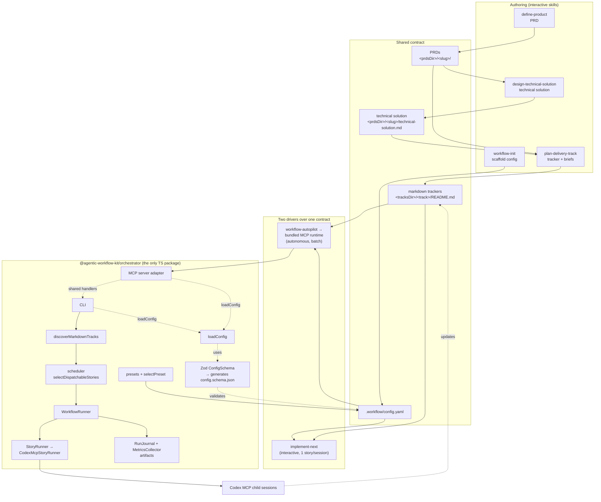
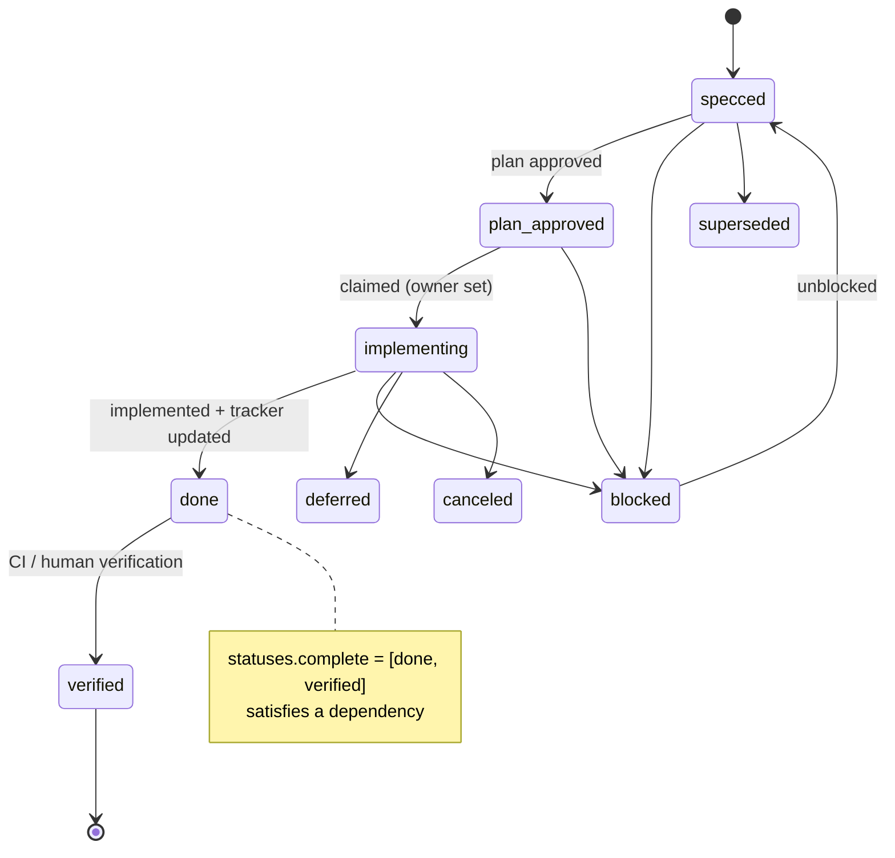
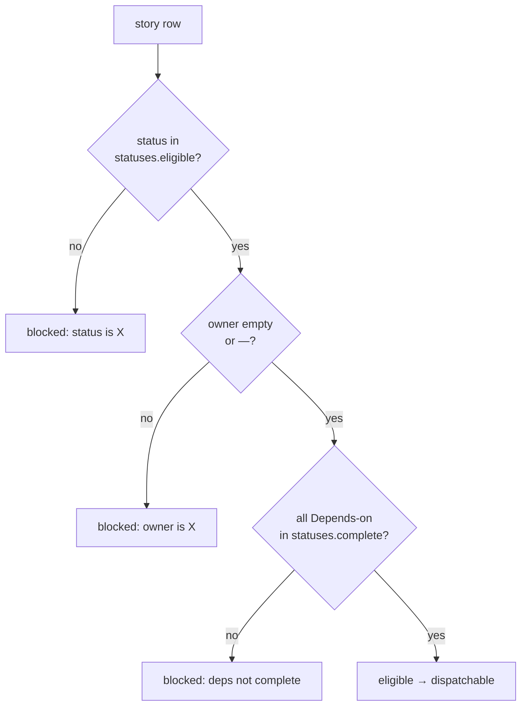
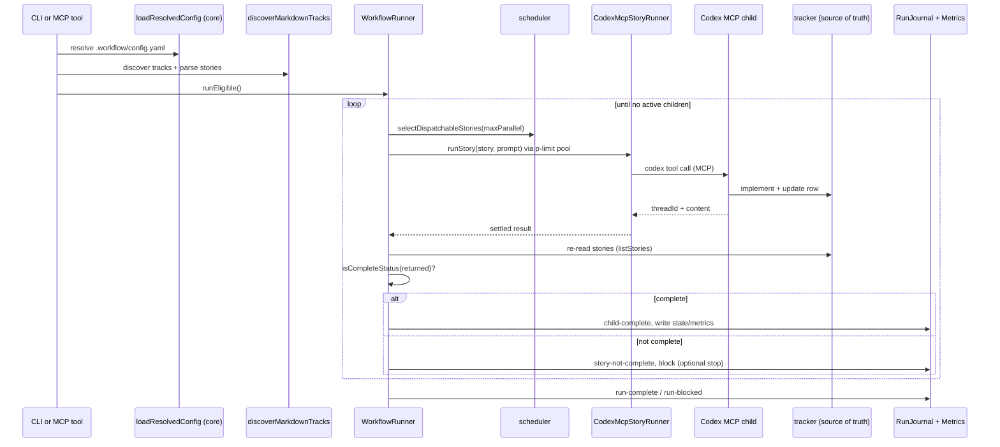

# Architecture

> The living architecture reference for agentic-workflow-kit. Packaging and publish status live with the maintainers; the phase-by-phase build history lives in git.

## In one sentence

agentic-workflow-kit turns any repo into a tracker-driven, spec-first delivery pipeline: a single
**markdown tracker** plus a single **`.workflow/config.yaml`** form one contract that two
interchangeable drivers read — an **interactive** skill that takes one story end-to-end, and an
**autonomous** runtime that fans stories out to child sessions through a plugin-bundled MCP server
or the standalone CLI.

## The shared contract (the spine)

Everything reads and writes the same two things, parameterized by config:

- **`.workflow/config.yaml`** — paths, status vocabulary buckets, verification commands, git
  strategy, and PR/merge policy. Reference: [config-schema.md](../references/config-schema.md).
- **Markdown trackers** at `<tracksDir>/<track>/README.md` — the single source of truth for what
  work exists, what is claimed, what is done, and what is unblocked. Reference:
  [tracker-contract.md](../references/tracker-contract.md).

A **PRD** (`<prdsDir>/<slug>/`, [prd-contract.md](../references/prd-contract.md)) sits upstream of
the tracker and defines the *what/why*. For complex technical work, a **technical solution**
document (`<prdsDir>/<slug>/technical-solution.md`,
[technical-solution-contract.md](../references/technical-solution-contract.md)) owns the
high-level *how* before tracker decomposition. The tracker owns delivery sequencing; each story's
spec owns story-local implementation detail.

**Invariant:** automation never infers completion from a child session's prose. Completion comes
only from the tracker row's status.

## Components



### Skills (`skills/`)
Instruction-first Markdown that runs inside Claude Code or Codex. Six entry points:

| Skill | Role | Side effects |
| --- | --- | --- |
| `workflow-init` | Detect repo signals, pick a preset, write config, scaffold trackers | Writes files (idempotent) |
| `define-product` | Guided interview → multi-file PRD | Writes a PRD |
| `design-technical-solution` | PRD -> high-level technical solution for complex work | Writes a technical solution doc |
| `plan-delivery-track` | PRD plus technical solution when needed -> tracker + story briefs | Writes a tracker + briefs |
| `implement-next` | One eligible story end-to-end | Branch/worktree, commits, PR, merge |
| `workflow-autopilot` | Drive the orchestrator over the same contract | Launches child sessions |

The two side-effectful drivers (`implement-next`, `workflow-autopilot`) are explicit-invocation-only.

### Config layer (`src/config/`)
The config logic, framework-free (formerly a separate `@agentic-workflow-kit/core` package, folded into the
orchestrator for v1):

- **`ConfigSchema`** (Zod, strict) is the single source of truth. `config.schema.json` is
  *generated* from it and pinned byte-for-byte by a drift test, so machine and source cannot
  diverge.
- **`loadConfig`** reads and validates `.workflow/config.yaml`, failing loud with a precise message.
- **`selectPreset`** maps detected repo signals to one of the three presets.

These remain a clean internal module and are re-exported from the package's public API, so they can
be split back out into a standalone library if an external consumer ever needs them.

### Bundled MCP runtime and standalone CLI
The autonomous driver ships two surfaces over the same command handlers:

- plugin installs use the bundled `mcp/server.mjs` artifact and expose MCP tools to Claude Code and Codex;
- the published `@agentic-workflow-kit/orchestrator` package provides the standalone CLI for local development, CI, and troubleshooting.

The bundled MCP server exposes eight tools over the shared handlers:

| Tool | Purpose |
| --- | --- |
| `list_tracks` | Discover tracker directories and active tracks. |
| `list_stories` | Parse stories for one track or all active tracks. |
| `list_eligible` | Return stories dispatchable after status, owner, and dependency filtering. |
| `run_eligible` | Dry-run (default) or launch eligible stories for one track. |
| `run_story` | Dry-run (default) or launch a specific story. |
| `watch_run` | Read `state.json` and `metrics.live.json` for a run artifact directory. |
| `analyze_run` | Analyze a completed run and its child session artifacts, including compatible interactive `implement-next` journals. |
| `check_codex_mcp` | Validate the Codex child MCP server schema used by the `codex-mcp` driver. |

`run_eligible` and `run_story` default to dry-run and never treat a child result, MCP success, or
token metric as completion — the tracker row remains the only completion authority. Read tools are
annotated read-only/idempotent and run tools destructive; large responses are bounded and can be
widened with `responseFormat: detailed`.

Both surfaces carry the config layer above. They wire concrete implementations into a `WorkflowRunner` that
depends only on interfaces (`StoryRunner`, `StorySource`, `ArtifactStore`, `Logger`, `Clock`). The
only shipped driver is `codex-mcp`; the driver boundary is reserved so new drivers can be added
without touching the tracker/config contract. _Roadmap:_ a future
`orchestrator.driver: claude-agent-sdk` can dispatch child sessions through the Claude Agent SDK over
this same boundary; today's bundled autopilot still uses the `codex-mcp` child driver. Every run
Autonomous orchestrator runs write structured artifacts under
`.codex/agentic-workflow-kit/runs/<runId>/` (`events.ndjson`, `state.json`, `metrics.live.json`,
per-child JSON), and `analyze-run` reconstructs metrics from Codex session logs. Interactive
`implement-next` journals use the same run directory and can be analyzed when `state.json` contains
`command: "implement-next"` plus an `interactive` child record. Event journals are also audit
artifacts: `analyze-run` normalizes legacy `ts` events and newer `eventAt`/`recordedAt` events into
a deterministic file-order timeline, then derives local pre-PR review mode, downgrades, execution
blockers, review findings, local fix batches, PR review findings, resolved threads, final
verification, merge, and cleanup status from the event stream. Local `pre_pr_review_blocked` is
reserved for review execution failures in new journals; completed reviews that return blocking
findings use `pre_pr_review_completed` with `verdict: "BLOCK"` or `pre_pr_review_findings`.

## Story lifecycle



The display name of `plan_approved` is `plan-approved`; Mermaid state IDs cannot contain a hyphen.
The three automation buckets (`statuses.eligible`, `statuses.inProgress`, `statuses.complete`) map
onto this vocabulary in config.

## Eligibility

A story is dispatchable only when all three hold (mirrors `blockedReasonFor` in
[markdownTracker.ts](../packages/orchestrator/src/tracks/markdownTracker.ts)):



## Orchestrator runtime (`run-eligible`)



The tracker is re-read after every child returns; the runner trusts the row, not the child. A row at
`statuses.complete` is accepted only when the resolved git policy is satisfied by committed work.
With `stopLaunchingOnBlocked: true` (default), an incomplete return halts new launches while
in-flight children finish.

The orchestrator dispatches children under `--sandbox workspace-write`, granting the repo's `.git`
and `.worktrees` paths as writable roots so git isolation works. Network access is governed
separately by the Codex sandbox/approval mode, which is off by default under `workspace-write`.
Child sessions that run install-dependent verification therefore need either a network-permitting
sandbox/approval mode or dependencies pre-installed before dispatch. If a child stalls in an
offline install loop, `orchestrator.childTimeoutMs` converts the hang into a child failure record
instead of leaving the run in `running` forever.

Completion reconciliation differs by git strategy. The orchestrator re-reads the tracker from the
**local workspace root** and performs no pull or merge of its own. Under **branch strategy** the
child's tracker update is committed in-place and immediately visible at the root, so a story can
complete within a single local run. Under **worktree strategy** the `statuses.complete` update
lives on the child's worktree branch and is reconciled to the base only via the configured PR/merge
flow — completion is therefore eventual and remote-mediated, not single-run. Both behaviors are by
design.

## Extension points

| Seam | Interface | Today | Future |
| --- | --- | --- | --- |
| Child-session driver | `StoryRunner` + `OrchestratorDriver` union | `codex-mcp` | `claude-mcp` or others — unsupported values are rejected, not partially run |
| Story source | `StorySource` | markdown trackers | Linear / GitHub Issues adapters (non-goal for v1) |
| Time | `Clock` | `SystemClock` | injected fakes in tests |
| Output | `ArtifactStore` | `FileArtifactStore` | alternative sinks |

Adding a driver does not change the tracker or config contract — that is the point of the boundary.

## Where things live

```
skills/                     instruction-first plugin skills (5 entry points)
references/                 contracts: config schema (human + machine), tracker, PRD, templates
presets/                    push-and-merge / gated-automerge / push-only
examples/                   worked PRD + tracker (Linkly)
packages/orchestrator/      the only TS package: config (Zod schema, loadConfig, presets, schema gen),
                            shared handlers, MCP server adapter, CLI, tracker parser, scheduler,
                            WorkflowRunner, codex-mcp driver
mcp/server.mjs              generated MCP runtime bundled into plugin installs
.mcp.json                   Claude Code plugin MCP wiring
.claude-plugin/             Claude Code plugin + marketplace manifests
.codex-plugin/              Codex plugin manifest
plugins/agentic-workflow-kit/       materialized copy for the local Codex marketplace fixture, including
                                    Codex-specific .mcp.json and mcp/server.mjs
docs/                       this architecture and the docs hub
```

## See also

- [Documentation hub](./README.md)
- [Getting started](./getting-started.md)
- [Config reference](../references/config-schema.md) ·
  [Tracker contract](../references/tracker-contract.md) ·
  [PRD contract](../references/prd-contract.md)
