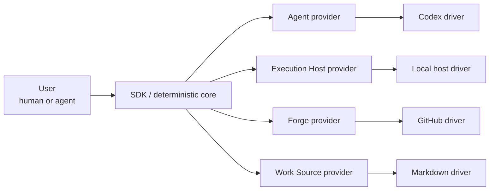

# Mission and scope

## Mission

`agentic-workflow-kit` delegates bounded implementation work to agent workers and lands the result
as reviewed, merged changes under human supervision.

The kit owns orchestration, gating, evidence collection, and recovery. Workers own only the bounded
implementation task they are handed. The operator remains a first-class participant throughout.

## Why this redesign exists

A delegated run must not silently lose three things:

- **Control** — the worker is observable, interruptible, and killable by the kit at any point.
- **Recoverability** — ambiguous or stale run state stops in a diagnosable place; recovery is
  in-band, never manual artifact surgery.
- **Evidence** — "done" and "merge" rest on independently gathered evidence and explicit policy, not
  a worker's self-report.

vNext makes these architectural invariants, not best-effort behaviors. Autonomy is earned by proving
guarantees; it is never assumed. When guarantees cannot be met the system stops in a clean,
diagnosable state rather than taking a risky action. See
[design-home-original.md](design-home-original.md) for the full framing, and
[requirements.md](requirements.md) for the verifiable expression of each guarantee.

## Runtime shape

The SDK is the deterministic control plane. Each provider seam is an abstract contract; a concrete
driver implements it. See [provider seams](../10-architecture/provider-seams.md) and the
[provider interface model](../20-sdk-and-packaging/provider-interface-model.md) for the contracts
the SDK owns.

## v1 scope

**In scope:**

- Local-first execution via the Local Execution Host driver.
- SDK-centered deterministic runtime with the four provider seams: Agent, Execution Host, Forge,
  and Work Source (see [glossary](glossary.md) for term definitions).
- CLI and MCP wrappers as thin entry-point adapters.
- Concrete drivers: Codex (agent), local host, GitHub (forge), Markdown (work source).
- Testkit package with mock providers and provider conformance fixtures.

**Out of scope for v1:**

- Hosted multi-tenant service operation (the seams remain compatible with it).
- Multi-project orchestration in a single run.
- LLM-adjudicated approval autonomy (deferred; see AD-14 in
  [accepted decisions](../40-decisions/accepted-decisions.md)).
- Migration or transformation of legacy runs.

For the full requirements that flow from this scope, see [requirements.md](requirements.md).

<!-- DOCS-NAV (generated — do not edit by hand) -->

---

**↑ Up:** [orientation](./README.md) · **← Prev:** [orientation](./README.md) · **Next →:** [requirements](./requirements.md)

<!-- /DOCS-NAV -->
