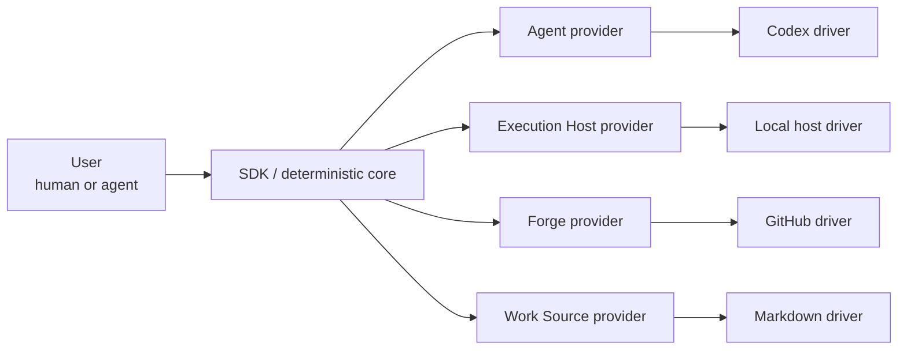

# Mission and scope

## Mission

`agentic-workflow-kit` is a toolkit for running agentic implementation workflows with deterministic orchestration, provider abstraction, human control, recoverability, and evidence-based decisions.

It delegates bounded implementation work to agent workers and lands the result as reviewed, merged changes under human supervision.

## Why the redesign exists

A delegated run must not silently lose:

- **Control** — the worker is observable, interruptible, and killable.
- **Recoverability** — stale or ambiguous state stops in a diagnosable place.
- **Evidence** — completion and merge rest on independently gathered evidence and explicit policy.

## Runtime shape

## v1 scope

In scope:

- Local-first execution.
- SDK-centered runtime.
- CLI and MCP wrappers.
- Provider interfaces for Agent, Execution Host, Forge, and Work Source.
- Concrete Codex, Local, GitHub, and Markdown providers.
- Testkit with mocks and conformance checks.

Out of scope:

- Hosted multi-tenant service operation.
- Multi-project orchestration in one run.
- LLM-adjudicated approval autonomy.
- Migration of legacy runs.
