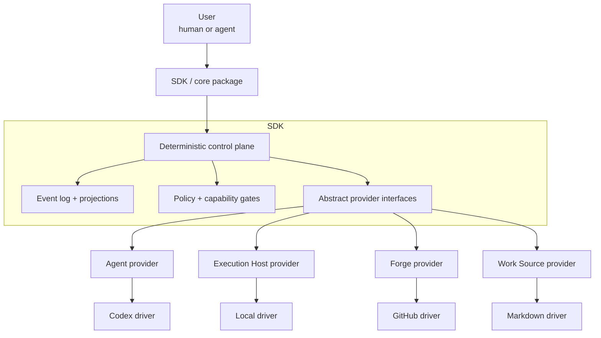

# Architecture

This layer explains the system before the reader enters low-level domain reference.

## Read in order

1. [Component model](component-model.md)
2. [Runtime flow](runtime-flow.md)
3. [Provider seams](provider-seams.md)
4. [Event log and state](event-log-and-state.md)
5. [Capability attestation](capability-attestation.md)
6. [Evidence gates and merge](evidence-gates-and-merge.md)
7. [Human control and approvals](human-control-and-approvals.md)
8. [Recovery and reconciliation](recovery-and-reconciliation.md)
9. [Observability and analysis](observability-and-analysis.md)
10. [Launch coordination](launch-coordination.md)
11. [Protected policy gate](protected-policy-gate.md)
12. [Original high-level architecture](architecture.md)

## Main model

