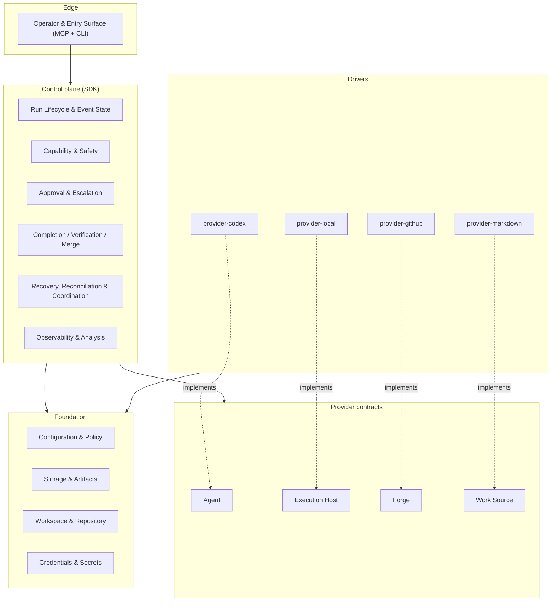

# Architecture overview

This layer explains the system before the reader enters the low-level domain reference. Each file
covers one architectural concept and links down to the authoritative specification in
`30-domain-reference/`. Read in the order below for a coherent top-to-bottom introduction.

## Reading order

1. [Component model](component-model.md) — layers, packages, and the Dependency Rule
2. [Runtime flow](runtime-flow.md) — end-to-end run sequence and the worker/runner boundary
3. [Provider seams](provider-seams.md) — the four host-neutral contracts and their drivers
4. [Event log and state](event-log-and-state.md) — append-only log, projections, writer discipline
5. [Capability attestation](capability-attestation.md) — probed guarantees; the "earn autonomy" model
6. [Evidence gates and merge](evidence-gates-and-merge.md) — completion and merge predicates; exact-head rule
7. [Human control and approvals](human-control-and-approvals.md) — approval relay, park/resume, scoped grants
8. [Recovery and reconciliation](recovery-and-reconciliation.md) — in-band recovery; classifier; coordination leases
9. [Observability and analysis](observability-and-analysis.md) — auto-fire analysis; metric honesty; redaction
10. [Launch coordination](launch-coordination.md) — story-launch lease; claim ordering; TaskSnapshot durability
11. [Protected policy gate](protected-policy-gate.md) — anti-gaming gate; protected path snapshot; approval binding
12. [High-level architecture](architecture.md) — layer diagram, Dependency Rule table, domain map, cross-cutting invariants

## System model at a glance

The Dependency Rule: Edge → Control plane → Provider contracts. Drivers → Provider contracts.
Everything → Foundation. Nothing depends on a concrete driver. Contracts never depend on the
Control plane.
