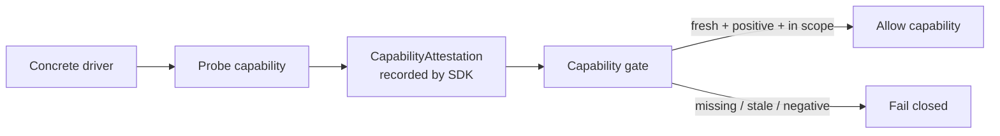

# Capability attestation

Autonomy is unlocked only by fresh, positive, scoped evidence.



## Ownership fix

`CapabilityAttestation` is owned by the SDK, not the testkit. Testkit imports and validates the SDK type; providers emit it; the SDK evaluates it.

## Required shape

The SDK-owned shape includes:

```txt
capability
probeMethod
result
evidenceRef
scope
expiry
driverVersion
platform
freshnessKey
at
details?
```

`details` carries provider-specific proof metadata such as containment strength or egress policy digest.
