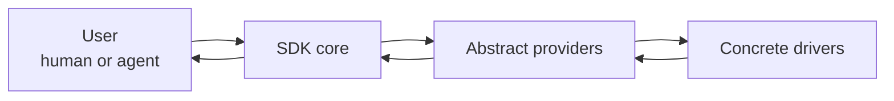

# Component model

The high-level relationship is deliberately small:

```txt
User / Agent
  -> SDK core
  -> abstract providers
  -> concrete drivers
```

## Component responsibilities

| Component | Responsibility |
|---|---|
| User / Agent | Starts, inspects, approves, waits, or triggers work. |
| SDK core | Deterministic orchestration, state, gates, approvals, recovery, analysis. |
| Abstract providers | Interfaces for external capabilities. |
| Concrete drivers | Real integrations such as Codex, Local Host, GitHub, Markdown. |

## Diagram



## Rule

The SDK can depend on provider interfaces, but it must not depend on concrete provider implementations.
