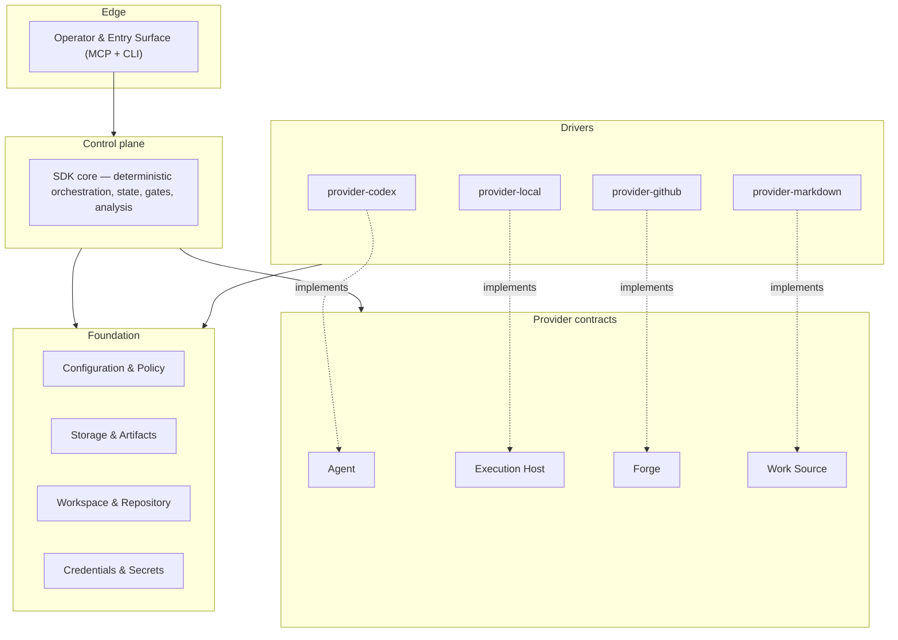

# Component model

The system is organized into four layers — Edge, Control plane, Providers, and Foundation. The
**Providers** layer has two parts: the host-neutral provider contracts and the concrete drivers that
implement them (drawn as separate boxes below). Dependencies point downward and inward only — the
Dependency Rule. This file summarises the layers and their relationships; the authoritative layer
diagram is in [architecture.md](architecture.md) §1.

## Layers



**Edge** is the operator and entry surface. It drives work (MCP, CLI) and surfaces attention
(parked-approval alerts). It holds no run logic.

**Control plane** is the deterministic core housed in the `sdk` package. It owns run state,
capability gating, adjudication, supervision, completion, recovery, and analysis. It knows nothing
about Codex, GitHub, or any concrete driver.

The **Providers** layer has two parts:

- **Contracts** — the four host-neutral seams the Control plane depends on: Agent, Execution Host,
  Forge, and Work Source. The SDK defines the interfaces; provider packages implement them.
- **Drivers** — the concrete adapters. All host-specific and tool-specific risk is encapsulated
  here. A driver implements exactly one provider contract and may not depend on the Control plane.

**Foundation** is depended on by every layer above it and depends on nothing above itself.

## Package structure

The eight packages map to this layer model. The SDK package contains the Control plane and the
four provider interface definitions. Provider packages implement a single interface each.

```txt
sdk/              — Control plane + provider interfaces
cli/              — Edge executable (wires providers into the SDK)
mcp/              — Edge MCP server (wires providers into the SDK)
provider-codex/   — Agent driver
provider-local/   — Execution Host driver
provider-github/  — Forge driver
provider-markdown/ — Work Source driver
testkit/          — test-only mocks, conformance helpers, fixtures
```

The complete dependency matrix and the reasons that the package count is held at eight are in
[package-target.md](../20-sdk-and-packaging/package-target.md).

## Dependency Rule (summary)

The rule: Edge → Control plane → Contracts. Drivers → Contracts. Everything → Foundation.
Nothing depends on a concrete driver. Contracts never depend on the Control plane.

The detailed tabulation of allowed and forbidden dependency pairs, and the SDK boundary
enforcement rule, are in [architecture.md](architecture.md) §2 and
[dependency-rules.md](../20-sdk-and-packaging/dependency-rules.md).

<!-- DOCS-NAV (generated — do not edit by hand) -->

---

**↑ Up:** [architecture overview](./README.md) · **← Prev:** [architecture overview](./README.md) · **Next →:** [runtime flow](./runtime-flow.md)

<!-- /DOCS-NAV -->
