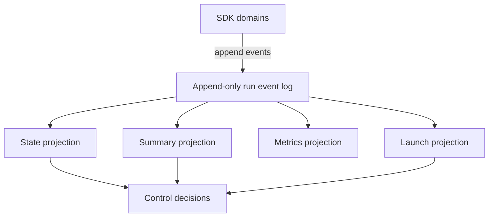

# Event log and state

The event log is the only authored run state. Projections are derived read models.

## Invariants

- Events are append-only.
- State is never manually edited.
- Projections are pure functions of the log.
- Non-deterministic inputs enter as recorded events.
- Recovery records new events; it does not perform artifact surgery.

Full details live in [Run lifecycle and state](../30-domain-reference/core/run-lifecycle-and-state/README.md).
