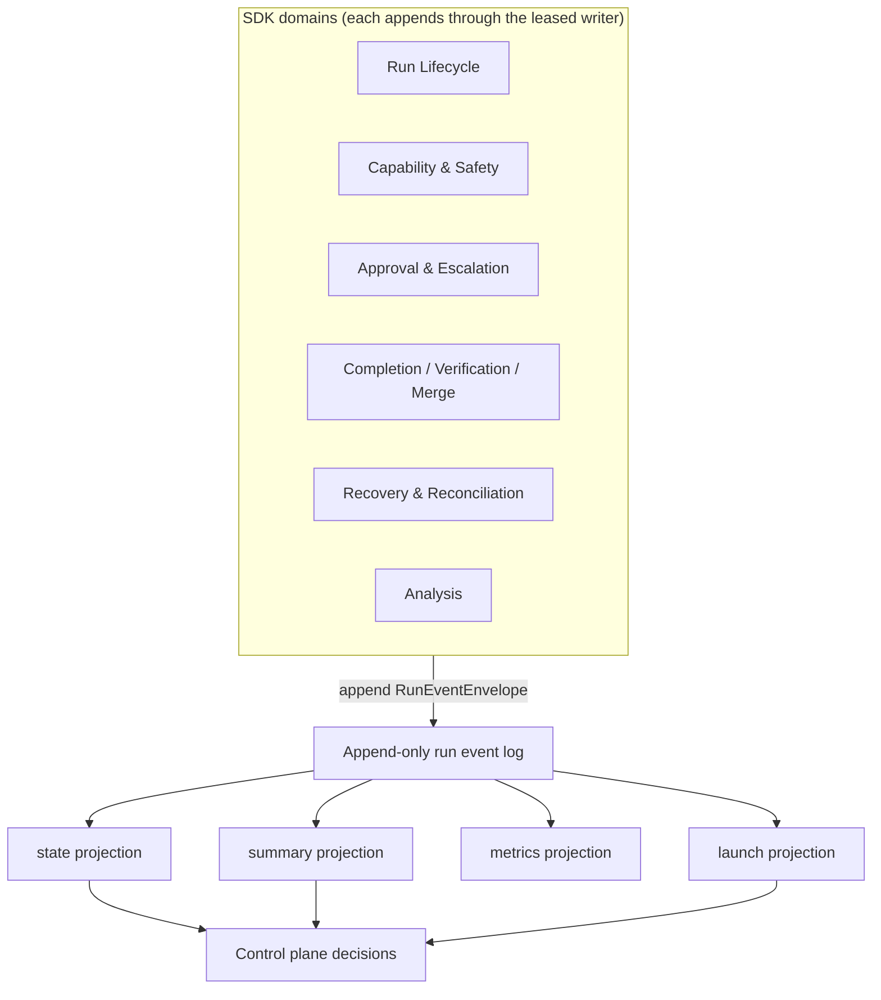

# Event log and state

The event log is the only authored run state. Every observable fact about a run — lifecycle
transitions, approval decisions, capability gate records, verification output, Forge evidence,
recovery classifications, analysis results — is an appended event. Nothing is edited in place.

## Writer discipline

A single leased writer holds append authority for a given run at any time. The lease (from Storage
& Artifacts) carries a monotonic epoch; every appended envelope carries that epoch. A writer whose
lease has been superseded is fenced: its appends are rejected by sequence and epoch checks.

This model guarantees coherent state under process crashes, stale writers, and concurrent recovery
attempts.

## Projections

Projections are pure functions of the log. They are computed by replaying the event sequence from
the beginning (or from a cursor) and are never written directly. The four projections are:

- `state` — current lifecycle state and active session linkage, used for all control decisions.
- `summary` — metadata about the run (task ref, policy ref, session chain, unknown future events).
- `metrics` — honest per-run counters; unavailable values are recorded as `unavailable`, never
  coerced to zero.
- `launch` — the snapshot needed to safely re-enter or recover a run.

Replaying a log from the same starting point always yields identical projections: the computation
is deterministic and has no external dependencies.

## Core invariants

- Events are append-only. Semantic history is never rewritten.
- Projections are read-only outputs from replay; they are never authored.
- Non-deterministic external inputs (a human decision, a provider probe result) enter the system
  as recorded events, making them part of the replayable history.
- Recovery appends new events; it does not perform artifact surgery.
- Session linkage is append-only; a later link can supersede a prior one in projection output but
  no link fact is clobbered.

## Authoritative references

All detail — the event envelope schema, the append protocol, writer-epoch fencing, durability
classes, tail and interior corruption handling, the lifecycle state machine, projection reducers,
and property-test strategy — is in:

- [Run Lifecycle & Event State](../30-domain-reference/core/run-lifecycle-and-state/README.md) (core-01)
- [Storage & Artifacts](../30-domain-reference/foundation/storage-and-artifacts/README.md) (fnd-02) — the
  lease, append, and replay primitives core-01 builds on
