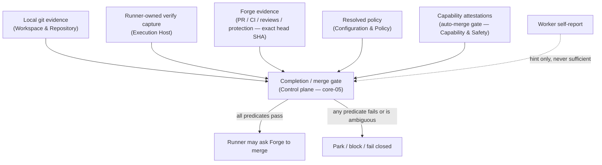

# Evidence gates and merge

Completion and merge decisions are made from independently gathered, recorded evidence and
resolved policy. Worker prose is a hint and never a gate input by itself.

## Completion vs merge

Completion and merge are two separate decisions evaluated sequentially.

**Completion** (`completion-verified`) requires that the candidate head has independent local git
evidence and a runner-owned verification capture bracketing the same clean head. A worker
declaration of "done" without captured evidence is unverified and does not satisfy the gate.

**Merge** (`merge-ready`) additionally requires fresh Forge evidence (PR state, required CI
checks, review decision, thread state, branch protection or rulesets), a matching exact head SHA
across all Forge evidence sources, applicable policy conditions, and a committed `auto-merge`
`CapabilityGateRecord` from Capability & Safety.

## Exact-head rule

All Forge evidence used in a merge decision must be bound to the same candidate head SHA. The PR
head, branch head, action-observed head, and the `expectedHeadSha` supplied to the Forge contract
must all match. Any mismatch fails the gate closed without proceeding.

## Changed-file anti-gaming gate

At run launch, the Control plane records a `ProtectedPolicySnapshotRecorded` event capturing the
verification command, CI definitions, package scripts, config files, and any other files that
control merge requirements. If the worker's changes touch a protected path, the gate requires
human approval and re-verification under the pre-change (or explicitly approved new) policy
before merge can proceed. For details see [protected-policy-gate.md](protected-policy-gate.md).

## Authoritative references

The complete evidence model — evidence record types, the completion and merge predicates, the
fail-closed state catalog, post-merge outcome mapping, and blocker-evidence PR rules — is in:

- [Completion, Verification & Merge](../30-domain-reference/core/completion-and-merge/README.md) (core-05)
- [Forge / Collaboration](../30-domain-reference/providers/forge-collaboration/README.md) (prov-02) — the
  Forge contract and the exact-head evidence model it supplies

<!-- DOCS-NAV (generated — do not edit by hand) -->

---

**↑ Up:** [architecture overview](./README.md) · **← Prev:** [capability attestation](./capability-attestation.md) · **Next →:** [human control and approvals](./human-control-and-approvals.md)

<!-- /DOCS-NAV -->
