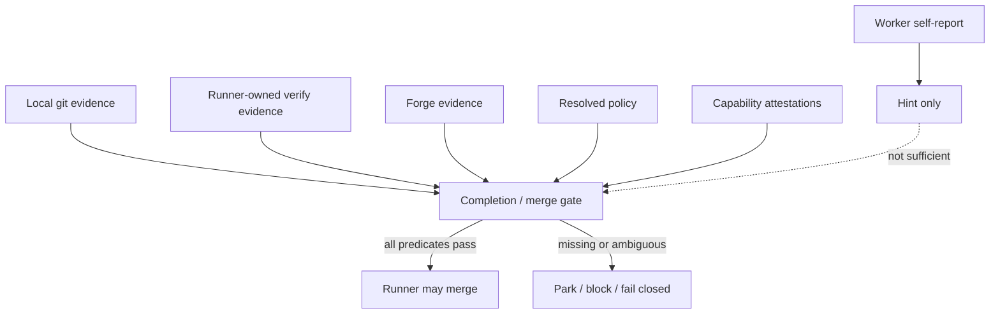

# Evidence gates and merge

Completion and merge are decided from evidence and policy, not worker prose.

## Exact-head rule

Merge-related evidence must bind to the same candidate head SHA. If the PR head, branch head, action-observed head, or expected head do not match, the gate fails closed.

Full details live in [Completion and merge](../30-domain-reference/core/completion-and-merge/README.md).
