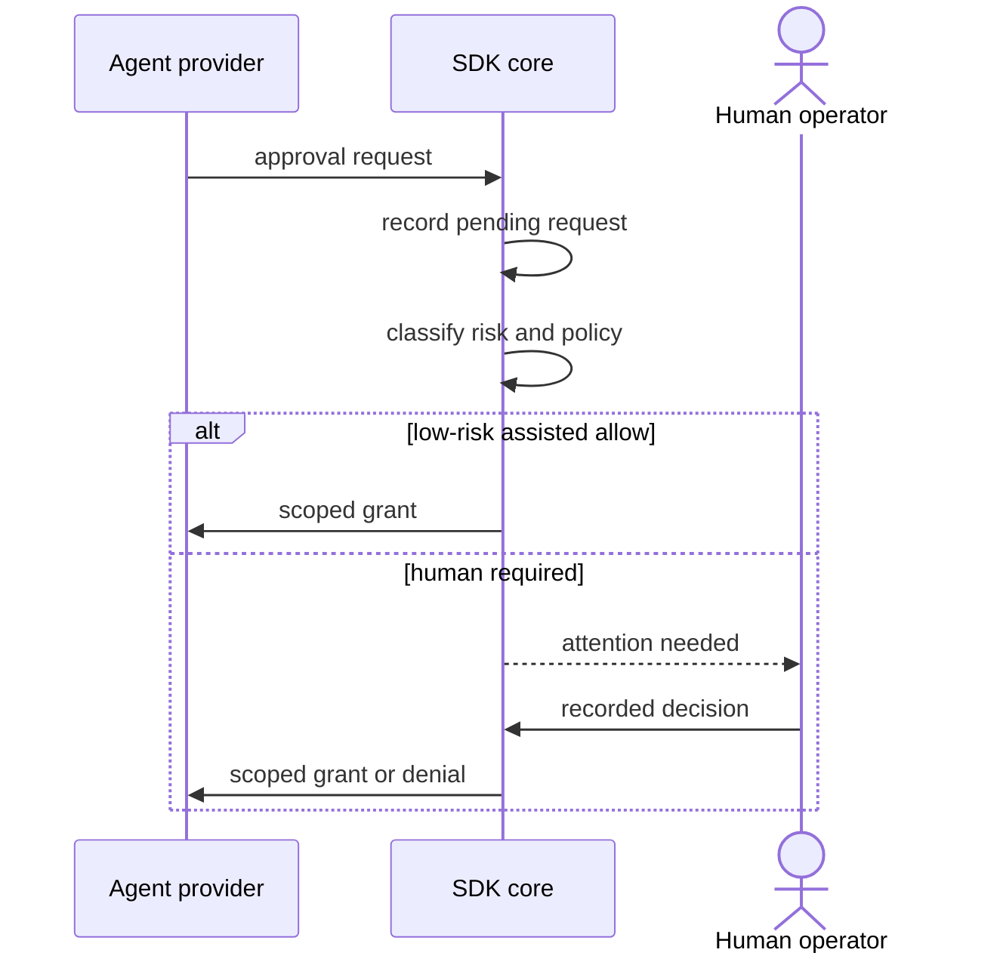

# Human control and approvals

The human operator is a first-class participant, not an emergency fallback.

## Rules

- Requests are recorded before decisions.
- High-risk requests go to a human.
- Grants are the tightest useful scope.
- `auto` / LLM adjudication is not v1.
