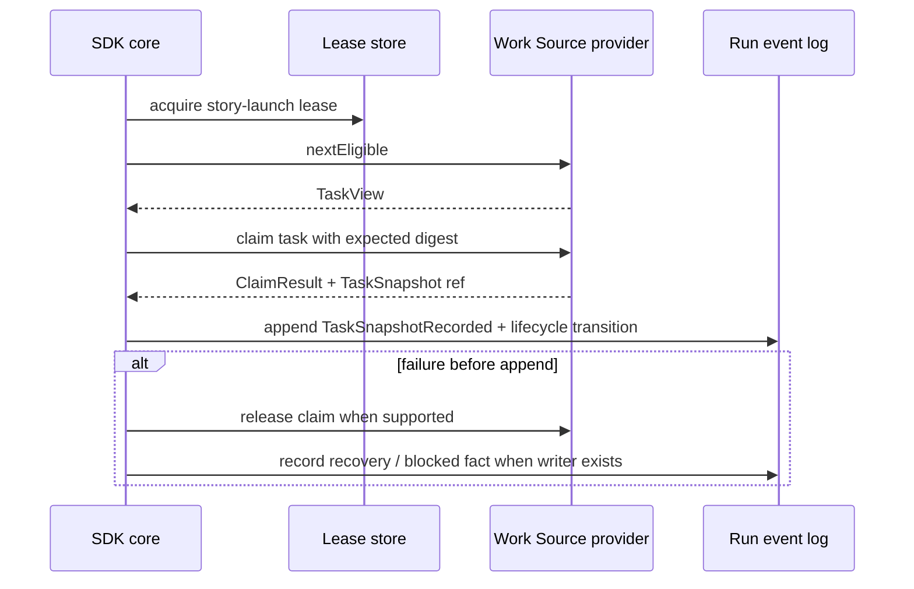

# Launch coordination

This file captures the launch-order fix required by the review.

## Problem

The design has both Work Source claim locking and a repo-wide `story-launch` lease. Both are necessary, but their ordering must be explicit.

## Normative launch sequence

## Rules

- `story-launch` prevents duplicate run starts across processes.
- Work Source claim protects task status authority.
- TaskSnapshot must be durable before the run treats the task as snapshotted.
- Recovery clears stale launch state only through supported controls.
