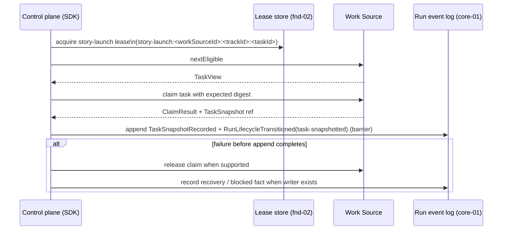

# Launch coordination

Starting a run safely requires two layers of coordination: a repo-wide lease that prevents
duplicate launches across concurrent processes, and a Work Source claim that asserts ownership of
a specific task. The ordering between them is normative and must not be reversed.

## Normative launch sequence

## Leases and their roles

**`story-launch` lease** is a repo-wide, fnd-02-backed lease keyed by
`story-launch:<workSourceId>:<trackId>:<taskId>`. It prevents two concurrent processes from
starting a run for the same task simultaneously. The epoch fencing and expiry of the lease are
the safety mechanism; holder text is diagnostic only.

**Work Source claim** is the task-level ownership mechanism. The Control plane supplies the
expected content digest when claiming, so a concurrent writer cannot silently modify the task
between `nextEligible` and `claim`. `ClaimResult` carries a `TaskSnapshot` reference — a durable
point-in-time copy of the task spec and metadata bound to the claim.

## TaskSnapshot durability requirement

The `TaskSnapshot` must be durably appended to the run log as `TaskSnapshotRecorded` before the
run treats the task as snapshotted. If the append fails, the claim must be released (when the
Work Source supports release) and the failure must be recorded. The lifecycle transition to
`task-snapshotted` may only follow a committed `TaskSnapshotRecorded` event.

## Recovery rules

- Stale launch state is cleared only through supported controls: fnd-02 lease acquisition (for
  expired leases) plus appended recovery events. Process absence alone never clears a lease or a
  claim.
- Claims are never cleared after unverified termination.
- Duplicate launch detection during recovery uses both lease evidence and run log events together,
  not either alone.

## Authoritative references

- Run lifecycle states and the `task-snapshotted` transition:
  [Run Lifecycle & Event State](../30-domain-reference/core/run-lifecycle-and-state/README.md) (core-01)
- Lease primitive and durability guarantees:
  [Storage & Artifacts](../30-domain-reference/foundation/storage-and-artifacts/README.md) (fnd-02)
- Duplicate launch prevention and reconciliation:
  [Recovery, Reconciliation & Coordination](../30-domain-reference/core/recovery-and-reconciliation/README.md) (core-06)

<!-- DOCS-NAV (generated — do not edit by hand) -->

---

**↑ Up:** [architecture overview](./README.md) · **← Prev:** [observability and analysis](./observability-and-analysis.md) · **Next →:** [protected policy gate](./protected-policy-gate.md)

<!-- /DOCS-NAV -->
