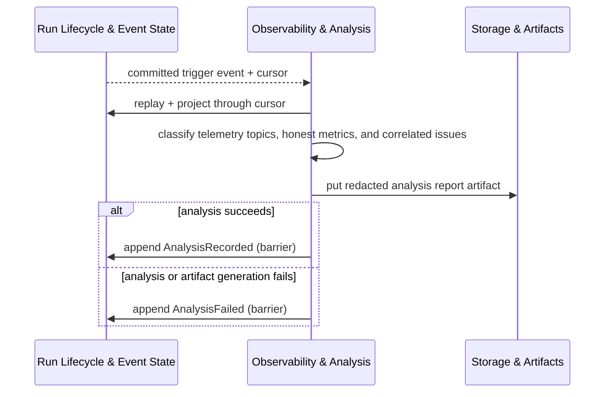

# Observability and analysis

Every terminal, blocked, supervision-lost, stale-progress, and recovery transition automatically
triggers a structured analysis of the run. The analyzer is a pure function over the event log and
projections; it does not inspect live external state.

## Auto-fire triggers

Analysis fires automatically on:

- Terminal lifecycle transitions (`completed`, `failed`, `canceled`).
- Blocked lifecycle transitions.
- Supervision-lost and stale-progress liveness state changes.
- Recovery events (`RecoveryClassified`, `RecoveryActionPlanned`, `RecoveryActionApplied`,
  `ReconciliationBlocked`).

A single committed event produces at most one trigger. Every terminal run with usable replay and a
writable run log must have either an `AnalysisRecorded` or an `AnalysisFailed` event. When replay
is corrupt or the log is unwritable, the invariant is explicitly unmet and surfaced through named
failure reasons rather than silently waived.

## Metric honesty

Metrics carry one of three states: `available`, `partial`, or `unavailable`. An unavailable
metric is never coerced to zero, `false`, an empty list, or a success state. Unknown or ambiguous
evidence is recorded as an issue or an unavailable metric, not a guessed value.

## Redaction

Analysis reports are redacted by default before being written as write-once artifacts to Storage &
Artifacts. Raw prompts, raw secrets, tokens, credentials, and unredacted command output are not
included in normal reports. A `redactionPolicyDigest` is supplied with every analysis request and
is recorded in the `AnalysisRecorded` event for auditability.

## What the analyzer does not observe

The analyzer is limited to committed event envelopes, approved payload contracts in those
envelopes, core-01 projections, fnd-02 replay health and artifact metadata, and redacted artifact
content selected by explicit refs. It does not read live provider state, raw driver output, cached
projections written outside the log, or worker prose without corroborating recorded evidence.

## Authoritative reference

The telemetry topic taxonomy, issue taxonomy, typed metric wrapper, analyzer input/output types,
retention and privacy boundaries, and the complete failure-reason catalog are in:

[Observability & Analysis](../30-domain-reference/core/observability-and-analysis/README.md) (core-07)
