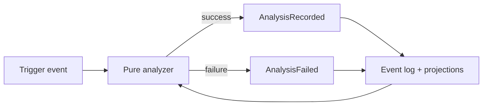

# Observability and analysis

Analysis auto-fires on terminal, blocked, supervision-lost, stale-progress, and recovery transitions.

## Metric honesty

Metrics are `available`, `partial`, or `unavailable`. Unavailable is never coerced to zero.
