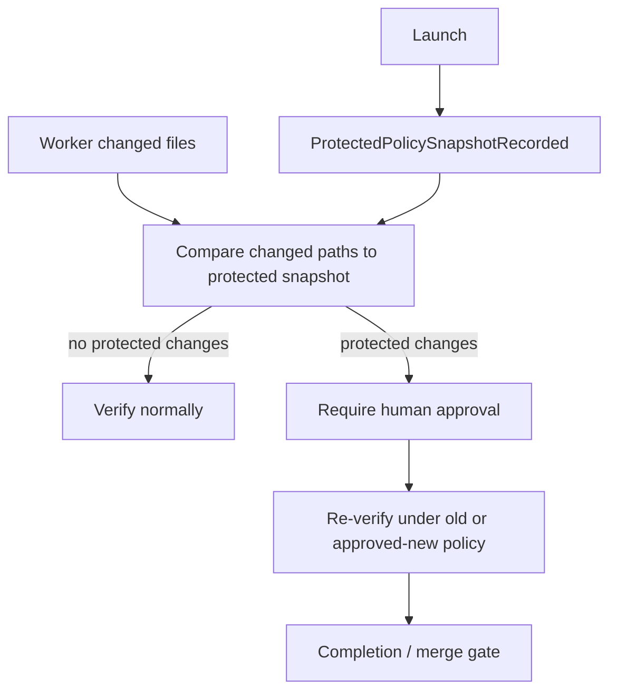

# Protected policy gate

This file captures the protected-policy anti-gaming fix required by the review.

## Goal

A worker must not weaken verification, CI, policy, or package scripts and then satisfy gates under the weakened rules.

## Gate model



## Protected policy classes

The implementation must explicitly define protected path sets for:

- workflow-kit config and policy files;
- verification command definitions;
- CI definitions;
- package scripts and lockfiles;
- provider/conformance policy;
- any file that controls merge requirements.

## Required binding

A protected-policy approval must bind to:

```txt
run id
candidate head SHA
changed protected path set
old policy digest
new policy digest when approved
operator decision event id
```
