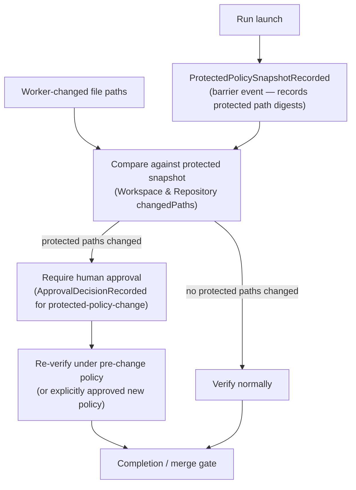

# Protected policy gate

A worker must not weaken the rules that gates will be evaluated against and then pass those
weakened gates. The protected-policy gate closes this anti-gaming vector by snapshotting the
policy context at launch and requiring human approval plus re-verification whenever a worker
changes a protected path.

## How it works

## Protected path classes

The implementation must define protected path sets covering at minimum:

- workflow-kit configuration and policy files
- verification command definitions
- CI definitions (e.g. `.github/workflows/`)
- package scripts and lockfiles
- provider conformance policy files
- any file that controls merge requirements or gate predicates

## Snapshot record

At launch, the Control plane appends a `ProtectedPolicySnapshotRecorded` event at barrier
durability. It contains the policy digest, the base commit SHA, the verifier command, and the
digests of the protected path set. All subsequent changed-file checks reference this record.

## Approval binding

A protected-policy-change approval must bind to specific evidence. The
`ApprovalDecisionRecorded` event for `ApprovalSubject = "protected-policy-change"` must carry:

| Field | Content |
|---|---|
| run id | The run being approved |
| candidate head SHA | The exact head the approval covers |
| changed protected path set | Which protected paths were modified |
| old policy digest | The digest from `ProtectedPolicySnapshotRecorded` |
| new policy digest | The approved new policy (when applicable) |
| operator decision event id | The recorded human decision authorizing this change |

Without a committed approval binding all of these fields, the gate returns
`protected-policy-change-unapproved` and fails closed.

## Authoritative references

The evidence model, the `ProtectedPolicySnapshotRecorded` event schema, the changed-file
predicate, and the full fail-closed state catalog are in:

- [Completion, Verification & Merge](../30-domain-reference/core/completion-and-merge/README.md)
  (core-05) — owns the protected-policy gate logic
- [Forge / Collaboration](../30-domain-reference/providers/forge-collaboration/README.md)
  (prov-02) — Forge evidence the gate consumes

<!-- DOCS-NAV (generated — do not edit by hand) -->

---

**↑ Up:** [architecture overview](./README.md) · **← Prev:** [launch coordination](./launch-coordination.md) · **Next →:** [high-level architecture](./architecture.md)

<!-- /DOCS-NAV -->
