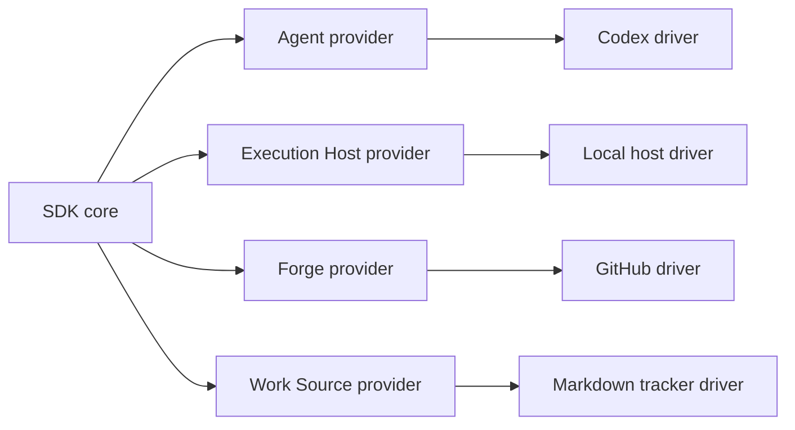

# Provider seams

The SDK depends on abstract provider interfaces. Concrete drivers live outside the SDK.

## Provider responsibilities

| Provider | Owns |
|---|---|
| Agent | Worker protocol, progress, approvals, session linkage, tool observations. |
| Execution Host | Process execution, containment, runner-owned commands, termination. |
| Forge | Remote repository collaboration: push, PR, CI, review, merge. |
| Work Source | Task intake, tracks, claims, dependencies, task status authority. |

## Boundary rule

Provider implementations may import the SDK. The SDK must not import provider implementations.
