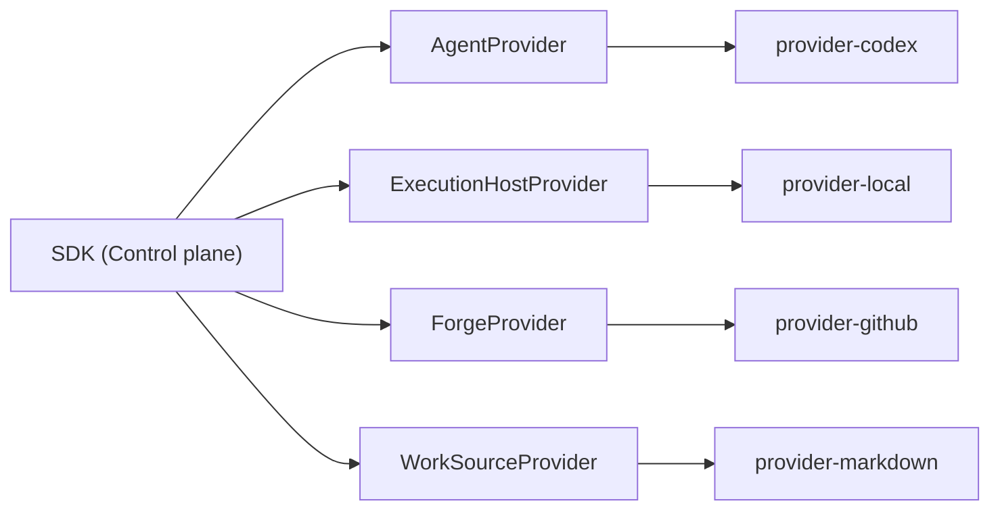

# Provider seams

The Control plane depends on four host-neutral provider contracts — seams — that isolate it from
concrete tool, platform, and service implementations. Each seam is an interface defined in the
`sdk` package; each concrete driver lives in a separate provider package and implements exactly
one interface.

## The four seams

**Agent** owns the worker protocol: drive a worker running on an Execution Host; a normalised
event stream (progress / linked / approval-requested / `ToolObserved` / terminal); an approval
answer channel; and resume of an owned session. Attested capabilities include `canRelayApproval`,
`canResumeOwned`, and `emitsStructuredToolExit`.

**Execution Host** owns where and how processes run: spawn and contain a worker process tree,
signal and terminate the whole tree, and run runner-owned commands (the verifier), capturing
command, argv, exit code, signal, and output digests. Attested capabilities include `canKill`,
`containmentStrength`, and egress confinement (proven with negative probes).

**Forge** owns all remote, credentialed repository collaboration: push a branch, create or update
a PR, collect evidence (PR state, CI checks, reviews, review threads, branch protection, rulesets)
bound to an exact head SHA, and perform merge, enqueue, or update-branch with `expectedHeadSha`.
Attested capabilities include `supportsRulesets`, `supportsMergeQueue`,
`supportsThreadResolution`, and `canInspectProtection`. The worker never receives Forge
credentials.

**Work Source** owns the task supply: enumerate tasks and tracks, report eligibility, claim and
release a task race-safely while emitting a `TaskSnapshot`, and read and write task status. Work
Source is the task status authority; the event log is the run-activity authority. They are
separate and must not cross-write. Attested capabilities include `supportsClaim`,
`supportsStatusWrite`, `supportsTracks`, and `supportsDependencies`.

## Boundary rule

Provider implementations may import the SDK to access types and contracts. The SDK must not
import any provider implementation. All host-specific and tool-specific risk lives inside the
driver packages.

Each seam also includes a conformance-tested mock driver used by the Control plane test suite.
The mock satisfies the same contract types, attestation shapes, exact-head checks, and degraded
modes as the real driver.

## Authoritative references

- Provider interface definitions and the SDK boundary rule:
  [provider-interface-model.md](../20-sdk-and-packaging/provider-interface-model.md)
- Agent contract and Codex driver:
  [providers/agent-execution/README.md](../30-domain-reference/providers/agent-execution/README.md)
- Forge contract and GitHub driver:
  [providers/forge-collaboration/README.md](../30-domain-reference/providers/forge-collaboration/README.md)
- Work Source contract and Markdown driver:
  [providers/work-source/README.md](../30-domain-reference/providers/work-source/README.md)
- Execution Host contract and Local driver:
  [providers/execution-host/README.md](../30-domain-reference/providers/execution-host/README.md)
