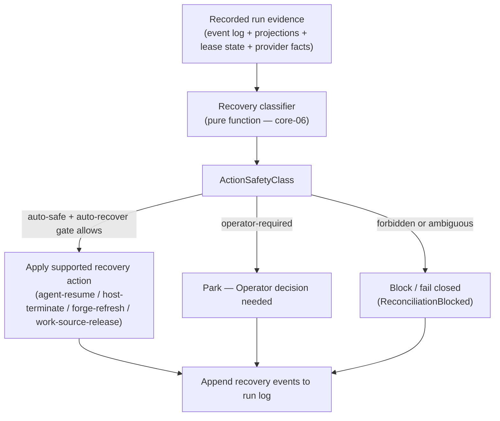

# Recovery and reconciliation

Recovery is entirely in-band. The Control plane classifies non-clean run terminals from recorded
evidence, selects a safe action, and records recovery facts as appended events. It never edits
logs, projections, Work Source files, or provider artifacts directly.

## Recovery classifier

The classifier is a pure function over core-01 replay and projections, fnd-02 lease snapshots,
core-04 liveness evidence, core-05 completion and merge outcomes, provider evidence events, and a
caller-supplied `observedAt` timestamp. It never calls providers directly, reads live external
state, or mutates anything.

Output is a named `RecoveryState`, an `ActionSafetyClass` (`auto-safe`, `operator-required`, or
`forbidden`), and an action. Ambiguous evidence always fails closed to a named state.

## Action-safety classes

**auto-safe** means the classifier's evidence classifies the action as safe to execute without
operator interaction — but execution still requires a committed `auto-recover` `CapabilityGateRecord`
from Capability & Safety (core-02) allowing the exact action scope. If the gate denies, the run
parks for the Operator.

**operator-required** means recovery cannot proceed without a recorded human decision, regardless
of capability gate state.

**forbidden** means the evidence makes the intended action unsafe. The run blocks and no recovery
action is applied.

## Coordination and duplicate launch prevention

The system uses two fnd-02 leases for repo-level coordination:

- `run-writer:<runId>` — append authority for a specific run's event log.
- `story-launch:<workSourceId>:<trackId>:<taskId>` — prevents two processes from starting a run
  for the same task simultaneously.

Duplicate launch clearing uses lease acquisition plus appended recovery events. Process absence
alone does not clear a lease or claim.

## Resume vs restart

**Resume** reconnects to a currently active, non-superseded owned Agent session where provider
evidence confirms the session is still usable.

**Restart** is only safe from `safe-empty-restartable`, which requires that launch, writer,
owner, termination, approval, and Work Source claim evidence are all in a confirmed safe state.
Restart is not available by default from any other recovery state.

Claims are never cleared after unverified termination. The system does not blind-relaunch.

## Authoritative reference

The recovery state taxonomy, the action-safety matrix, the full lease model, reconciliation event
payloads, and the complete resume-vs-restart rules are in:

[Recovery, Reconciliation & Coordination](../30-domain-reference/core/recovery-and-reconciliation/README.md) (core-06)
