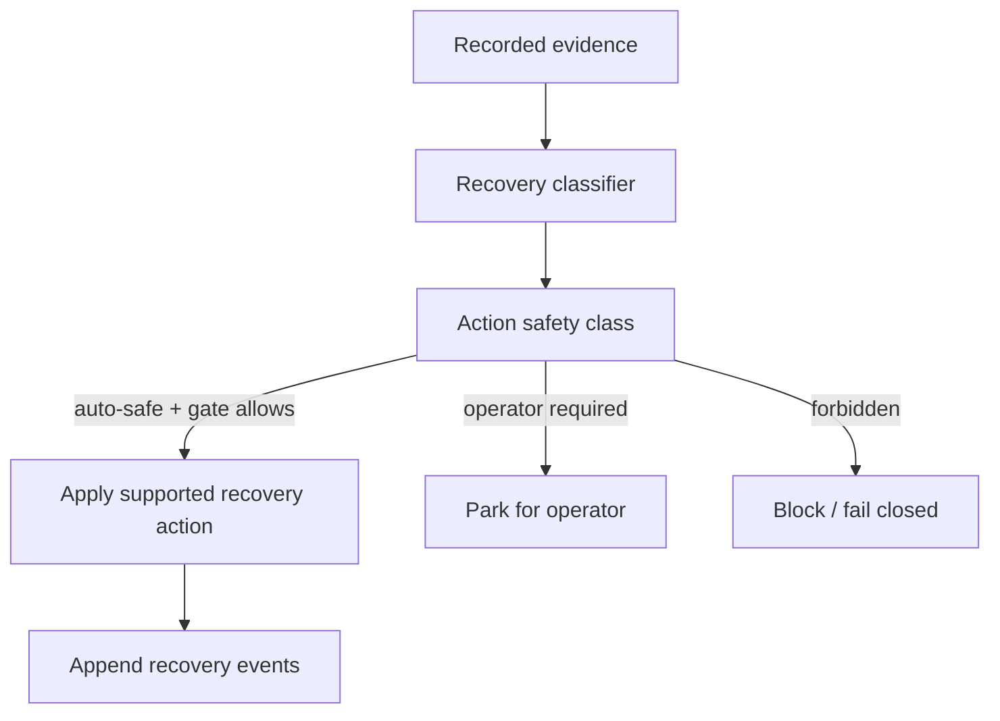

# Recovery and reconciliation

Recovery is in-band. The system records recovery facts; it does not edit artifacts manually.

## Rules

- Recovery decisions are pure functions of recorded evidence.
- Ambiguity fails closed.
- Duplicate launches are prevented by leases.
- Claims are never cleared after unverified termination.
