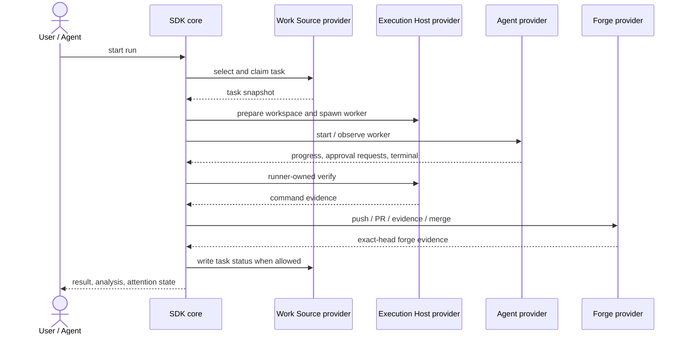

# Runtime flow

A run moves through intake, workspace preparation, worker execution, verification, forge operations, and settlement.

The worker implements. The SDK decides. The providers report evidence. The runner owns credentialed and irreversible actions.
