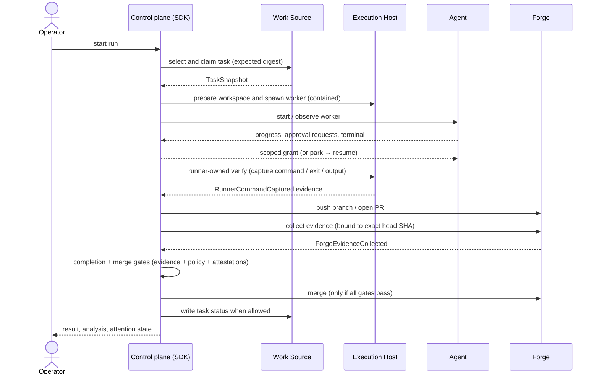

# Runtime flow

A run moves through task intake, workspace preparation, worker execution, verification, Forge
operations, and settlement. The Control plane decides at each step; providers report evidence; the
runner owns credentialed and irreversible actions.

## Key boundaries

**Worker / runner split.** The worker (the Agent) implements the task: it edits files and commits
locally. The runner (the Control plane acting through the Execution Host and Forge) owns every
credentialed and irreversible action: spawn, contain, verify, push, PR, merge. The worker never
holds Forge credentials.

**Evidence over prose.** A worker claim or self-report does not satisfy any gate. Gates consume
independently captured evidence: local git state, runner-owned verification output, and Forge
evidence bound to the exact candidate head SHA.

**Fail closed.** If a required capability attestation is absent or stale, if evidence is
ambiguous, or if a gate predicate cannot be evaluated from the event log, the run moves to a named
blocking or recoverable state. It does not proceed by assumption.

## Authoritative reference

The full lifecycle state machine — every state, every legal transition, the event log that records
them, and the projection model derived from it — is the single source in
[Run Lifecycle & Event State](../30-domain-reference/core/run-lifecycle-and-state/README.md).

The end-to-end happy-path sequence at a higher level of abstraction is in
[architecture.md](architecture.md) §4.
