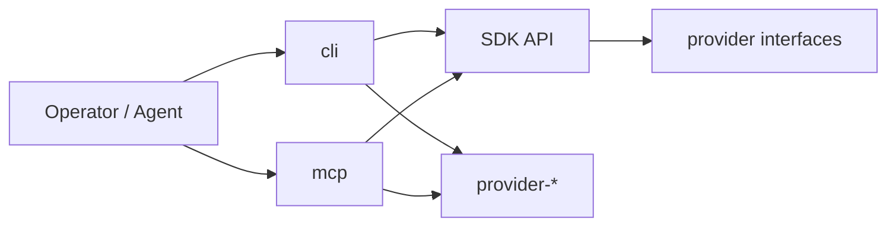

# CLI and MCP wrappers

`cli` and `mcp` are executable adapters over the SDK. Neither owns orchestration logic; both exist
to present an interface to a caller, wire concrete providers, and supply a production storage backend
to the SDK factory.

## CLI owns

- Argument parsing and flag resolution
- Terminal rendering and progress display
- Exit codes
- Config path discovery
- Runtime wiring: instantiating concrete providers and passing them to `createWorkflowKit`
- Wiring the filesystem-backed storage implementation into the SDK's port slots

## MCP owns

- MCP server lifecycle and tool registration
- Tool definitions and request/response envelopes
- Streaming result formatting
- Runtime wiring: same provider and storage wiring as CLI, adapted for the MCP execution context

## Both must avoid

- Core orchestration decisions (those belong to the Control plane inside the SDK)
- Provider-specific behavior outside wiring
- Direct mutation of run state

## Shared default-composition helper

Because both executables perform the same provider and storage wiring, a **shared
default-composition helper** is the intended convention for keeping CLI and MCP parity. The helper
encapsulates `createWorkflowKit` instantiation with a standard provider set and the filesystem store,
so neither executable duplicates the wiring logic. Each executable calls the helper, then applies its
own interface layer on top.

This is a convention, not a third package: the helper may live inside `cli`/`mcp` as a shared
module, or in a thin internal utility. It must not become a separately published package unless
there is a concrete need for external consumers to reuse it.
