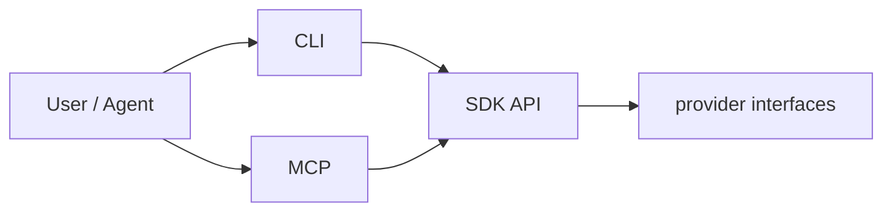

# CLI and MCP wrappers

CLI and MCP are executable adapters over the SDK.

## CLI owns

- argument parsing;
- terminal rendering;
- exit codes;
- config path discovery;
- runtime wiring for local execution.

## MCP owns

- MCP server;
- tool definitions;
- request/response envelopes;
- streaming result formatting;
- runtime wiring for MCP execution.

## Both must avoid

- core orchestration decisions;
- provider-specific behavior outside wiring;
- direct mutation of run state.

