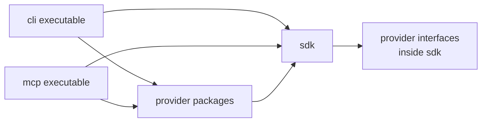

# Package target

The packaging model is SDK-centered. Design domains remain useful as design reference, but they are not one-to-one npm packages.

## Package tree

```txt
packages/
  sdk/
  cli/
  mcp/
  provider-codex/
  provider-local/
  provider-github/
  provider-markdown/
  testkit/
```

## Dependency direction



## Why not one package per design domain?

The design has domains to organize thinking and ownership. Packages should represent runtime and dependency boundaries.

A package per design domain would add build complexity before there is evidence that independent package boundaries are needed. The SDK can still keep internal folders for design domains.
