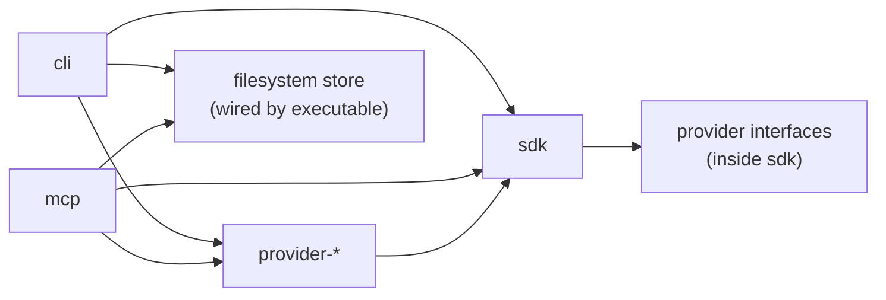

# Package target

The packaging model is SDK-centered. Eight packages form the complete kit-vnext delivery surface.
Design domains are a useful organizing tool, but they do not map one-to-one to npm packages; packages
represent runtime and dependency boundaries, not design groupings.

## Package tree

```txt
packages/
  sdk/              — core runtime library; provider interfaces; storage ports + defaults
  cli/              — terminal executable; provider wiring; filesystem store wiring
  mcp/              — MCP server executable; provider wiring; filesystem store wiring
  provider-codex/   — AgentProvider driver (Codex protocol)
  provider-local/   — ExecutionHostProvider driver (local process execution)
  provider-github/  — ForgeProvider driver (GitHub push / PR / merge)
  provider-markdown/ — WorkSourceProvider driver (Markdown task tracker)
  testkit/          — test-only: provider mocks, conformance helpers, incident fixtures
```

## Dependency direction



## Why not one package per design domain?

A package per design domain would introduce build and versioning complexity before there is evidence
that independent publish boundaries are needed. The SDK maintains internal folder structure that
mirrors the domain map, so ownership and boundaries remain clear without multiplying packages. The
complete dependency matrix is in [dependency-rules.md](dependency-rules.md).
