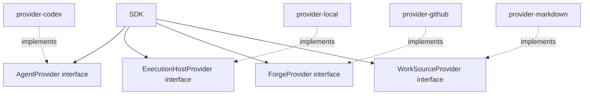

# Provider interface model

Provider interfaces live in the SDK. Provider packages implement them.

## Interfaces

- `AgentProvider`
- `ExecutionHostProvider`
- `ForgeProvider`
- `WorkSourceProvider`

## Rule

The interface is stable, host-neutral, and SDK-owned. Driver-specific SDK objects die inside provider packages.
