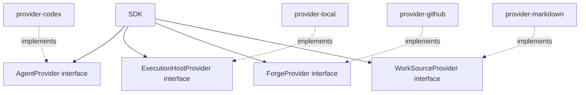

# Provider interface model

Provider interfaces are the four seam contracts the Control plane depends on. They live in the SDK.
Provider packages implement them; the SDK never imports provider packages. This is the hard
inversion-of-control boundary that keeps the Control plane host-neutral.



## The four interfaces

| Interface | Seam | What it abstracts |
|---|---|---|
| `AgentProvider` | Agent | The LLM agent: session linkage, delegation, approval relay, progress events |
| `ExecutionHostProvider` | Execution Host | Where and how the worker runs: spawn, containment, verify, process signals |
| `ForgeProvider` | Forge | Remote collaboration: push, PR creation/update, CI checks, reviews, merge |
| `WorkSourceProvider` | Work Source | Task authority: eligible tasks, claim/release, status writes, track grouping |

Canonical method signatures and neutral DTOs live in [provider-ports.md](provider-ports.md).
Provider deep specs keep driver mapping, evidence, conformance, and degraded-mode obligations.

Each interface is host-neutral and stable. Driver-specific SDK response types and protocol objects
belong inside the provider package, not in the interface itself. A provider package may only import
`sdk`; it must not import `cli`, `mcp`, `testkit`, or another provider package.

## Capability attestation

Every provider emits `CapabilityAttestation` events that record probed guarantees. The attestation
type is SDK-owned. Providers emit it; the SDK's Capability & Safety domain (core-02) evaluates it;
testkit only validates against the SDK type — it does not redefine it.

The canonical generic `CapabilityAttestation<Capability extends string = string>` payload lives in
[provider-ports.md](provider-ports.md). Its fields are:

```
capability, probeMethod, result (positive | negative), evidenceRef,
scope, expiry, driverVersion, platform, freshnessKey, at
plus optional details
```

A capability that cannot be freshly and positively attested is treated as absent — self-report is
never sufficient. The gate evaluation mechanics are in
[docs/design/30-domain-reference/core/capability-and-safety/](../30-domain-reference/core/capability-and-safety/README.md).
Provider-side attestation contracts are in the respective provider deep specs under
[docs/design/30-domain-reference/providers/](../30-domain-reference/providers/README.md).

<!-- DOCS-NAV (generated — do not edit by hand) -->

---

**↑ Up:** [SDK & packaging overview](./README.md) · **← Prev:** [SDK boundary](./sdk-boundary.md) · **Next →:** [SDK provider ports and capability attestation](./provider-ports.md)

<!-- /DOCS-NAV -->
