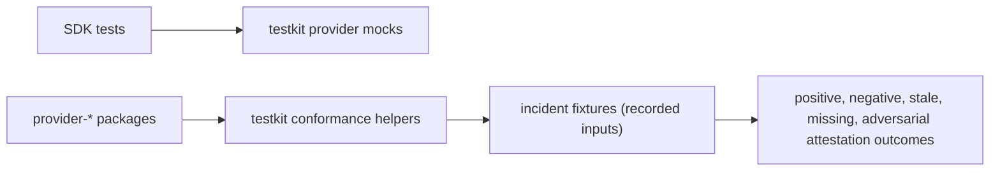

# Testkit and conformance

`testkit` is a test-only package. It is not a runtime dependency of any executable and must not
appear in the production dependency graph of `sdk`, `cli`, `mcp`, or any provider package.

## What testkit owns

- **Provider mocks** — in-memory implementations of `AgentProvider`, `ExecutionHostProvider`,
  `ForgeProvider`, and `WorkSourceProvider` for use in Control plane unit tests
- **Conformance suite helpers** — shared test utilities that provider packages use to validate their
  drivers against the SDK interfaces
- **Incident fixtures** — recorded cases (test inputs: event sequences, attestation sets, adversarial
  scenarios) used as inputs to conformance and recovery tests

## Replay and projection engine: SDK-owned, not testkit

The incident fixtures in testkit are **test inputs** — static data that exercises the system.
The engine that replays those event sequences and derives projections is **SDK-owned** (core-01 and
core-06). Testkit does not hold a replay runtime; it holds the fixture data that drives tests against
the SDK's replay engine. Implying otherwise would be incorrect: a replay or projection capability
must live in the SDK so it is available at runtime for recovery and analysis.

## What testkit imports

```txt
sdk
```

Testkit depends only on `sdk`. It must not import `cli`, `mcp`, or any provider package.

## What testkit must not own

The following belong to the SDK and must not be redefined in testkit:

- Production provider interfaces (`AgentProvider`, `ExecutionHostProvider`, `ForgeProvider`,
  `WorkSourceProvider`) from [provider-ports.md](provider-ports.md)
- `CapabilityAttestation` type definition from [provider-ports.md](provider-ports.md)
- Core DTOs and event types
- Runtime wiring or the `createWorkflowKit` factory

## Test strategy



Provider conformance suites must cover positive, negative, stale, and adversarial attestation cases.
Mock success alone is not conformance: a provider that passes only happy-path tests is not considered
conformant. Broken providers must fail the suite.

<!-- DOCS-NAV (generated — do not edit by hand) -->

---

**↑ Up:** [SDK & packaging overview](./README.md) · **← Prev:** [concrete providers](./concrete-providers.md) · **Next →:** [dependency rules](./dependency-rules.md)

<!-- /DOCS-NAV -->
