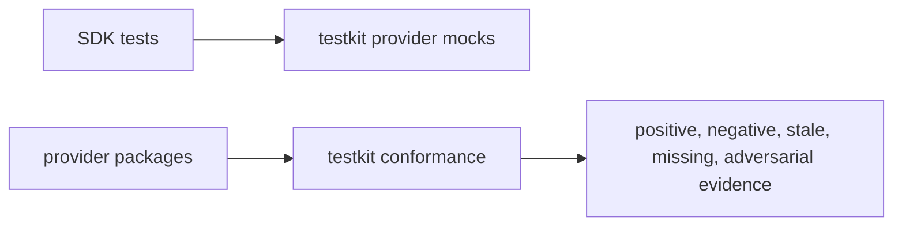

# Testkit and conformance

The testkit is test-only. It is not a runtime dependency.

## Testkit owns

```txt
provider mocks
conformance suite helpers
fixtures
incident replays
adversarial cases
```

## Testkit imports

```txt
sdk
```

## Testkit must not own

```txt
production provider interfaces
CapabilityAttestation
core DTOs
runtime wiring
```

Those belong to the SDK.

## Test strategy



Mock success alone is not conformance. Broken providers must fail the suite.
