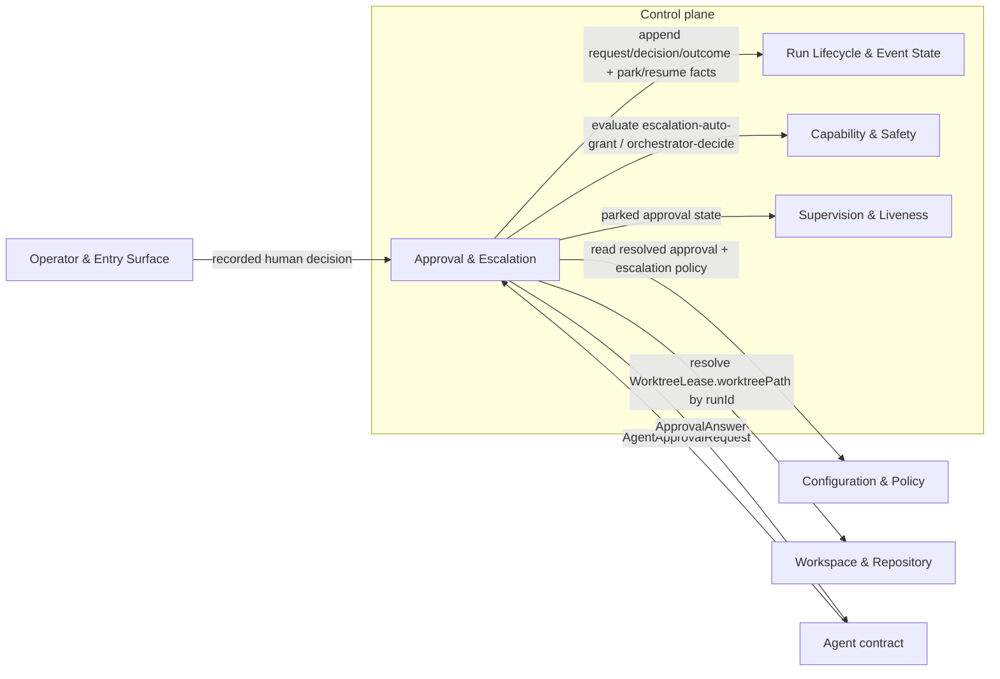
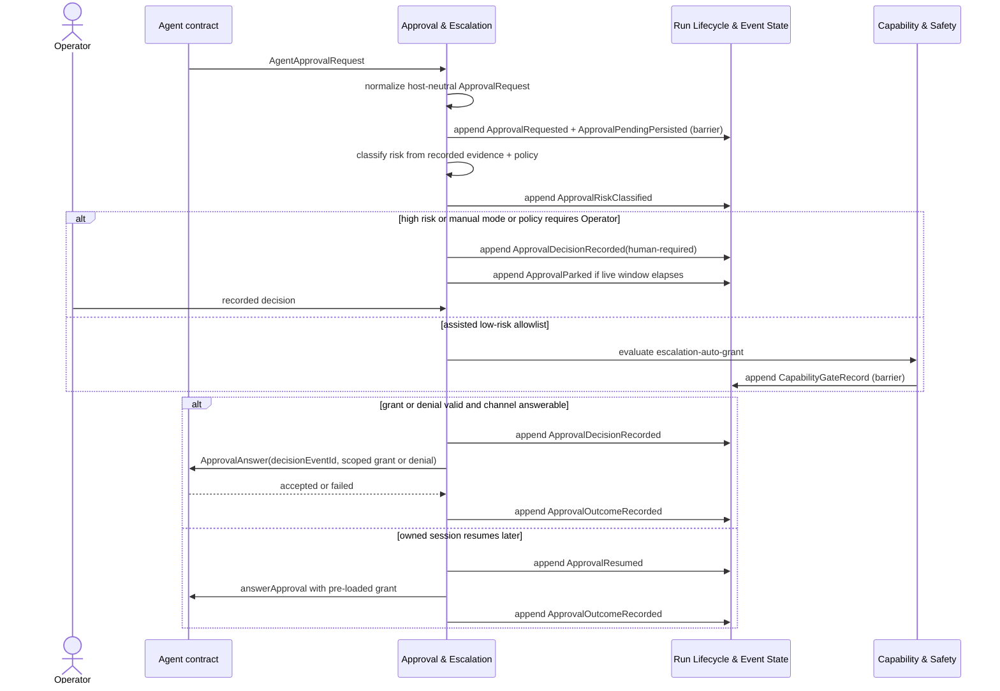

# Approval & Escalation - design

## Mandate

**Purpose.** Host-neutral adjudication of a worker's escalation requests, plus durable park/resume
that survives human latency and process death.

### Responsibilities (in scope)
- Normalizing and adjudicating an `ApprovalRequest`: deterministic risk classification
  (low/medium/high) and the mode ladder. **v1: policy allowlist → human** (manual/assisted).
  `auto`/LLM orchestrator-decide is deferred (AD-14); when added, the LLM verdict is a **consulted
  input recorded as an event** (not replayable logic) — the core decides whether to ask and validates
  bounds.
- Selecting the **tightest scoped grant** (per-command / per-command-prefix / per-host / session).
- The durable **park/resume** state machine: persist the pending request before deciding; time-box
  the live answer; resume the owned session with the grant pre-loaded.
- Audit events for every request, decision, and outcome.

### Out of scope
- The protocol transport that catches/answers the request — that is the Agent driver (prov-01).
- Risk/policy configuration shapes — owned by fnd-01 (this consumes them).

### Requirements owned
FR-4 (approval relay), NFR-SAFE, NFR-DET.

### Dependencies (Dependency Rule)
- Depends on: core-01 (events), core-02 (the `orchestrator-decide` / `escalation-auto-grant` gates),
  fnd-01 (resolved approval/escalation policy via `ResolvedPolicy`), fnd-02 (prompt persistence),
  fnd-03 (the run's `WorktreeLease.worktreePath` workspace boundary), and prov-01 (the Agent
  contract neutral request/decision/grant shapes).
- Must NOT: depend on the Codex driver or its enums directly.

### Required reading
Standard set + [core-02](../capability-and-safety/README.md),
[fnd-01](../../foundation/configuration-and-policy/README.md),
[fnd-03](../../foundation/workspace-and-repository/README.md), and the Agent contract in
[prov-01](../../providers/agent-execution/README.md).

### Deliverable
`README.md` defining: `ApprovalRequest` / `Decision` / `Outcome` (neutral); the risk rules; the mode
ladder; the scoped-grant taxonomy; the park/resume events and invariants.

### Definition of done (domain-specific)
- Adjudication is a pure function `(request, policy, mode, rules) → decision`.
- A parked approval survives process death and resumes via the owned session.
- High risk always escalates to a human regardless of mode.

### Open questions
- Circuit breaker for repeated identical denials.

## 1. Purpose & boundaries

Approval & Escalation owns the host-neutral Approval relay decision path inside the Control plane. It
normalizes worker escalation requests into an `ApprovalRequest`, persists pending state before any
decision, classifies risk deterministically, selects the v1 mode ladder, records a `Decision`, returns
the tightest scoped grant or denial, and records the final `Outcome`.

Out of scope: catching or answering the provider protocol request, which belongs to the Agent
contract; concrete Codex behavior; approval policy schema authoring, which belongs to Configuration &
Policy; provider capability probing, which belongs to provider domains; and lifecycle authorship,
which remains with Run Lifecycle & Event State.

Owned requirements: FR-4, NFR-SAFE, and NFR-DET. This design also satisfies NFR-TEST through
mock-only Control plane tests.

## 2. Required reading

- [README.md](../../../00-orientation/design-home-original.md)
- [requirements.md](../../../00-orientation/requirements.md)
- [decisions.md](../../../40-decisions/accepted-decisions.md)
- [architecture.md](../../../10-architecture/architecture.md)
- [conventions.md](../../../00-orientation/conventions.md)
- [glossary.md](../../../00-orientation/glossary.md)
- [_templates/domain-design-template.md](../../../_templates/domain-design-template.md)
- [README.md#mandate](README.md#mandate)
- [core-01 design](../run-lifecycle-and-state/README.md) and its contracts, writer, and
  lifecycle subfiles
- [core-02 design](../capability-and-safety/README.md) and its capability registry and gate
  record subfiles
- [fnd-01 design](../../foundation/configuration-and-policy/README.md) and its policy interfaces subfiles
- [fnd-03 design](../../foundation/workspace-and-repository/README.md) and its worktree lease
  lifecycle/events subfiles
- [prov-01 design](../../providers/agent-execution/README.md) and its Agent contract/capability subfiles

No later core-domain drafts and no concrete Driver designs were read or used.

## 3. Context diagram

Dependency Rule statement: `core-03` depends only on `core-01`, `core-02`, `fnd-01`, `fnd-02`
(`ArtifactStore` for prompt persistence), `fnd-03` (the run's `WorktreeLease.worktreePath` workspace
boundary), and the host-neutral Agent contract. It introduces no dependency on Codex, GitHub,
Markdown, Local, mock, or any concrete Driver behavior.

## 4. Design

The approval flow is `persist prompt -> normalize -> persist pending -> classify -> decide ->
answer or park -> record outcome`. Before `normalize`, the orchestration persists the Agent prompt to
an fnd-02 `ArtifactRef` and supplies its id as `ApprovalContext.promptRef`, alongside the
`AgentApprovalRequested` envelope `.at` as `ApprovalContext.requestedAt`; this keeps `normalize` a
pure total function that reads no ambient time. The request is always recorded before classification
or decision, so recovery can resume from the Event log after process death or human latency.

Low-level detail is split to keep this entry point focused:

- [Decision model](decision-model.md) defines neutral `ApprovalRequest`, `Decision`, and
  `Outcome` shapes, deterministic low/medium/high risk classification, the v1 mode ladder, and the
  scoped grant taxonomy.
- [Park/resume and failures](park-resume-and-failures.md) defines durable pending state,
  live answer time-boxing, owned-session resume with pre-loaded grants, and named fail-closed states.
- [Interfaces, events, and tests](interfaces-events-and-tests.md) defines consumed/exposed
  interfaces, audit events, projections, and mock-only testing strategy.

Core decisions:

- `ApprovalPendingPersisted` is the durable checkpoint and is appended at `barrier` durability before
  any decision.
- Classification and adjudication are pure functions of recorded evidence, resolved policy, mode,
  and caller-supplied time values.
- Final approval expiry is computed as
  `decisionDeadline = request.expiresAt ?? request.requestedAt + policy.approval.decisionWindowMs`.
  The built-in fnd-01 default is `900000` milliseconds; a live answer-channel deadline may park a
  request earlier, but it does not expire the durable pending request before `decisionDeadline`.
- High risk always escalates to a human regardless of mode.
- V1 supports `manual` and `assisted` only. `auto` and LLM adjudication are deferred by AD-14; later
  LLM judgment can enter only as a recorded input event.
- Assisted auto-grant is available only for low-risk policy allowlist matches after core-02 records an
  `escalation-auto-grant` allow. `orchestrator-decide` always denies with `capability-deferred` in v1.
- The selected policy-level grant is the tightest scope: `per-command`, `per-command-prefix`,
  `per-host`, or `session`; denial is a decision disposition, not a scope. Grant decisions must map
  deterministically to the approved Agent `ScopedGrant` before `ApprovalAnswer` is sent.
- Missing resolved policy/provenance, missing capability, missing Agent relay, ambiguous
  ownership/session linkage, unwritable Event log, or expired parked request fails closed to a named
  state and never continues by guess.

## 5. Contracts & interfaces

Core-03 exposes host-neutral `ApprovalRequest`, `Decision`, `Outcome`, failure states, policy-level
grant planning, Agent grant mapping, and pure classification/decision functions. It consumes core-01
`RunWriter`, replay, projections, lifecycle, and session linkage; core-02 `CapabilityGateRecord`;
fnd-01 resolved approval and escalation policy; fnd-03 `WorktreeLease.worktreePath` as the trusted
workspace boundary injected into `ApprovalContext`; and the Agent contract's neutral approval
request/answer channel and `ScopedGrant`. The canonical Agent seam dependency is the SDK
`AgentProvider` contract plus testkit mock/conformance surface; concrete Codex mapping is
production-readiness work outside core-03's build/test prerequisite.

The typed contract is in [Interfaces, events, and tests](interfaces-events-and-tests.md).

## 6. Events & data

Core-03 emits audit events for every request, decision, and outcome through core-01 envelopes:
`ApprovalRequested`, `ApprovalPendingPersisted`, `ApprovalRiskClassified`,
`ApprovalDecisionRecorded`, `ApprovalParked`, `ApprovalResumed`, and `ApprovalOutcomeRecorded`.
Barrier durability is required for pending, decision, park/resume, and outcome facts. Future
`ApprovalInputJudgmentRecorded` is reserved for LLM judgment-as-recorded-input and is not evaluated in
v1.

Event payloads and projection contributions are defined in
[Interfaces, events, and tests](interfaces-events-and-tests.md).

## 7. Behavior diagram

## 8. Failure & degraded modes

Named fail-closed states are defined in
[Park/resume and failures](park-resume-and-failures.md). Capability gates treat any active
approval failure state as `escalation-auto-grant` absent. Missing capability, missing Agent relay,
missing resolved policy/provenance, ambiguous ownership/session linkage, unwritable Event log, and
expired parked request fail closed to `blocked` or `expired`; they never allow worker execution to
continue by guess.

## 9. Testing strategy

NFR-TEST is met with a deterministic in-memory core-01 Run log, fake fnd-01 resolved policies, mock
Agent contract events, and mock core-02 gate records. Tests use zero real processes, network, Forge,
Work Source, Execution Host, filesystem, or concrete Driver behavior.

The complete strategy is in [Interfaces, events, and tests](interfaces-events-and-tests.md).
This satisfies FR-4 by relaying approvals through durable request/decision/outcome records,
NFR-SAFE by failing closed to named states when guarantees are unavailable, NFR-DET by making every
decision a pure function of recorded evidence, and NFR-TEST by using mocks only.

## 10. Open questions

- Decision-window default remains open from the charter.
- Circuit breaker for repeated identical denials remains open from the charter.
- Exact Operator decision event payload belongs to Operator & Entry Surface; this design requires it
  to be a recorded input event with Operator identity, decision, scope, reason, and timestamp.

## 11. Definition of done

- [x] All sections complete; guidance notes removed.
- [x] Files are focused; low-level detail is split into cohesive subfiles.
- [x] Complies with the Dependency Rule; dependencies listed and justified.
- [x] Uses glossary vocabulary.
- [x] States the FR/NFR ids satisfied; shows how NFR-TEST is met.
- [x] Failure/degraded modes defined (fail-closed).
- [x] Provider-domain validation is not applicable to this core domain.
- [x] Diagrams present and consistent with architecture.md naming.

<!-- DOCS-NAV (generated — do not edit by hand) -->

---

**↑ Up:** [core domain reference](../README.md) · **← Prev:** [Capability & Safety - gate evaluation and records](../capability-and-safety/gate-evaluation-and-records.md) · **Next →:** [Approval & Escalation - decision model](./decision-model.md)

**Children:** [Approval & Escalation - decision model](./decision-model.md) · [Approval & Escalation - park resume and failures](./park-resume-and-failures.md) · [Approval & Escalation - interfaces events and tests](./interfaces-events-and-tests.md)

<!-- /DOCS-NAV -->
