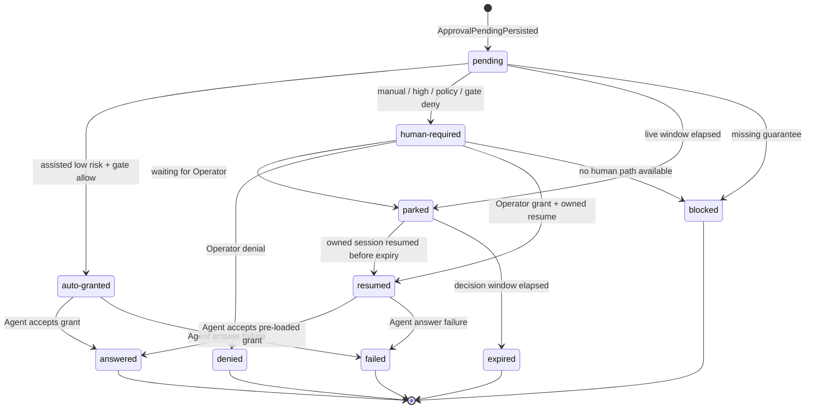

# Park/resume and failures

## Durable park/resume state machine

`ApprovalPendingPersisted` is the durable checkpoint. A live answer window may be short, but the
pending request remains authoritative until an outcome records answer, denial, expiry, block, or
failure.

States:

- `pending`: request and answer channel are durably recorded before any decision.
- `auto-granted`: assisted low-risk policy allowlist and committed `escalation-auto-grant` allow.
- `human-required`: human input is required because mode, risk, policy, or gate denial requires it.
- `parked`: live answer window elapsed or channel is live-only; the Run may transition
  `running -> parked` using the approval event as source evidence.
- `resumed`: owned session is resumed with the selected grant pre-loaded and a fresh `SessionLinked`
  or current non-ambiguous session linkage.
- `answered` / `denied`: Agent accepted the answer or denial.
- `expired`: `expiresAt` or policy decision window elapsed before a valid decision.
- `blocked`: required resolved policy/provenance, capability, Agent relay, ownership, session
  linkage, Event log durability, or grant mapping is unavailable.
- `failed`: an answer was attempted but the Agent reports a non-retryable failure.

Resume requires known `launch.linkage`, a current owned session, a non-expired pending request, and
fresh positive Agent attestations for `canResumeOwned` and `canRelayApproval`. If the pending channel
must survive human latency, `canPersistApprovalAnswerChannel` must also be fresh positive. The grant
is pre-loaded by passing the committed decision event id and grant into the Agent answer call before
worker execution continues.



## Failure and degraded modes

```ts
type ApprovalFailureState =
  | "approval-request-unrecordable"
  | "approval-relay-missing"
  | "approval-answer-channel-lost"
  | "approval-session-ambiguous"
  | "approval-owner-missing"
  | "approval-policy-unavailable"
  | "approval-risk-high"
  | "approval-gate-denied"
  | "approval-gate-unwritable"
  | "approval-grant-mapping-invalid"
  | "approval-expired"
  | "approval-event-log-unavailable"
  | "approval-outcome-ambiguous";
```

- `approval-request-unrecordable`: `ApprovalRequested` or `ApprovalPendingPersisted` cannot be
  appended at `barrier`; fail closed to `blocked`.
- `approval-relay-missing`: Agent `canRelayApproval` is absent, stale, negative, or wrong-scope;
  fail closed to `blocked`.
- `approval-answer-channel-lost`: channel cannot be answered after park/resume; fail closed to
  `blocked` or `parked` when Operator recovery can intervene.
- `approval-session-ambiguous`: core-01 launch linkage is unknown or ambiguous; fail closed to
  `blocked`.
- `approval-owner-missing`: current session is not owned or owned-remote for a resumable request;
  fail closed to `blocked`.
- `approval-policy-unavailable`: fnd-01 resolved policy, `ConfigResolved`, or per-field provenance is
  missing or failed with `provenance-write-failed`; fail closed to `blocked` before classification or
  decision.
- `approval-risk-high`: high risk requires human; assisted auto-grant is unavailable.
- `approval-gate-denied`: `escalation-auto-grant` denied; require human or deny per policy.
- `approval-gate-unwritable`: core-02 gate record cannot be appended; deny autonomous grant and
  fail closed to `blocked` if no human path is available.
- `approval-grant-mapping-invalid`: a policy-level grant cannot be mapped to the approved Agent
  `ScopedGrant` shape without widening scope; fail closed to `blocked`.
- `approval-expired`: parked request exceeded `expiresAt` or decision window; fail closed to
  `expired` and deny.
- `approval-event-log-unavailable`: replay/projection or append is unavailable; fail closed to
  `blocked`.
- `approval-outcome-ambiguous`: Agent answer result is missing or contradictory; fail closed to
  `failed` unless retry evidence allows a later recovery domain action.

Capability gates treat any active failure state above as `escalation-auto-grant` absent. Missing
resolved policy/provenance, missing capability, missing Agent relay, ambiguous ownership/session
linkage, unwritable Event log, invalid grant mapping, and expired parked request never continue
worker execution by guess.

<!-- DOCS-NAV (generated — do not edit by hand) -->

---

**↑ Up:** [Approval & Escalation](./README.md) · **← Prev:** [Approval & Escalation - decision model](./decision-model.md) · **Next →:** [Approval & Escalation - interfaces events and tests](./interfaces-events-and-tests.md)

<!-- /DOCS-NAV -->
