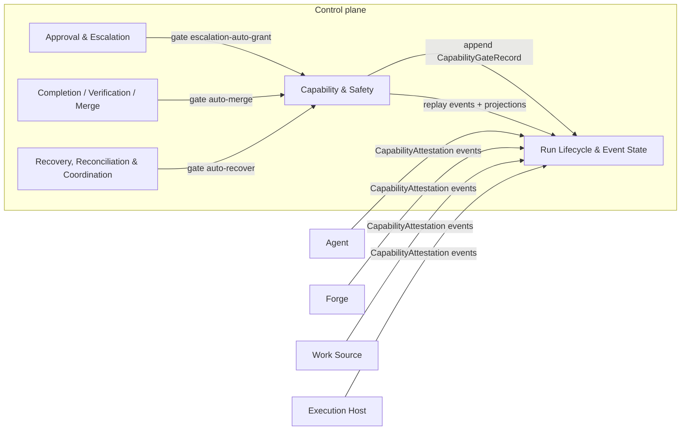
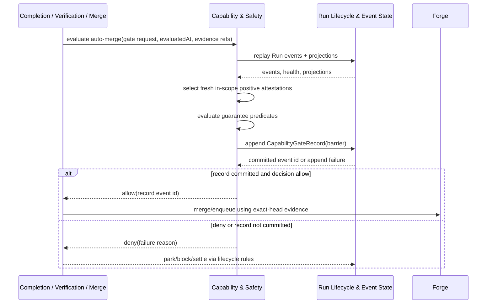

# Capability & Safety - design

## Mandate

**Purpose.** The "earn autonomy" model: the registry of autonomous capabilities and the gates that
unlock each only when its guarantees hold against recorded evidence and **capability attestations**.

### Responsibilities (in scope)
- The capability registry (`auto-merge`, `auto-recover`, `unattended-run`, `escalation-auto-grant`,
  `orchestrator-decide` [deferred, AD-14], …) and each one's **guarantee predicate**.
- Gate evaluation as pure predicates over recorded evidence + **capability attestations** (probed,
  fresh, expiring — never self-report); a `CapabilityGateRecord` event per evaluation (allow/deny +
  which guarantees held).
- The approval **modes** (`manual` / `assisted`; `auto` deferred per AD-14) as the high-level posture.
- Conservative defaults (capabilities off until guarantees can be attested).

### Out of scope
- The approval adjudication itself (core-03), merge mechanics (core-05), recovery actions (core-06).
  This domain provides the gates those domains consult.

### Requirements owned
FR-7 (gating of irreversible actions), NFR-SAFE, NFR-DET.

### Dependencies (Dependency Rule)
- Depends on: core-01 (evidence/events); the **capability attestations** emitted by the provider
  contracts (abstract, not drivers).
- Must NOT: depend on a concrete driver.

### Required reading
Standard set + [core-01](../run-lifecycle-and-state/README.md) and the capability
**attestation** model in [architecture.md](../../../10-architecture/architecture.md) §3.

### Deliverable
`README.md` defining: the capability list + each guarantee predicate; how attestations are consumed
(freshness/expiry; stale, absent, or negative → capability off); the gate evaluation + record; the
modes; the default-off posture.

### Definition of done (domain-specific)
- Gates are pure predicates; every gated decision emits a `CapabilityGateRecord`.
- A capability with no fresh positive attestation is treated as absent (never a silent allow).

### Open questions
- Capability granularity (e.g. split `auto-pr` from `auto-merge`).

## 1. Purpose & boundaries

Capability & Safety owns the "earn autonomy" contract for the Control plane. It defines the
capability registry, the guarantee predicates that unlock each autonomous power, the mode rules for
`manual` and `assisted`, and the `CapabilityGateRecord` event written for every capability
evaluation.

Out of scope: approval adjudication, park/resume mechanics, merge mechanics, recovery action
selection, Work Source status policy, provider probing, and concrete Driver behavior. This domain
evaluates recorded evidence and capability attestations; it never calls or imports a concrete Driver.

Owned requirements: FR-7 for gating irreversible actions, NFR-SAFE for fail-closed autonomy,
NFR-DET for pure recorded-evidence decisions, and NFR-TEST for mock-only Control plane tests.

## 2. Required reading

Read: [README.md](../../../00-orientation/design-home-original.md), [requirements.md](../../../00-orientation/requirements.md),
[decisions.md](../../../40-decisions/accepted-decisions.md), [architecture.md](../../../10-architecture/architecture.md),
[conventions.md](../../../00-orientation/conventions.md), [glossary.md](../../../00-orientation/glossary.md),
[_templates/domain-design-template.md](../../../_templates/domain-design-template.md), and
[README.md#mandate](README.md#mandate). Approved dependency read: [core-01 design](../run-lifecycle-and-state/README.md),
[contracts](../run-lifecycle-and-state/contracts.md),
[event log protocol](../run-lifecycle-and-state/event-log-writer-and-corruption.md), and
[projection/lifecycle rules](../run-lifecycle-and-state/projections-lifecycle-and-tests.md).
Provider contract inputs read: [prov-01](../../providers/agent-execution/README.md),
[prov-01 contracts](../../providers/agent-execution/contracts-and-conformance.md),
[prov-01 capabilities](../../providers/agent-execution/capabilities-and-conformance.md),
[prov-02](../../providers/forge-collaboration/README.md), [prov-03](../../providers/work-source/README.md),
[prov-04](../../providers/execution-host/README.md), and
[prov-04 contracts](../../providers/execution-host/contracts-and-conformance.md).
No later core-domain drafts were read or used.

## 3. Context diagram



Dependency Rule statement: `core-02` depends on `core-01` for Event log primitives and on provider
contract event payloads for capability attestations. It does not depend on Codex, GitHub, Markdown,
Local, mock, or any other concrete Driver.

## 4. Design

Low-level detail is split to keep this entry point focused:

- [Capability registry](capability-registry.md) defines the v1 capabilities and guarantee
  predicates.
- [Gate evaluation and records](gate-evaluation-and-records.md) defines attestation handling,
  self-report rejection, and the `CapabilityGateRecord` payload.

Core decisions: `manual` records explanations but denies autonomous powers; `assisted` can allow only
deterministic policy-enabled capabilities whose guarantees hold. `auto` mode and LLM adjudication are
deferred by AD-14, so `orchestrator-decide` always denies with `capability-deferred` in v1. Every
capability is default-off, and a missing fresh positive attestation is equivalent to absent
capability. Gate evaluation is a pure function of recorded Event log evidence, provider attestations,
projections, policy refs, and caller-supplied `evaluatedAt`. An `allow` decision is usable only after
`CapabilityGateRecord` is appended; if the record is unwritable, the caller must deny. The v1
containment floor for `unattended-run` and kill-dependent `auto-recover` is `process-group` or
stronger unless policy requires a stricter floor.

## 5. Contracts & interfaces

```ts
evaluateCapabilityGate(
  request: CapabilityGateRequest,
  replay: RunReplay,
  projections: RunProjections
): CapabilityGateRecordPayload
```

The complete types are in [Gate evaluation and records](gate-evaluation-and-records.md). The
record includes `allow`/`deny`, evaluated guarantees, attestation refs, mode, scope, evidence refs,
requested action, policy ref, and failure reason. Provider capability names remain contract-owned by
Agent, Forge, Work Source, and Execution Host.

Consumed interfaces: core-01 `RunEventLog`, `RunWriter`, `RunReplay`, `RunProjections`,
`RunLifecycleTransitioned`, `SessionLinked`, and provider `CapabilityAttestation` event payloads.
`core-02` has no concrete Driver interface.

## 6. Events & data

Consumed events: `CapabilityAttestation`, `RunLifecycleTransitioned`, `SessionLinked`,
`SessionLinkSuperseded`, provider evidence events, and caller-supplied evidence records for
completion, verification, approval, and recovery.

Emitted event: `CapabilityGateRecord` with `domain = "core-02"` and `barrier` durability because it
gates irreversible action or autonomous execution. This domain may expose latest-gate read models only
as pure projections over recorded gate records; it never writes projection state.

Core-01 degraded health, missing projections, stale writer rejection, or ambiguous session linkage
makes every autonomous capability absent.

## 7. Behavior diagram



## 8. Failure & degraded modes

- `mode-disallows-capability`, `policy-disallows-capability`, or `capability-deferred`: deny.
- `run-log-degraded`: replay/projection health is not usable; deny all autonomous capabilities.
- `required-evidence-absent` or `required-evidence-ambiguous`: deny.
- `attestation-absent`, `attestation-stale`, `attestation-negative`, `attestation-out-of-scope`,
  `attestation-contradictory`, or `attestation-non-replayable`: deny.
- `self-report-only`: worker prose, Guardian text, or an unprobed driver claim is the only support;
  deny.
- `gate-record-unwritable`: the record cannot be appended at required durability; caller must not act.

The caller chooses the lifecycle consequence through core-01 legal transitions: park for Operator
attention when a human can supply a recorded decision, block when a required guarantee is unavailable,
or fail when evidence classifies an unrecoverable error. `core-02` supplies the deny reason; it does
not select recovery actions.

## 9. Testing strategy

NFR-TEST: tests use a deterministic in-memory `core-01` Run log and mock provider contract events
only. No real processes, network, Forge, Agent, Work Source, Execution Host, filesystem, or Driver is
used in Control plane tests.

Required tests: table tests for every capability in both modes; replay property tests for identical
`CapabilityGateRecord` payloads; freshness, expiry, scope, negative, contradictory, and
non-replayable attestation tests; fail-closed self-report/schema-only tests; append-failure tests; and
adversarial mock tests where attestations are omitted, delayed, stale, wrong-scope, or lying.

This satisfies FR-7 by gating irreversible/autonomous actions, NFR-SAFE by denying unknown or
ambiguous guarantees, NFR-DET by making the decision a pure function of recorded evidence, and
NFR-TEST by using mocks only for core tests.

## 10. Open questions

- Whether `auto-pr` should be a separate capability from `auto-merge`; current registry treats PR
  creation/update as a completion-domain gate and reserves `auto-merge` for the irreversible merge
  boundary.
- Whether the v1 unattended containment floor should be stricter than `process-group` on platforms
  where stronger `kernel-tree` or `job-object` containment is available.
- The exact policy shape that enables assisted capabilities belongs to Configuration & Policy; this
  design assumes a resolved `policyRef` and does not define that schema.

## 11. Definition of done

- [x] All sections complete; guidance notes removed.
- [x] Files are focused; low-level registry and gate-record detail is split into cohesive subfiles.
- [x] Complies with the Dependency Rule; dependencies listed and justified.
- [x] Uses glossary vocabulary.
- [x] States the FR/NFR ids satisfied; shows how NFR-TEST is met.
- [x] Failure/degraded modes defined (fail-closed).
- [x] Provider-domain validation is not applicable to this core domain.
- [x] Diagrams present and consistent with architecture.md naming.
- [x] Open questions captured, not silently resolved.

<!-- DOCS-NAV (generated — do not edit by hand) -->

---

**↑ Up:** [core domain reference](../README.md) · **← Prev:** [Run Lifecycle & Event State - projections, lifecycle, and tests](../run-lifecycle-and-state/projections-lifecycle-and-tests.md) · **Next →:** [Capability & Safety - capability registry](./capability-registry.md)

**Children:** [Capability & Safety - capability registry](./capability-registry.md) · [Capability & Safety - gate evaluation and records](./gate-evaluation-and-records.md)

<!-- /DOCS-NAV -->
