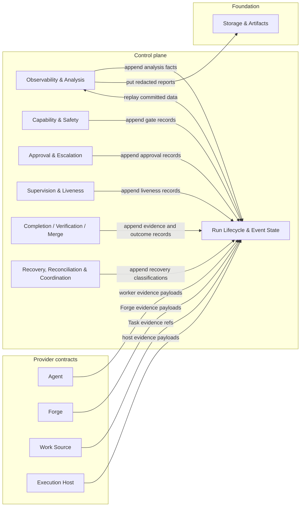
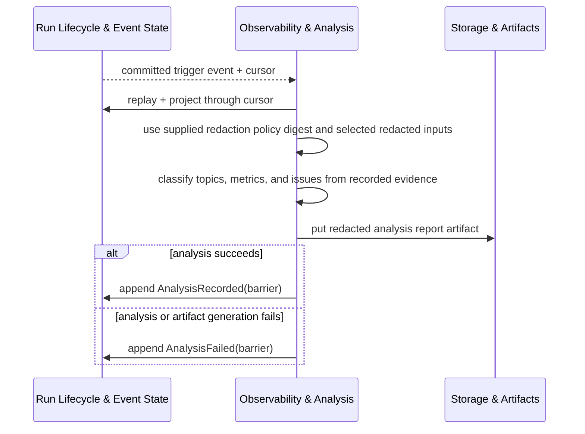

# Observability & Analysis - design

## Mandate

**Purpose.** Structured telemetry at the source, and analysis that **auto-fires** on every terminal /
blocked / supervision-lost transition and correlates the event log.

### Responsibilities (in scope)
- The telemetry event envelope and topic taxonomy; honest metrics (`available` / `unavailable` /
  `partial`, **never coerced to zero**).
- The analyzer: a **pure function** over the event log + projections that emits correlated issues with
  evidence refs; the issue taxonomy.
- Auto-fire triggers (terminal, blocked, supervision-lost, recovery-decision, stale-progress) and the
  `analysis-failed` fallback — invariant: every terminal run with usable replay and a writable Run log
  has an analysis **or** an `analysis-failed` record.
- Redaction (no raw secrets/tokens/prompts in normal reports).

### Out of scope
- Emitting the raw domain events (each domain emits its own).
- Operator surfacing of analysis (edge-01).

### Requirements owned
FR-9 (observability & analysis), NFR-OBS.

### Dependencies (Dependency Rule)
- Depends on: core-01 (the event log).
- Must NOT: depend on a concrete driver.

### Required reading
Standard set + [core-01](../run-lifecycle-and-state/README.md).

### Deliverable
`README.md` defining: the telemetry envelope; the issue taxonomy; auto-fire triggers + the invariant;
the metric-honesty model; the redaction policy.

### Definition of done (domain-specific)
- Every terminal run has an analysis or `analysis-failed`; the analyzer is pure/replayable.
- Metrics are never faked; unavailable is recorded as unavailable, not zero.

### Open questions
- Analysis artifact: write-once terminal vs re-projection. OTel export later.

## 1. Purpose & boundaries

Observability & Analysis defines the Control plane contract for structured telemetry, metric honesty,
and deterministic run analysis. It reads committed core-01 Run events, core-01 projections, and
redacted artifact refs, then appends an `AnalysisRecorded` or `AnalysisFailed` fact for every
auto-fire trigger.

Out of scope: emitting raw domain events, authoring lifecycle state, deciding approvals, recovery,
completion, merge, or capability gates, surfacing reports to the Operator, exporting to OTel, and
calling provider clients or concrete Drivers. Provider-specific facts are observable only when a
provider seam recorded them as event payloads or artifact refs.

Dependency Rule statement: core-07 depends only on core-01 for the Run log, envelopes, projections,
and `EvidenceEventRef`, and on fnd-02 for write-once analysis artifacts. Sibling core event types and
provider seam evidence are consumed as data from the core-01 log, not as code dependencies.
`redactionPolicyDigest` is a digest string supplied in the analysis request, so fnd-04 is not a
dependency. Core-07 introduces no dependency on Codex, GitHub, Markdown, Local, mock, or live
external state.

## 2. Required reading

Read: the standard design docs, the domain template, this domain's
[README.md#mandate](README.md#mandate), approved core-01 contracts, approved
[fnd-02](../../foundation/storage-and-artifacts/README.md), and sibling/provider event payload docs only as
data catalogs for events already present in the core-01 log. No concrete Driver behavior was used.

## 3. Context diagram



## 4. Design

Core-07 classifies structured Run events into a stable telemetry taxonomy, computes honest metrics
and correlated issues as a pure analysis function, and ensures every auto-fire trigger has a durable
`AnalysisRecorded` or `AnalysisFailed` fact when the Run log can be replayed and appended.

Observable inputs are limited to committed `RunEventEnvelope` metadata, approved payload contracts
carried in those envelopes, core-01 projections, fnd-02 replay health and artifact metadata, redacted
artifact content explicitly selected by refs, redaction policy digests supplied by the request, and
caller-supplied clock values. Derived data includes telemetry topics, issue correlations, metric
values, report artifacts, and latest-analysis projections.

Live provider state, raw Driver output, raw prompts, raw secrets, unredacted artifacts, cached
projections, and worker prose without corroborating evidence are not observable inputs. Unknown or
ambiguous evidence becomes an issue or an unavailable metric; it never becomes a guessed value.

The detailed telemetry topic taxonomy, issue taxonomy, typed metric wrapper, analyzer input/output
types, retention/privacy boundaries, and failure reason catalog are in
[Analysis contract](analysis-contract.md). They are split because those types are cohesive
low-level detail used by tests and future implementations, while this file remains the domain entry
point.

Core decisions:

- The analyzer is pure over replay/projections, selected redacted artifacts, explicit `analyzedAt`,
  analyzer version, rule-set digest, and a supplied redaction policy digest.
- `AnalysisRecorded` and `AnalysisFailed` are post-terminal-safe non-lifecycle facts under core-01.
- Recording an analysis outcome carries the full `AnalysisRequest`, input health, and append result;
  an unwritable record is surfaced as `analysis-record-unwritable`, not hidden behind a bare receipt.
- Analysis reports are redacted-by-default write-once artifacts; scratch refs cannot satisfy
  analysis, gates, exports, or the terminal invariant.
- Metrics use `available`, `partial`, or `unavailable`; unavailable values are never coerced to `0`,
  false, empty arrays, or success.
- Analysis event ids are derived from the final canonical payload digest, and same-attempt retries
  reuse the original `AnalysisRecordInput` bytes exactly.
- Reconciliation note (2026-06-19): the terminal-analysis invariant has one explicit exception:
  corrupt or unwritable Run logs cannot always record `AnalysisFailed`. That condition is surfaced as
  `analysis-record-unwritable` / `analysis-invariant-missing`, disables observability-dependent
  autonomy, and is not treated as a satisfied analysis.

## 5. Contracts & interfaces

Core-07 exposes:

```ts
classifyTrigger(event: RunEventEnvelope, projections: RunProjections): AnalysisTrigger | null
analyze(request: AnalysisRequest, snapshot: AnalysisSnapshot): AnalysisResult | AnalysisFailure
recordAnalysisOutcome(input: AnalysisRecordInput, writer: RunWriter):
  Result<AnalysisRecordCommit, AnalysisRecordFailure>
```

Consumed: core-01 `RunEventLog`, `RunWriter`, `RunReplay`, `RunProjections`, `RunEventCursor`,
`EvidenceEventRef`, and event envelopes; sibling-domain and provider-seam payloads as committed log
data; and fnd-02 `ArtifactStore`. Core-07 never opens provider clients, reads the filesystem
directly, imports Drivers, imports sibling core/provider implementation types, or writes projections.
Detailed types are in
[Analysis contract](analysis-contract.md).

## 6. Events & data

Core-07 emits:

- `AnalysisRecorded` (`barrier`): trigger, evaluated cursor, analyzer version, rule-set digest,
  redaction policy digest, input health, issue summaries, honest metrics, evidence refs, and report
  artifact refs.
- `AnalysisFailed` (`barrier`): trigger, evaluated cursor, analyzer version, stable failure reason,
  input health, and evidence refs. It is the required fallback when analysis or artifact generation
  cannot complete but the Run log is writable.

Auto-fire triggers are derived from committed events:

- terminal `RunLifecycleTransitioned` to `completed`, `failed`, or `canceled`;
- `RunLifecycleTransitioned` to `blocked`, recorded only as `blocked-transition`;
- `SupervisionLost` or `LivenessStateChanged` to `supervision-lost`;
- `LivenessTimerExpired` or `LivenessStateChanged` to `stale`;
- `RecoveryClassified`, `RecoveryActionPlanned`, `RecoveryActionApplied`, or `ReconciliationBlocked`.

Trigger classification is first-match in the order above, so a single committed event produces at
most one trigger kind. For a trigger event id, analyzer version, and rule-set digest, exactly one
deterministic analysis event id is current, whether the outcome is `AnalysisRecorded` or
`AnalysisFailed`. A later analysis may supersede it only by citing the prior analysis event id and a
later replay cursor. The invariant is: every terminal Run with usable replay health and a writable Run
log has `AnalysisRecorded` or `AnalysisFailed` at or after the terminal lifecycle sequence. If replay
is corrupt or the Run log is unwritable, the invariant is explicitly unmet and reported through
`analysis-input-degraded`, `analysis-record-unwritable`, or `analysis-invariant-missing` rather than
silently waived.

NFR-OBS wording that names an `analysis` or `analysis-failed` record maps to the concrete
`AnalysisRecorded` and `AnalysisFailed` event types, with schemas `kit-vnext.analysis-recorded.v1`
and `kit-vnext.analysis-failed.v1`; invariant tests target those event names and schemas.

## 7. Behavior diagram



## 8. Failure & degraded modes

Named modes are `analysis-input-degraded`, `analysis-artifact-unavailable`,
`analysis-redaction-unavailable`, `analysis-rule-error`, `analysis-record-unwritable`, and
`analysis-invariant-missing`.

When analysis, artifact storage, redaction, or a rule fails but the Run log remains writable, core-07
appends `AnalysisFailed`. If neither `AnalysisRecorded` nor `AnalysisFailed` can be appended,
autonomous capabilities depending on observability are absent, and recovery treats terminal analysis
as missing until a supported writer records it. Core-07 never repairs by editing logs, writing
projections, clearing leases, calling providers, or changing lifecycle state.

## 9. Testing strategy

Requirements satisfied: FR-9 and NFR-OBS. The design also supports NFR-DET, NFR-SAFE, NFR-SEC, and
NFR-TEST through pure replay analysis, fail-closed analysis failures, redaction, and mock-only tests.

NFR-TEST: tests use an in-memory core-01 Run log, deterministic fnd-02 artifact fake, supplied
redaction policy digests, and mock approved-domain event payloads. No real processes, filesystem,
network, or concrete Driver is used.

Required tests: generated trigger coverage; terminal analysis invariant tests; replay-determinism and
stable-ordering property tests; metric honesty tests for `partial` and `unavailable`; redaction tests
over generated secrets, prompts, URLs, headers, and command output refs; fallback tests for artifact,
redaction, rule, replay, and append failures; and adversarial mocks that omit, delay, or contradict
liveness, recovery, merge, capability, provider, or credential evidence.

## 10. Open questions

- OTel export remains deferred. This design records analysis facts and redacted artifacts only.
- Retention class names for analysis reports are policy-owned; until policy supplies defaults, the
  producer must name retention explicitly and align it with the Run event-log lifetime.
- Terminal analysis may reuse the terminal writer epoch until lease expiry, ratified in core-01's
  post-terminal append rule. A fresh epoch is required only after lease loss.

## 11. Definition of done

- [x] All sections complete; guidance notes removed.
- [x] Files are focused; low-level taxonomy and type detail is split into one cohesive subfile.
- [x] Complies with the Dependency Rule; dependencies listed and justified.
- [x] Uses glossary vocabulary.
- [x] States the FR/NFR ids satisfied; shows how NFR-TEST is met.
- [x] Failure/degraded modes defined (fail-closed).
- [x] Provider-domain validation is not applicable to this core domain.
- [x] Diagrams present and consistent with architecture.md naming.
- [x] Open questions captured, not silently resolved.
