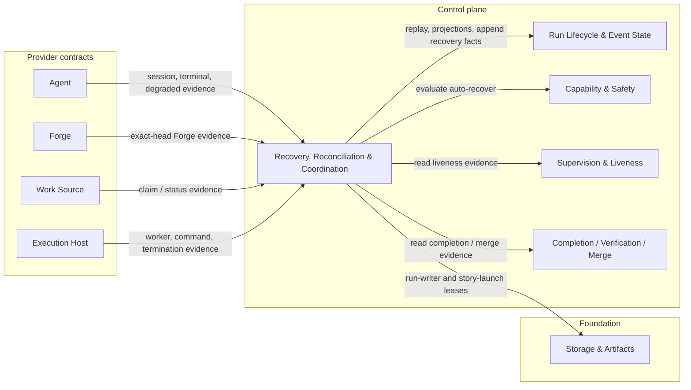
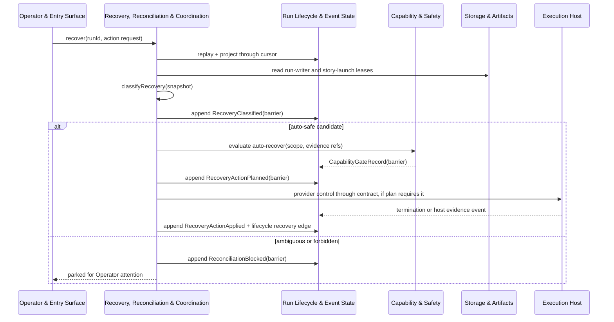

# Recovery, Reconciliation & Coordination - design

## Mandate

**Purpose.** Classify non-clean terminals from evidence and recover **in-band**; coordinate launches so
the same work is never run twice. No manual artifact edits, ever.

### Responsibilities (in scope)
- The **recovery classifier**: a pure function mapping run evidence to a named recovery state and an
  **action-safety class** (auto-safe / operator-required / forbidden).
- **Repo-level coordination**: the `run-writer` lease and a repo-wide **`story-launch` lease** (catches
  duplicates across separate processes), backed by the fnd-02 lease primitive; kept lean for local (no
  scheduler/admission system in v1).
- Reconciliation and stale-launch clearing as **appended events via supported controls** — not edits.
- Resume-vs-restart semantics (resume an owned session vs restart from a safe empty state).

### Out of scope
- The actual resume/kill mechanics (Execution Host); merge (core-05); event-log primitives (core-01).

### Requirements owned
FR-8 (recovery, reconciliation & coordination), NFR-SAFE, NFR-DET, NFR-SCALE.

### Dependencies (Dependency Rule)
- Depends on: core-01 (events), core-02 (the `auto-recover` gate), core-04 (liveness and supervision
  evidence), core-05 (completion, merge, and post-merge evidence), fnd-02 (the lease/lock primitive);
  all four seams (for recovery evidence).
- Must NOT: depend on a concrete driver.

### Required reading
Standard set + [core-01](../run-lifecycle-and-state/README.md),
[core-02](../capability-and-safety/README.md), and the lease primitive in
[fnd-02](../../foundation/storage-and-artifacts/README.md).

### Deliverable
`README.md` defining: the recovery state taxonomy; the action-safety matrix; the repo-level lease model
(lean for local; remote-ready); reconciliation events; resume-vs-restart rules.

### Definition of done (domain-specific)
- Classifier is pure; never blind-relaunches; never clears a claim after unverified termination.
- Duplicate launches are caught across processes; recovery is appended events, no manual edits.

### Open questions
- None for v1. Auto-recover eligibility is resolved by the design's action-safety matrix; execution
  still requires the core-02 `auto-recover` gate. Scheduler/admission remains deferred.

## 1. Purpose & boundaries

Recovery, Reconciliation & Coordination owns FR-8: classify non-clean Run evidence, recover in-band,
and coordinate repo-level launches so the same Task is not run twice. Decisions are pure functions of
recorded evidence plus explicit clock input.

Out of scope: physical append and lease mechanics are fnd-02; event envelopes, lifecycle validation,
and projections are core-01; capability authorization is core-02; liveness is core-04; completion and
merge outcomes are core-05; resume/kill mechanics are provider controls through Agent and Execution
Host. This domain never edits logs, projections, Work Source records, or provider artifacts directly.

## 2. Required reading

Read in order: `README.md`, `requirements.md`, `decisions.md`, `architecture.md`,
`conventions.md`, `glossary.md`, `_templates/domain-design-template.md`, this domain's
`README.md#mandate`, approved core-01/core-02/fnd-02 designs and subfiles, approved provider seam designs
for Agent, Forge, Work Source, and Execution Host, and approved core-04/core-05 designs and subfiles.
No core-07 draft or concrete Driver behavior was read or used.

## 3. Context diagram



## 4. Design

Detailed classifier, lease, and resume/restart rules are in
[Recovery model](recovery-model.md). Entry-point decisions:

- `classifyRecovery(snapshot)` is pure over core-01 replay/projections, fnd-02 lease snapshots,
  core-04 liveness, core-05 completion/merge facts, provider evidence, and caller-supplied
  `observedAt`; it never calls providers, reads live systems, or mutates artifacts.
- Output is a named `RecoveryState`, `ActionSafetyClass` (`auto-safe`, `operator-required`, or
  `forbidden`), and action. Ambiguous evidence fails closed to a named state.
- `auto-safe` still requires a committed core-02 `CapabilityGateRecord` allowing `auto-recover` for
  the exact action scope; otherwise the Run parks for the Operator.
- Coordination uses only fnd-02 leases: `run-writer:<runId>` for append authority and
  `story-launch:<workSourceId>:<trackId>:<taskId>` for duplicate-launch prevention. Holder text is
  diagnostic; epoch fencing and expiry are the safety mechanism.
- Duplicate launch prevention uses leases plus event evidence. Expired launch clearing is only fnd-02
  lease acquisition plus appended recovery events; process absence never clears it.
- Resume reconnects to a current non-superseded owned session with positive provider evidence.
  Restart is only from `safe-empty-restartable` after launch, writer, owner, termination, approval,
  and Work Source claim evidence are all safe.
- Recovery never clears a claim after unverified termination, blind relaunches, or treats worker
  prose as completion, termination, or ownership evidence.

## 5. Contracts & interfaces

```ts
interface RecoveryCoordinator {
  classify(snapshot: RecoveryEvidenceSnapshot): RecoveryClassification;
  plan(input: RecoveryPlanInput, classification: RecoveryClassification): RecoveryPlan;
  record(input: RecoveryRecordInput, writer: RunWriter): RunAppendReceipt | RunAppendFailure;
}
interface RecoveryPlanInput {
  runId: string;
  mode: "manual" | "assisted";
  policyRef: string;
  requestedAction: RecoveryAction;
  scope: CapabilityGateScope;
  evaluatedThrough: RunEventCursor;   // replay cursor; also feeds the deterministic planId hash
}
interface RecoveryRecordInput {
  runId: string;
  plan: RecoveryPlan;
  appliedControl?: { kind: NonNullable<RecoveryPlan["providerControl"]>; evidenceRefs: EvidenceEventRef[] };
  outcome: "applied" | "blocked";
  blockedReason?: string;          // required when outcome === "blocked"
  gateRef?: CapabilityGateRecord;
  evaluatedThrough: RunEventCursor;
}
interface RecoveryPlan {
  planId: string;
  classification: RecoveryClassification;
  requiresGate?: CapabilityGateRequest;
  lifecycleTarget?: RunLifecycleState;
  providerControl?: "agent-resume" | "host-terminate" | "forge-refresh" | "work-source-release";
}
```

Consumed: core-01 replay, projections, writer, lifecycle rules, session linkage, and cursors;
core-02 `CapabilityGateRecord`; core-04 liveness and termination facts; core-05 completion and
post-merge facts; fnd-02 `LeaseStore`; provider seam evidence events and capability attestations.

Exposed: pure classifier, repo launch lease naming rules, recovery plan records, and reconciliation
event payloads. Provider controls are invoked only after a committed plan and any required capability
gate; this domain never imports a Driver.

Dependency Rule statement: `core-06` depends only on approved core contracts, provider seams, and
fnd-02. It introduces no concrete Driver dependency and no reverse dependency from contracts or
foundation into the Control plane.

## 6. Events & data

Barrier events emitted with `domain = "core-06"`: `StoryLaunchLeaseAcquired`,
`DuplicateLaunchBlocked`, `RecoveryClassified`, `RecoveryActionPlanned`, `RecoveryActionApplied`,
`StaleLaunchClearanceRequested`, `StoryLaunchLeaseCleared`, and `ReconciliationBlocked`. Each carries
only its own required fields through a named `*Payload` (lease epochs only for lease events; classifier
rule version and replay cursor for `RecoveryClassified`; selected action, required gate, lifecycle
target, and provider control for the plan/apply events; parked reason for `ReconciliationBlocked`):

```ts
interface StoryLaunchLeaseAcquiredPayload {
  schema: "kit-vnext.story-launch-lease-acquired.v1";
  runId: string;
  storyLaunchKey: string;          // workSourceId:trackId:taskId
  leaseEpoch: number;
  acquiredAt: string;
  sourceEventIds: string[];
}

interface DuplicateLaunchBlockedPayload {
  schema: "kit-vnext.duplicate-launch-blocked.v1";
  runId: string;
  storyLaunchKey: string;
  incumbentLeaseEpoch: number;
  blockedAt: string;
  sourceEventIds: string[];
}

interface RecoveryClassifiedPayload {
  schema: "kit-vnext.recovery-classified.v1";
  runId: string;
  recoveryState: RecoveryState;
  actionSafety: ActionSafetyClass;
  recommendedAction: RecoveryAction;
  classifierRuleVersion: string;
  cursor: RunEventCursor;          // replay cursor classified through
  evidenceRefs: EvidenceEventRef[];
  classifiedAt: string;
}

interface RecoveryActionPlannedPayload {
  schema: "kit-vnext.recovery-action-planned.v1";
  runId: string;
  planId: string;
  selectedAction: RecoveryAction;
  requiredGate?: "auto-recover";
  lifecycleTarget?: RunLifecycleState;
  providerControl?: NonNullable<RecoveryPlan["providerControl"]>;
  plannedAt: string;
  sourceEventIds: string[];
}

interface RecoveryActionAppliedPayload {
  schema: "kit-vnext.recovery-action-applied.v1";
  runId: string;
  planId: string;
  appliedControl: NonNullable<RecoveryPlan["providerControl"]>;
  gateRef?: CapabilityGateRecord;
  appliedEvidenceRefs: EvidenceEventRef[];
  appliedAt: string;
  sourceEventIds: string[];
}

interface StaleLaunchClearanceRequestedPayload {
  schema: "kit-vnext.stale-launch-clearance-requested.v1";
  runId: string;
  storyLaunchKey: string;
  expiredLeaseEpoch: number;
  nextLeaseEpoch: number;
  requestedAt: string;
  evidenceRefs: EvidenceEventRef[];
}

interface StoryLaunchLeaseClearedPayload {
  schema: "kit-vnext.story-launch-lease-cleared.v1";
  runId: string;
  storyLaunchKey: string;
  clearedLeaseEpoch: number;
  clearedAt: string;
  sourceEventIds: string[];
}

interface ReconciliationBlockedPayload {
  schema: "kit-vnext.reconciliation-blocked.v1";
  runId: string;
  recoveryState: RecoveryState;
  parkedReason: string;      // -> operator-notice summary
  severity: "operator-attention" | "info";
  evidenceRefs: EvidenceEventRef[];   // -> sourceEventRef
  cursor: RunEventCursor;
  blockedAt: string;
}
```

`ReconciliationBlockedPayload` carries the fields the operator surface consumes
(see [Operator Surface - attention, explainability & triggers](../../edge/operator-surface/attention-explainability-and-triggers.md)):
a summary (`parkedReason`), a `severity`, and `evidenceRefs`.

Core-06 contributes a `recovery` projection: latest classification by Run, active `story-launch`
lease ref, duplicate-launch status, latest recovery plan, and whether recovery is parked. The
projection is pure replay only and never writes state.

Lifecycle transitions remain core-01 events. Core-06 may request only approved recovery edges:
`runner-verifying -> running`, `forge-waiting -> runner-verifying`,
`merge-waiting -> forge-waiting`, `settling -> merge-waiting`, or terminal `blocked`/`failed` when
evidence requires it. Every transition cites recovery event ids.

## 7. Behavior diagram



## 8. Failure & degraded modes

Named modes: `lease-unavailable` for missing/stale/degraded lease guarantees; `log-unwritable` and
`log-corrupt`; `owner-ambiguous`; `termination-ambiguous`; `supervision-stale-ambiguous`;
`merge-outcome-ambiguous`; `provider-evidence-gap`; and `manual-edits-forbidden`. These prohibit
resume, kill, clear, restart, or completion whenever the required guarantee is absent or ambiguous.

Capability gates treat every ambiguous, corrupt, unwritable, or lease-degraded mode as
`auto-recover` absent. Operator decisions are recorded inputs; they do not make ambiguous evidence
unambiguous unless followed by supported provider or Work Source controls that record new evidence.

## 9. Testing strategy

Requirements satisfied: FR-8, NFR-SAFE, NFR-DET, NFR-SCALE, and NFR-TEST.

NFR-TEST: tests use an in-memory core-01 log, deterministic fnd-02 lease fake, mock provider events,
mock core-02 gate records, mock core-04 liveness facts, and mock core-05 outcome facts. No real
processes, filesystem, network, Forge, Agent, Work Source, Execution Host, or concrete Driver is
used.

Required tests: classifier determinism and stable failure ordering; table tests for every state,
safety class, and action; duplicate launch races; stale/expired/degraded lease cases; resume only for
known owned sessions; restart only from `safe-empty-restartable`; same-scope `auto-recover` gate
enforcement; lifecycle edge legality; corrupt/unwritable log handling; stale supervision and
ambiguous merge outcomes; adversarial mocks that omit, delay, or lie about ownership, terminal,
claim, lease, or provider evidence.

NFR-SCALE is met for v1 by repo-wide lease coordination across local processes without scheduler or
admission machinery. The same lease names and fencing model fit a later remote Execution Host driver
without changing core classifier logic.

## 10. Open questions

None. The charter's auto-recover default question is resolved here: no state is auto-recovered by
default. A state is autonomous only when the classifier returns `auto-safe`, policy/mode permit it,
and a committed core-02 `auto-recover` gate allows the exact action scope.

## 11. Definition of done

- [x] All sections complete; guidance notes removed.
- [x] Files are focused; detailed classifier and lease rules are split by cohesive sub-topic.
- [x] Complies with the Dependency Rule; dependencies listed and justified.
- [x] Uses glossary vocabulary.
- [x] States FR-8 and NFR-SAFE/NFR-DET/NFR-SCALE/NFR-TEST; shows how NFR-TEST is met.
- [x] Failure/degraded modes defined and fail closed.
- [x] Provider-domain validation is not applicable to this core domain.
- [x] Diagrams present and consistent with architecture.md naming.
- [x] Open questions captured.

<!-- DOCS-NAV (generated — do not edit by hand) -->

---

**↑ Up:** [core domain reference](../README.md) · **← Prev:** [Completion, Verification & Merge - evidence model and predicates](../completion-and-merge/evidence-model-and-predicates.md) · **Next →:** [Recovery, Reconciliation & Coordination - recovery model](./recovery-model.md)

**Children:** [Recovery, Reconciliation & Coordination - recovery model](./recovery-model.md)

<!-- /DOCS-NAV -->
