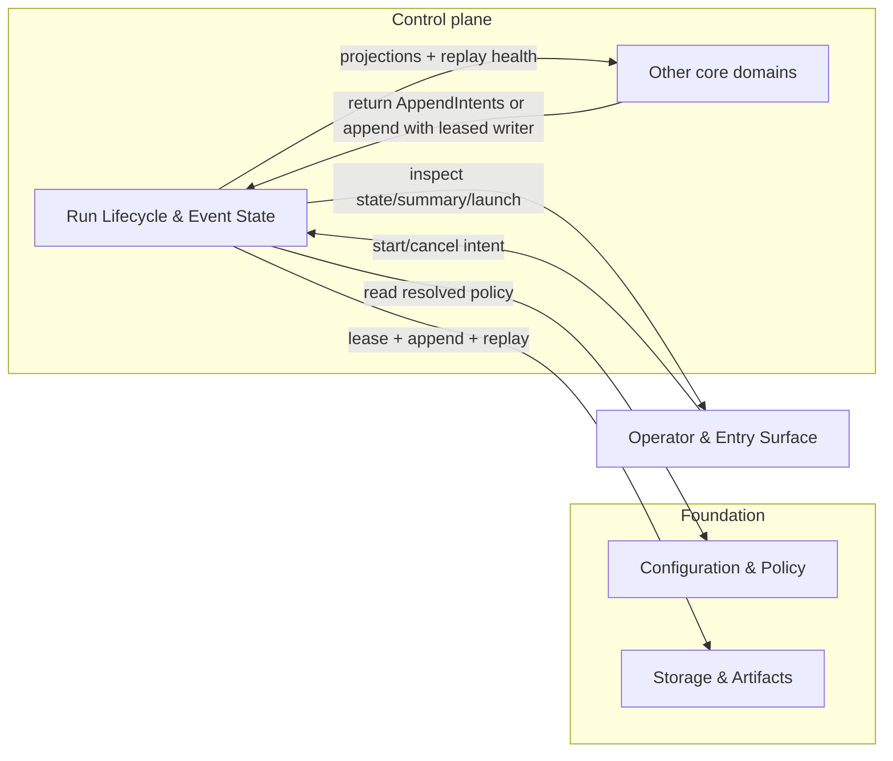
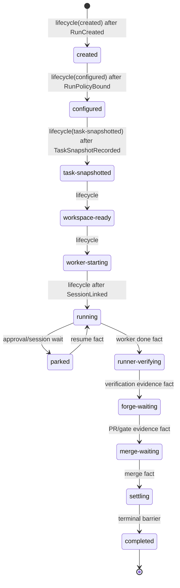

# Run Lifecycle & Event State - design

## Mandate

**Purpose.** The spine of the control plane: the append-only event log (single source of truth),
the projection model, the writer discipline, and the run lifecycle state machine.

### Responsibilities (in scope)
- The event envelope and append protocol: single leased writer, monotonic sequence, writer-epoch
  fencing, partial-write recovery.
- Projections (`state` / `summary` / `metrics` / `launch`) as pure functions of the log — never
  authored directly.
- The run lifecycle state machine and its transitions.
- Session linkage as an append-only fact (monotonic, never clobbered).
- Physical durability of the log (append atomicity, corruption handling: tail vs interior).

### Out of scope
- Domain-specific event semantics (each domain defines its own events).
- Analysis (core-07), recovery/coordination actions (core-06) — this provides the primitives they use.

### Requirements owned
FR-11 (run-activity authority), NFR-OBS, NFR-DET, NFR-SAFE (coherent state).

### Dependencies (Dependency Rule)
- Depends on: Foundation — fnd-01 (config) and fnd-02 (Storage & Artifacts: persistence + lease primitive).
- Must NOT: depend on drivers or other core domains for state authorship.

### Required reading
Standard set + [fnd-01](../../foundation/configuration-and-policy/README.md).

### Deliverable
`README.md` defining: event envelope; writer/lease/fencing model; projection set + deterministic
rebuild; lifecycle states/transitions; durability classes; corruption handling.

### Definition of done (domain-specific)
- Projections are pure functions; replaying a log yields identical projections (property-tested).
- No projection is ever written directly; linkage is monotonic.
- Stale-writer writes after a terminal/superseded epoch are rejected.

### Open questions
- Durability class per event (which events fsync). Storage backend (filesystem first; SQLite later?).

## 1. Purpose & boundaries

Run Lifecycle & Event State is the authored run-state spine for the Control plane. It defines the
semantic event envelope, append protocol, single leased writer, monotonic sequence discipline,
writer-epoch fencing, pure projections, lifecycle state machine, append-only session linkage,
durability mapping, and corruption handling over the Storage & Artifacts primitives.

Out of scope: domain-specific payload semantics, recovery action selection, analysis, supervision,
approval adjudication, completion gates, Forge operations, Work Source status writes, and concrete
Driver behavior. Core-01 owns writer fencing and the append protocol; sibling domains either return
`AppendIntent` batches for the owning core flow to append or, where their approved contract says so,
receive the active leased `RunWriter` to append their own records through the same core-01 protocol.

Dependency Rule: this design depends only on Configuration & Policy for resolved policy inputs and
Storage & Artifacts for log, lease, durability, and artifact primitives. It introduces no dependency on
Drivers or other core domains for state authorship.

## 2. Required reading

Read: [README.md](../../../00-orientation/design-home-original.md), [architecture.md](../../../10-architecture/architecture.md),
[requirements.md](../../../00-orientation/requirements.md), [conventions.md](../../../00-orientation/conventions.md),
[glossary.md](../../../00-orientation/glossary.md), [domains/README.md](../../domain-catalog.md),
[_templates/domain-design-template.md](../../../_templates/domain-design-template.md),
[README.md#mandate](README.md#mandate), [fnd-01 Configuration & Policy design](../../foundation/configuration-and-policy/README.md),
and [fnd-02 Storage & Artifacts design](../../foundation/storage-and-artifacts/README.md).

## 3. Context diagram

## 4. Design

Low-level detail is split to keep this entrypoint focused:

- [Contracts](contracts.md) defines the host-neutral TypeScript contract for the run event log,
  writer, envelopes, append/replay failures, projections, lifecycle payloads, linkage payloads, and
  health records.
- [Event log, writer, and corruption protocol](event-log-writer-and-corruption.md) defines the
  event envelope, append protocol, single leased writer, monotonic sequences, writer-epoch fencing,
  lost-ack recovery, durability classes, and tail/interior corruption handling.
- [Projections, lifecycle, and tests](projections-lifecycle-and-tests.md) defines the pure
  projection set, deterministic rebuild, lifecycle state machine, session linkage, emitted/consumed
  events, degraded modes, and mock-only/property-test strategy.

Core decisions:

- The Event log is the only authored run state. Projections are read-only outputs from replay and are
  never written directly.
- `RunLifecycleTransitioned` is the only event type that authors lifecycle state, including the
  initial `created`, `configured`, and `task-snapshotted` transitions. `RunCreated`,
  `RunPolicyBound`, and `TaskSnapshotRecorded` are factual payload events consumed by summary and
  launch projections; they do not move lifecycle state on their own.
- Every authored event uses the `RunEventEnvelope` schema and a contiguous per-Run `sequence`.
- A fnd-02 `run-writer:<runId>` lease is required to append; its epoch is copied into every event and
  fences stale writers.
- A terminal lifecycle transition closes lifecycle mutation for that writer epoch. Post-terminal
  non-lifecycle facts may reuse the terminal writer epoch until lease expiry, but they cannot change
  the terminal state; a fresh epoch is required only after lease loss.
- Session linkage is append-only. A later link can supersede a prior link in projection output, but no
  link fact is clobbered.
- Canonical Run events use only `durable` or `barrier` durability. Core-01 does not request fnd-02
  `buffered` writes for the authored Run log because they may disappear and cannot support lifecycle,
  gating, coordination, recovery, or evidence state.
- A multi-intent append is one atomic semantic batch. The writer maps it to one fnd-02 `AppendBatch`
  using the strongest requested durability in the batch and records that effective durability on every
  committed envelope and on the receipt; it never splits a semantic batch to satisfy mixed durability.
- Physical repair never rewrites semantic history. Tail repair truncates only uncommitted bytes per
  fnd-02; semantic corrections are new events.

## 5. Contracts & interfaces

Core-01 exposes a host-neutral run log contract in [Contracts](contracts.md): `RunEventLog`,
`RunWriter`, event envelopes, append/replay failures, projections, lifecycle payloads, linkage
payloads, and health records.

Consumed interfaces: fnd-01 resolved policy data; fnd-02 `LeaseStore`, `EventLogStore`,
`DurabilityClass`, replay health, and append receipts. The detailed append and replay contracts are in
[Event log, writer, and corruption protocol](event-log-writer-and-corruption.md).

`CreateRunInput.idempotencyKey` and `operatorRef` are API request metadata used before any event
exists; `RunCreatedPayload` stores the same values durably so replay remains self-contained after the
request object is gone.

`RunEventCursor` is sequence-based and host-neutral. `waitRunEvents` is the low-level cursor primitive
that core-04 wraps for liveness and operator blocking; core-01 does not derive liveness or timers from
it. Because fnd-02 exposes replay rather than subscribe, core-01 implements a bounded
poll-over-`EventLogStore.replay`: deliver committed events after `cursor.afterSequence`, or return
`timedOut = true` when `timeoutMs` elapses. Waiting does not acquire or renew leases, append health
records, mutate liveness state, write projections, or otherwise change the canonical log.

## 6. Events & data

Core-01 emitted events: `RunCreated`, `RunPolicyBound`, `TaskSnapshotRecorded`,
`RunLifecycleTransitioned`, `SessionLinked`, `SessionLinkSuperseded`, `RunLogTailRepaired`, and
`RunAppendRejected`. Only `RunLifecycleTransitioned` authors lifecycle state; the factual events it
references provide metadata and gating evidence for the transition payload.

Consumed events: any valid `RunEventEnvelope` appended through core-01's single leased `RunWriter`.
Sibling domains may contribute records by returning `AppendIntent`s for the owning flow or by using
the active leased writer when their approved contract exposes one. Core-01 consumes only envelope,
lifecycle, linkage, and durability metadata needed for projections and state-machine safety;
payload-specific meaning stays with the emitting domain. Event names and payload schemas are valid
once the emitting domain lists and types them; core-01 does not maintain a central sibling-event
registry. Well-formed unknown future payloads do not fail replay or projection and are preserved in
`summary.unknownEvents`.

Projected data: `state`, `summary`, `metrics`, and `launch`. Reducers are pure functions and cannot
call append APIs, mutate artifacts, write projection files, or inspect live external state. Projection
details are in [Projections, lifecycle, and tests](projections-lifecycle-and-tests.md).

## 7. Behavior diagram

This diagram shows the main flow only. The authoritative transition contract, including terminal and
recovery-classified edges, is the legal transition table in
[Projections, lifecycle, and tests](projections-lifecycle-and-tests.md).

## 8. Failure & degraded modes

Named fail-closed modes: `stale-writer-fenced`, `sequence-conflict`,
`illegal-lifecycle-transition`, `durability-insufficient`, `partial-ack-unknown`, `tail-repaired`,
`malformed-envelope`, `interior-corrupt`, `event-log-unavailable`, and
`malformed-declared-payload`.

Capability gates must treat `malformed-envelope`, `interior-corrupt`, `event-log-unavailable`,
`malformed-declared-payload`, missing projections, stale writer rejection, or ambiguous session
linkage as autonomous capabilities absent.

## 9. Testing strategy

Supports FR-1 only by durably recording the Work Source `TaskSnapshot` after claim; Work Source owns
task intake and status authority. Satisfies FR-11 for separated run-activity authority,
NFR-OBS for evented state changes, NFR-DET for pure replay, NFR-SAFE for coherent fail-closed state,
NFR-SOLID for foundation-only dependencies, and NFR-TEST for mock-only core execution.

Reconciliation note (2026-06-19): core-01 does not own FR-1. Its contract supplies durable
task-snapshot evidence for the run log; prov-03 remains the owner of task intake and claim semantics.

Tests use only mock/fake fnd-01 policy inputs and a deterministic in-memory fnd-02 implementation with
fault injection. No real processes, network, Forge, Agent, Work Source, or filesystem are used in
core-01 tests. Property tests cover append/replay/projection determinism, reducer totality, lifecycle
edges, writer-epoch fencing, lost acknowledgements, partial writes, session linkage monotonicity,
durability rejection, and projection purity.

## 10. Open questions

None for v1. Prior integration-review questions are resolved as follows:

- Terminal vocabulary stays `completed`, `blocked`, `failed`, and `canceled`; there is no distinct
  `abandoned` terminal state. Core-06 maps abandonment evidence onto `blocked` or `failed`.
- Post-terminal non-lifecycle facts, such as `SupervisorStopped` or `AnalysisRecorded`, may reuse the
  terminal writer epoch until lease expiry. A fresh epoch is required only after lease loss.

## 11. Definition of done

- [x] All sections complete; guidance notes removed.
- [x] Files are focused; low-level detail is split into cohesive subfiles.
- [x] Complies with the Dependency Rule; dependencies listed and justified.
- [x] Uses glossary vocabulary.
- [x] States the FR/NFR ids satisfied; shows how NFR-TEST is met.
- [x] Failure/degraded modes defined (fail-closed).
- [x] Provider-domain validation is not applicable to this core domain.
- [x] Diagrams present and consistent with architecture.md naming.
- [x] Open questions captured, not silently resolved.

<!-- DOCS-NAV (generated — do not edit by hand) -->

---

**↑ Up:** [core domain reference](../README.md) · **← Prev:** [core domain reference](../README.md) · **Next →:** [Run Lifecycle & Event State - contracts](./contracts.md)

**Children:** [Run Lifecycle & Event State - contracts](./contracts.md) · [Run Lifecycle & Event State - event log, writer, and corruption protocol](./event-log-writer-and-corruption.md) · [Run Lifecycle & Event State - projections, lifecycle, and tests](./projections-lifecycle-and-tests.md)

<!-- /DOCS-NAV -->
