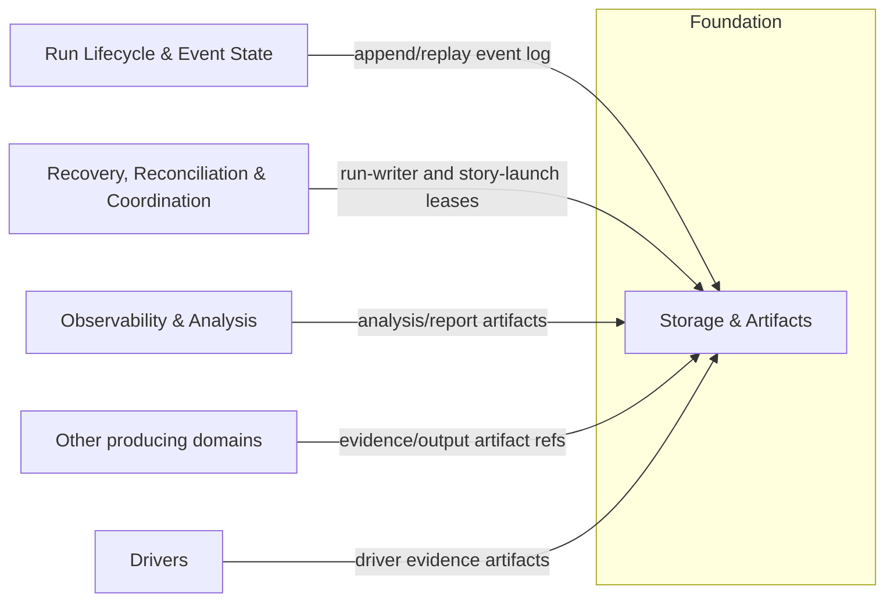

# Storage & Artifacts - design

## Mandate

**Purpose.** The durable primitives the rest of the system stands on: crash-safe event-log persistence,
the lease/lock primitive for coordination, and a write-once artifact store.

### Responsibilities (in scope)
- **Event-log persistence**: atomic append, durability classes (which events fsync), partial-write and
  corruption handling (tail vs interior).
- **Lease / lock primitive**: acquire / renew / fence (writer epoch), used by the single-writer model
  (core-01) and repo-level coordination (core-06).
- **Artifact store**: write-once blobs for outputs / evidence / analysis / reports — content-addressed
  digests, retention, redaction hooks, size limits, export.

### Out of scope
- Event *semantics* and projections (core-01); recovery/coordination *semantics* (core-06); *what* to
  store (the producing domains decide).

### Requirements owned
NFR-OBS, NFR-SAFE, NFR-DET, NFR-OPS; supports FR-6 / FR-9 (artifact refs).

### Dependencies (Dependency Rule)
- Depends on: nothing above Foundation.
- Depended on by: core-01 (log), core-06 (leases), core-07 and others (artifacts).

### Required reading
Standard set + the writer/coordination notes in
[core-01](../../core/run-lifecycle-and-state/README.md) and
[core-06](../../core/recovery-and-reconciliation/README.md).

### Deliverable
`README.md` defining: the persistence contract (append/durability classes/corruption handling); the
lease/lock primitive (epoch fencing); the artifact store (write-once, digests, retention, redaction,
export); network-filesystem degrade behavior.

### Definition of done (domain-specific)
- Append is crash-safe and corruption-tolerant (tested); leases fence stale writers.
- Artifacts are immutable + digested; sensitive content is redactable; network-FS degrades safely.

### Open questions
- Durability class per event; SQLite as a later backend; retention defaults.

## 1. Purpose & boundaries
Storage & Artifacts provides the durable primitives used by the Control plane and Drivers: event-log
persistence, a leased lock with epoch fencing, and a write-once artifact store. It owns physical
storage guarantees, not the meaning of stored records.
Out of scope: event envelopes, projections, and run lifecycle semantics belong to core-01; recovery
classification and launch coordination semantics belong to core-06; artifact content and policy are
chosen by producing domains. Dependency Rule: this Foundation domain depends on no Control plane,
Provider, Driver, or Edge module. It is depended on by core-01 for logs, core-06 for leases, and other
domains for artifact refs.
## 2. Required reading
Read only: `README.md`, `architecture.md`, `conventions.md`, `glossary.md`,
`_templates/domain-design-template.md`, this domain's `README.md#mandate`, core-01's `README.md#mandate`, and
core-06's `README.md#mandate`. No extra contracts were used.
## 3. Context diagram

## 4. Design
The storage root has `logs/` for framed append-only logs, `leases/` for lock records, and `artifacts/`
for content-addressed blobs plus metadata. Opening the root probes atomic same-directory
create/rename, file fsync, directory fsync, exclusive create, and lease compare-and-swap. Failed
probes put the root in a degraded mode before a Run starts.
Event-log persistence:
- The log store treats core-01 event payloads as opaque bytes and adds physical frame metadata:
  `sequence`, `writerEpoch`, lease name, payload length, payload digest, frame digest, and byte range.
- `openForAppend(logId, leaseCapability)` mints an opaque `LogHandle` bound to lease name, epoch, and
  token. `append` validates that full capability, validates `expectedSequence`, writes a framed batch
  with a commit trailer, applies durability, then returns an acknowledgement.
- `buffered` writes framed bytes and a trailer but does not fsync; it returns only `NonDurableAck`.
  It may disappear after crash and is forbidden for authored, gating, lifecycle, coordination, or
  evidence state.
- `durable` writes the full batch and commit trailer, fsyncs the log file, and returns an
  `AppendReceipt`. If the append creates a segment, directory fsync is required before the receipt.
- `barrier` first flushes or discards prior buffered bytes for the log, then fsyncs the log file and
  containing directory before returning an `AppendReceipt`.
- Tail corruption is partial bytes after the last valid commit trailer: quarantine, truncate to the
  last committed frame, and return `log-tail-repaired`.
- Interior corruption is checksum failure, sequence gaps, or invalid frames before later committed
  frames: mark read-only and reject append with `log-interior-corrupt`.
Lease primitive:
- Leases are named opaque coordination records; FND-02 does not interpret names such as `run-writer`
  or `story-launch`. A lease record is JSON: `{ name, epoch, holder, tokenDigest, acquiredAt,
  expiresAt, recordDigest }`.
- `acquire(name, holder, ttl)` succeeds only when no live lease exists or the prior lease is expired
  and can be atomically replaced. Success increments the monotonic `epoch`.
- `renew` and `release` require the current epoch and token. Release is an optimization; fencing is
  the safety mechanism.
- `acquire` and `renew` return a `LeaseCapability` containing the token secret; persisted records and
  `read` snapshots expose only `tokenDigest`.
- `fence(name, epoch, token)` is true only for the current unexpired epoch and matching token digest.
  Protected writes with stale epochs or missing tokens are rejected before bytes are appended.
- Filesystem update protocol: create `leases/<name>.guard` with exclusive create containing `{ name,
  holder, operationId, operation, guardExpiresAt }`, fsync the guard and lease directory, read the
  current record, write the next record to a temp file, fsync it, atomically rename it over
  `leases/<name>.json`, fsync the directory, then remove the guard and fsync again.
- Stale guard recovery reads `guardExpiresAt` from the guard file itself. Only after that time may a
  contender atomically rename the guard to a stale evidence file, fsync the directory, then retry.
  Expired lease recovery uses the same guarded update and always advances `epoch`.
Artifact store:
- Blobs are immutable and addressed by `sha256`. Writers stream to a temp file, compute digest and
  size, enforce size limits, fsync, then publish by atomic link/rename.
- Metadata records media type, size, digest, retention class, classification, redaction state,
  producer, and creation time. Blob bytes are never rewritten.
- Every `ArtifactRef` and `ScratchArtifactRef` has a stable `id`. The id is the canonical string
  reference carried by consuming event envelopes and provider observations.
- A pre-store redaction hook may transform content before publish. A post-store redaction creates a
  new redacted artifact and an append-only tombstone from original digest to replacement digest.
- Normal reads and exports deny tombstoned originals unless raw access is explicitly requested and
  policy allows it.
- Every write names a retention class and optional expiry. Export creates a write-once,
  redacted-by-default manifest with stable ordering, log health, artifact refs, digests, and sizes;
  export refuses if any selected blob fails digest verification.
Network filesystem degradation:
- Network behavior is probed, not trusted by path shape or operator claim.
- If atomic rename, exclusive create, fsync, directory fsync, or lease compare-and-swap cannot be
  proven, storage enters `network-fs-degraded`.
- Mid-operation fsync, rename, exclusive-create, or guarded-update failure immediately flips the root
  to degraded/unusable health, invalidates open append handles, refuses new authoritative writes, and
  quarantines any partial output.
- In degraded mode, authoritative appends and leases are unavailable. `put` fails; only `putScratch`
  may return `ScratchArtifactRef`, which is barred from evidence, export, gates, and retention policy.
  Existing logs and artifacts remain readable with health annotations.
- Capability gates must treat durable logging, coordination, unattended-run, and auto-recover
  guarantees as absent until storage reopens in full mode.
## 5. Contracts & interfaces
```ts
type DurabilityClass = "buffered" | "durable" | "barrier";
type StorageHealth = "ok" | "log-tail-repaired" | "log-interior-corrupt" |
  "network-fs-degraded" | "read-only" | "unusable";
interface EventLogStore { openForAppend(logId: string, lease: LeaseCapability): LogHandle | StorageError;
  append(handle: LogHandle, batch: AppendBatch): AppendReceipt | NonDurableAck | StorageError;
  replay(logId: string): { records: StoredRecord[]; health: StorageHealth }; }
interface LeaseStore { acquire(name: string, holder: string, ttlMs: number): LeaseCapability | StorageError;
  renew(name: string, epoch: number, token: string, ttlMs: number): LeaseCapability | StorageError;
  release(name: string, epoch: number, token: string): void | StorageError;
  read(name: string): { snapshot?: LeaseSnapshot; health: StorageHealth };
  fence(name: string, epoch: number, token: string): boolean; }
interface ArtifactStore { put(input: ArtifactInput): ArtifactRef | StorageError;
  putScratch(input: ArtifactInput): ScratchArtifactRef | StorageError;
  resolve(id: string): ArtifactRef | StorageError;
  get(ref: ArtifactRef, mode: "redacted" | "raw"): ArtifactStream | StorageError;
  redact(ref: ArtifactRef, hookId: string): ArtifactRef | StorageError;
  export(selection: ExportSelection): ExportManifest | StorageError; }
type LeaseCapability = { name: string; epoch: number; token: string; expiresAt: Date };
type LeaseSnapshot = { name: string; epoch: number; holder: string; tokenDigest: string; expiresAt: Date };
type LogHandle = { logId: string; leaseName: string; epoch: number; token: string };
type AppendBatch = {
  expectedSequence: number;
  durability: DurabilityClass; payloads: Uint8Array[];
};
type ArtifactRef = {
  id: string;
  digest: string;
  size: number;
  mediaType: string;
  retentionClass: string;
  classification: string;
  redactionState: "raw" | "redacted" | "tombstoned";
};
type ScratchArtifactRef = {
  id: string;
  digest: string;
  size: number;
  mediaType: string;
  classification: string;
  redactionState: "raw" | "redacted";
};
```
Consumed contracts: none. Filesystem is the first backend; any later SQLite backend must satisfy the
same append, lease, artifact, corruption, and export contracts.

## 6. Events & data

FND-02 emits no Control plane events on its own. It returns receipts, refs, and health so callers can
append semantic events through core-01 when needed.

Data authored here: `StoredRecord` frame metadata plus opaque bytes; `AppendReceipt` sequence range,
epoch, lease name, byte range, digest, and durability; `NonDurableAck` for non-authoritative buffered
writes; `LeaseSnapshot` name, holder, epoch, token digest, and expiry; `LeaseCapability` returned only
from acquire/renew; `ArtifactRef` id, digest, size, media type, retention class, classification, and
redaction state; `ScratchArtifactRef` id plus non-authoritative degraded output metadata;
`ExportManifest` stable log ranges and artifact refs with digests and redaction mode.

`ArtifactRef.id` is the canonical opaque artifact reference string carried by core-01 `artifactRefs`,
prov-01 `outputRef`, and prov-04 `stdoutRef`/`stderrRef`. Consumers resolve those strings through
`ArtifactStore.resolve(id)` before reading with `get(ref, mode)`. Core and provider domains store the
ids opaquely; fnd-02 owns id resolution and artifact metadata.

## 7. Behavior diagram
```mermaid
sequenceDiagram
  participant C as Run Lifecycle & Event State
  participant L as LeaseStore
  participant E as EventLogStore
  participant F as Filesystem backend
  C->>L: acquire("run-writer:<run>", holder, ttl)
  L->>F: guarded CAS + fsync lease record
  F-->>L: epoch 8 committed with token digest
  L-->>C: LeaseCapability(epoch 8, token)
  C->>E: openForAppend(logId, LeaseCapability(epoch 8, token))
  E-->>C: LogHandle(bound to name, epoch, token)
  C->>E: append(expectedSequence 41, barrier, payloads)
  E->>L: fence("run-writer:<run>", 8, token)
  L-->>E: current
  E->>F: write framed batch + commit trailer; fsync file + directory
  F-->>E: durable
  E-->>C: AppendReceipt(lastSequence 42, epoch 8)
  Note over C,E: A stale writer with epoch 7 is rejected before bytes are appended.
```
## 8. Failure & degraded modes
- `stale-writer-fenced` - lease name, epoch, or token is not current; mutation is rejected before write.
- `lease-unavailable` - lock guarantees are not proven; duplicate launch prevention is unavailable.
- `log-tail-repaired` - incomplete tail bytes were quarantined and replay can continue.
- `log-interior-corrupt` - committed history is incoherent; appends are refused.
- `artifact-quarantined` - digest, redaction, classification, or size checks failed.
- `export-incomplete-forbidden` - a selected blob or log range cannot be verified.
- `network-fs-degraded` - authoritative appends, leases, evidence refs, and exports are unavailable;
  autonomous capabilities that require durable state or coordination fail closed.
## 9. Testing strategy
Requirements satisfied: NFR-OBS through receipts, refs, manifests, and health; NFR-SAFE through
durable append, epoch fencing, and fail-closed modes; NFR-DET through deterministic replay, stable
exports, and digests; NFR-OPS through diagnosable errors and exportable evidence; FR-6/FR-9 through
artifact refs.

NFR-TEST is met with a storage conformance suite using a deterministic fake filesystem, local temp
filesystem, and fault injection at every write, fsync, rename, and lease compare-and-swap boundary.
Tests cover append/replay equivalence, monotonic sequences, durability acknowledgements, corruption
handling, guarded lease updates, stale epoch/token rejection, artifact immutability, digest
verification, redaction tombstones, scratch refs, retention eligibility, export verification, and
open-time plus mid-operation network filesystem degradation.

## 10. Open questions
- Exact event-to-durability mapping is owned with core-01 event semantics. FND-02 defines classes and
  rejects unsafe uses, but does not classify every event type.
- SQLite or another backend may be added later if it satisfies this contract; filesystem is first.
- Retention defaults are policy-owned outside this domain. Until policy supplies defaults, writes
  should name retention explicitly.

## 11. Definition of done
- [x] All sections complete; guidance notes removed.
- [x] Files are focused; no split needed.
- [x] Complies with the Dependency Rule; dependencies listed and justified.
- [x] Uses glossary vocabulary.
- [x] States the FR/NFR ids satisfied; shows how NFR-TEST is met.
- [x] Failure/degraded modes defined (fail-closed).
- [x] Provider-domain validation is not applicable to this Foundation domain.
- [x] Diagrams present and consistent with architecture.md naming.
- [x] Open questions captured, not silently resolved.

<!-- DOCS-NAV (generated — do not edit by hand) -->

---

**↑ Up:** [foundation domain reference](../README.md) · **← Prev:** [Configuration & Policy — interfaces, events, and verification](../configuration-and-policy/interfaces-events-and-verification.md) · **Next →:** [Workspace & Repository](../workspace-and-repository/README.md)

<!-- /DOCS-NAV -->
