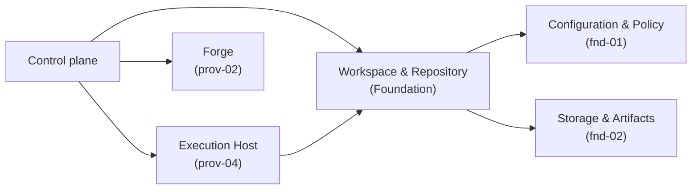

# Workspace & Repository - design

## Mandate

**Purpose.** The local git worktree lifecycle and local git evidence. **Local git only** — a hard
boundary (see architecture §5).

### Responsibilities (in scope)
- Create / lease / clean up an isolated worktree; create the task branch; expose working-tree state.
- Define the **declared repo setup** contract (the command + fresh-worktree detection); the command is
  *executed* via the Execution Host as the worker's contracted first step.
- Produce **local git evidence**: branch exists, commits present, base/head SHAs, diff from merge base,
  uncommitted paths. Read-only inspection of local repo state.

### Out of scope (the hard boundary)
- **No remote, no credentials, no push / PR / checks / merge** — that is the Forge (prov-02).
- **No process spawning or containment** — that is the Execution Host (prov-04).
- **No CI.** Workspace prepares and inspects *local* repo state and nothing else.

### Requirements owned
FR-2 (workspace provisioning), the local-git slice of FR-6 (evidence), NFR-SOLID, NFR-TEST.

### Dependencies (Dependency Rule)
- Depends on: nothing above Foundation (the setup command runs via Execution Host; persisted refs via
  fnd-02).
- Depended on by: core-01 / core-05 (evidence), prov-04 (the workspace it runs in).

### Required reading
Standard set + the seam-boundary note in [architecture.md](../../../10-architecture/architecture.md) §5.

### Deliverable
`README.md` defining: the worktree lifecycle; the branch model; the local git evidence shape; the
declared-setup contract + fresh-worktree detection; cleanup.

### Definition of done (domain-specific)
- Local git only — no remote/credential/process leakage (the hard boundary is explicit and testable).
- Git evidence is read-only inspection; worktree lifecycle is leak-free (always cleaned up).

### Open questions
- Worktree prune/repair on missing/moved; concurrent worktrees per repo.

## 1. Purpose & boundaries
Workspace & Repository owns the local git workspace for a Run: isolated worktree leasing, task branch
creation, declared setup metadata, fresh-worktree detection, read-only local git evidence, and local
cleanup.

Hard boundary: **local git only**. This domain exposes no remote, credential, push, PR, check,
review, merge, process spawning, containment, or CI concept. Forge owns remote and credentialed
operations. Execution Host owns process execution and containment, including running the declared
setup command as the worker's contracted first step.
## 2. Required reading
- `docs/README.md`
- `docs/architecture.md`, especially section 5 seam boundaries
- `docs/conventions.md`
- `docs/glossary.md`
- `docs/design/domains/foundation/fnd-03-workspace-and-repository/README.md#mandate`

No sibling contracts were read. Assumptions are listed in Open questions.
## 3. Context diagram

Dependency Rule compliance: this design depends on `fnd-01-configuration-and-policy` for repository
policy, branch naming, setup declaration, and cleanup policy; and on `fnd-02-storage-and-artifacts`
for lease records, evidence artifacts, and cleanup tombstones. It has no dependency on Control plane,
Forge, Execution Host, Work Source, Agent, or a concrete Driver. Workspace returns local metadata only
to its caller; the Control plane coordinates Execution Host and Forge.
## 4. Design
### Repository identity
`RepositoryIdentity` is local-only: `{ repoId, repoRoot, gitDir, defaultBaseRef }`. Paths must be
absolute local paths. Remote names, hosted repository ids, remote URLs, and credentials are not
representable.
### Declared setup
Configuration & Policy supplies:
```ts
type DeclaredSetup = {
  command: string;
  workingDirectory: RelativePath;
  freshness: { kind: "marker-file"; path: RelativePath; contentHash?: string } |
    { kind: "path-set"; paths: RelativePath[] } |
    { kind: "artifact-ref"; refName: string };
  rerunPolicy: "on-fresh-worktree" | "when-stale" | "always";
};
```
Workspace records this declaration, returns it to its caller, and evaluates freshness locally. It
does not send anything to Execution Host or execute `command`; the Control plane passes the returned
setup metadata to Execution Host.
### Worktree lifecycle
`WorktreeLease` is `{ leaseId, epoch, runId, repoId, worktreePath, baseRef, baseSha, branchName,
state, fenceToken }`, where `state` is `planned`, `leased`, `branch-created`, `setup-required`,
`ready`, `finalized`, `cleanup-pending`, `cleanup-blocked`, or `cleaned`. It is backed by an fnd-02
`LeaseCapability`: `leaseId` is the fnd-02 `name`, `epoch` is the monotonic fnd-02 epoch, and
`fenceToken` is the fnd-02 token.

Lifecycle:
1. Resolve `baseRef` to local `baseSha`; fail closed if absent and never fetch.
2. Allocate `<worktreeRoot>/<repoId>/<runId>/` and create a local worktree at `baseSha`.
3. Create the task branch in that worktree and persist `leaseId`, `epoch`, and `fenceToken`.
4. Evaluate setup freshness; emit `setup-required` when stale or `ready` when fresh.
5. After the Control plane runs setup through Execution Host, it calls `confirmSetup`. Workspace
   re-evaluates freshness locally and transitions to `ready` only when the detector is fresh.
   Otherwise it remains `setup-required` and returns `setup-freshness-unknown` or a stale reason.
6. Freeze `baseSha`, `branchName`, `worktreePath`, `epoch`, and `fenceToken` for later operations.
7. Finalize only after local evidence has been recorded for the current `headSha`.
8. Cleanup removes the worktree and writes a tombstone; blocked cleanup moves to retry/escalation.
### Branch model
Branches are local-only names generated from `{ repoId, runId, taskId }` plus a short collision
suffix, using configured `{ prefix, includeRunId, includeTaskId, maxLength }`. They have no upstream
tracking ref. The worker may edit and create local commits on the task branch. Forge may later consume
`branchName`, `baseSha`, and `headSha`; push and PR behavior remain out of scope.
### Local git evidence
`LocalGitEvidence` contains identity (`evidenceId`, `leaseId`, `repoId`, `worktreePath`,
`branchName`, `inspectedAt`), commit refs (`baseSha`, `mergeBaseSha`, `headSha`), local commits
(`sha`, `parentShas`, `subject`, `authoredAt`), diff (`fromSha`, `toSha`, `changedPaths`, optional
`statRef`, optional `patchRef`), and working tree state (`clean`, `stagedPaths`, `unstagedPaths`,
`untrackedPaths`).

Evidence is read-only inspection. It must not include remote refs, remote URLs, credential material,
CI state, review state, merge state, or worker prose. If branch, merge base, status, or diff cannot
be read, the result is `local-git-evidence-unavailable`, not partial success.
### Cleanup
Cleanup is fenced by `leaseId`, `epoch`, and `fenceToken`. Cleanup and finalize both call
`fence(name=leaseId, epoch, token=fenceToken)` before protected lease writes. Cleanup may remove the
leased worktree path, prune the local worktree registration for that path, delete the local task
branch only when explicitly requested and `headSha` still matches finalized evidence, and write a
cleanup tombstone. It must not infer remote merge state.

If cleanup is blocked, the lease enters `cleanup-blocked` with a retry record: reason, observed
path/branch/head state, next retry time, and whether Operator escalation is required. Missing paths
are settled by tombstone only after confirming worktree registration is absent or pruned. Dirty paths
require Operator disposition or new local evidence. Branch deletion is safe only when the branch still
points at `expectedHeadSha` and is not checked out by any known worktree. Cleanup is finally settled
when path and registration are absent, branch deletion has succeeded or been skipped, and the
tombstone is durable.
## 5. Contracts & interfaces
```ts
interface WorkspaceRepository {
  resolveRepository(repoRoot: AbsolutePath): RepositoryIdentity;
  createLease(input: { runId: string; taskId: string; repoId: string; baseRef?: LocalRef }): WorktreeLease;
  evaluateSetup(leaseId: string): SetupEvaluation;
  confirmSetup(input: { leaseId: string; epoch: number; fenceToken: string }): SetupEvaluation;
  recordLocalGitEvidence(leaseId: string): LocalGitEvidence;
  finalizeLease(input: { leaseId: string; evidenceId: string; epoch: number; fenceToken: string }): WorktreeLease;
  cleanupLease(input: CleanupRequest): CleanupResult;
}
```
`SetupEvaluation` returns `{ leaseId, setup, fresh, reason }`, where `reason` is `new-worktree`,
`marker-missing`, `marker-mismatch`, `paths-missing`, `artifact-stale`, or
`setup-freshness-unknown`. `confirmSetup` is the post-Execution Host handoff: it re-runs the same
freshness detector and transitions the lease to `ready` only on `fresh=true`. `CleanupRequest` includes
`leaseId`, `epoch`, `fenceToken`, `deleteLocalBranch`, and optional `expectedHeadSha`. Inputs are
local repository policy from Configuration & Policy and artifact persistence from Storage &
Artifacts. Outputs are lease handles, setup evaluation, branch metadata, and local git evidence.
## 6. Events & data
Contributed events: `WorktreeLeaseCreated`, `LocalBranchCreated`, `RepoSetupEvaluated`,
`RepoSetupConfirmed`, `LocalGitEvidenceRecorded`, `WorktreeLeaseFinalized`,
`WorktreeCleanupRetryScheduled`, `WorktreeCleanupCompleted`, and `WorktreeCleanupBlocked`.

Consumed data: repository policy, branch policy, setup declaration, cleanup policy, artifact refs,
and durable lease records. Contributed projections: active worktree leases by Run, latest local git
evidence by lease, and cleanup state by lease.
## 7. Behavior diagram
```mermaid
sequenceDiagram
  participant CP as Control plane
  participant WR as Workspace & Repository
  participant SA as Storage & Artifacts
  participant EH as Execution Host
  CP->>WR: createLease(runId, taskId, repoId, baseRef)
  WR->>WR: resolve baseSha locally; create worktree + branch
  WR->>SA: persist lease + fenceToken
  WR-->>CP: WorktreeLease
  CP->>WR: evaluateSetup(leaseId)
  WR-->>CP: SetupEvaluation(fresh=false)
  CP->>EH: run declared setup command in worktree
  CP->>WR: confirmSetup(leaseId, epoch, fenceToken)
  WR->>WR: re-evaluate freshness locally
  WR-->>CP: SetupEvaluation(fresh=true, lease ready)
  CP->>WR: recordLocalGitEvidence(leaseId)
  WR->>SA: store diff/stat artifacts
  WR-->>CP: LocalGitEvidence
  CP->>WR: finalizeLease(leaseId, evidenceId, epoch, fenceToken)
  CP->>WR: cleanupLease(leaseId, epoch, fenceToken)
  WR->>SA: write cleanup tombstone
  WR-->>CP: CleanupResult(cleaned)
```
## 8. Failure & degraded modes
- `base-ref-unresolved`: local base ref or commit cannot be resolved; no fetch is attempted.
- `worktree-path-conflict`: target path already exists or is not owned by the lease.
- `branch-conflict`: generated branch already exists at a different commit.
- `setup-freshness-unknown`: freshness detector cannot be evaluated locally or remains stale after
  post-setup re-evaluation.
- `local-git-evidence-unavailable`: branch, merge base, status, or diff cannot be read.
- `dirty-worktree`: uncommitted paths exist when clean state is required.
- `stale-lease-fence`: caller fence token does not match the durable lease.
- `cleanup-blocked`: worktree, branch, or head SHA no longer matches the finalized lease; retry or
  Operator escalation is recorded.

Capability gates treat every degraded mode as fail-closed. Recovery requires Control plane action
that records new local evidence or an Operator decision. This domain never fetches, pushes, kills
processes, runs CI, or consults remote state to self-heal. Cleanup gates consider a lease unsettled
until the path and worktree registration are absent and the cleanup tombstone records branch deletion
or an explicit branch-retention decision.
## 9. Testing strategy
Requirements satisfied: FR-2 (isolated worktree lease, branch creation, setup freshness, cleanup),
FR-6 local-git slice (branch, commit, base/head, merge-base, diff, working-tree evidence),
NFR-SOLID (no upward dependency and no concrete Driver dependency), and NFR-TEST (temporary local
repositories plus in-memory Storage & Artifacts; no remote service, credentials, CI, worker process,
or Forge dependency).

Tests: lifecycle state transitions, fence-token enforcement, deterministic branch naming, path
containment, clean and dirty local repository fixtures, missing base, branch conflict, moved worktree,
stale fence, cleanup tombstone, diff/stat artifact persistence, and boundary tests proving the public
API has no remote, credential, push, PR, check, merge, process, or CI fields. Cleanup tests cover
blocked retry records, stale-path tombstoning, dirty-path escalation, and finally settled cleanup.
## 10. Open questions
- Should concurrent worktrees per `repoId` be limited by policy or only by path-level leases?
- For a missing or moved leased worktree, is the only allowed repair a tombstone, or may a new lease
  be recreated from `baseSha`?
- Which exact Foundation event names will core-01 standardize?
## 11. Definition of done
- [x] All sections complete; guidance notes removed.
- [x] Files are focused; no split needed.
- [x] Complies with the Dependency Rule; dependencies listed and justified.
- [x] Uses glossary vocabulary.
- [x] States the FR/NFR ids satisfied; shows how NFR-TEST is met.
- [x] Failure/degraded modes defined (fail-closed).
- [x] Provider domains: not applicable.
- [x] Diagrams present and consistent with architecture.md naming.
- [x] Open questions captured, not silently resolved.
