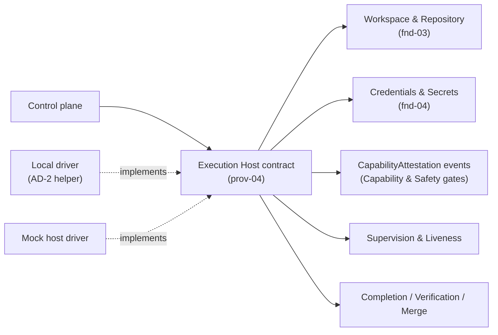
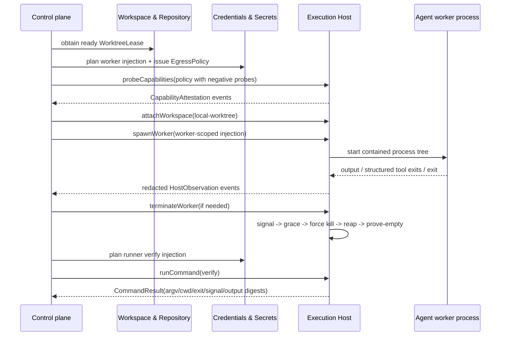

# Execution Host - design

## Mandate

**Purpose.** The seam for **where and how processes run** — spawning and containing the worker, and
running **runner-owned commands** (the verifier) — against a workspace. Local driver in v1; remote
drivers later. This is the clean home for containment and for the remote-exec future.

### Responsibilities (in scope)
- The host-neutral **Execution Host contract**: spawn a worker process against a prepared workspace;
  **contain** it (own the process tree); signal/terminate the whole tree and reap it; and run
  **runner-owned commands** (the verify gate) capturing command/argv/cwd/exit/signal/output + digests.
- **Capability attestation**: `canKill`, `containmentStrength`, `emitsStructuredToolExit`, and
  **egress confinement proven with negative probes** (a disallowed host is provably blocked),
  recorded with driver version + platform + freshness.
- The **Local driver** (the AD-2 native containment helper: process group/session, cgroup/systemd or
  Job Object where available; reap; prove-empty) and a **mock host**.

### Out of scope
- The agent protocol (prov-01 drives a worker that *runs on* a host).
- Local git (fnd-03) and remote/credentialed collaboration (prov-02).

### Requirements owned
FR-3 (run the worker), FR-5 (guaranteed termination), FR-6 (runner-owned verify), NFR-EXT, NFR-TEST,
NFR-SEC (egress attestation), NFR-OPS.

### Dependencies (Dependency Rule)
- Depends on: fnd-03 (the workspace it runs in), fnd-04 (scoped creds for runner-owned commands).
  Implements the Execution Host contract.
- Must NOT: depend on the control plane.

### Required reading
Standard set + [fnd-03](../../foundation/workspace-and-repository/README.md),
[fnd-04](../../foundation/credentials-and-secrets/README.md), AD-2/AD-13 in
[decisions.md](../../../40-decisions/accepted-decisions.md), and the conformance/evidence rules in
[conventions.md](../../../00-orientation/conventions.md).

### Deliverable
`README.md` defining: the contract + attestations; the Local driver's termination ladder
(signal → grace → SIGKILL → reap → prove-empty); the runner-owned command/verify capture; the egress
attestation incl. negative probes; the mock; remote-host considerations (deferred, but the contract
must not bake in locality).

### Definition of done (domain-specific)
- Termination reaps the whole tree and proves the containment empty (tested).
- Egress confinement is attested with negative probes; `containmentStrength` attested honestly.
- Verify capture is runner-owned (never the Agent's self-report). Contract satisfiable by Local + mock.

### Open questions
- Kernel-tree vs process-group containment as the floor for autonomy; native language (Rust vs Go);
  the remote-host protocol shape (deferred).

## 1. Purpose & boundaries

Execution Host is the provider seam for where and how processes run. It attaches a prepared
workspace, spawns and contains the Agent worker, terminates and reaps the owned process tree, and
runs runner-owned commands such as declared setup and verify while capturing command evidence.

Out of scope: Agent protocol and prompts, local git lifecycle and evidence, Forge push/PR/check/merge,
credential resolution, egress-policy authorship, and Control plane decisions. The worker edits and
commits locally through the hosted process; the host does not inspect git or perform Forge actions.

## 2. Required reading

Read: `README.md`, `architecture.md`, `conventions.md`, `glossary.md`, `requirements.md`,
`decisions.md` (AD-2, AD-13), this domain's `README.md#mandate`, the `fnd-03` README Mandate and design, and the
`fnd-04` README Mandate, design, and `contracts-and-events.md`.

## 3. Context diagram

Dependency Rule compliance: this design depends on `fnd-03` for the workspace handle it runs in and
on `fnd-04` for injection, redaction, and egress-policy inputs. It introduces no dependency on the
Control plane, Agent, Forge, Work Source, or a concrete driver. The Control plane consumes the
Execution Host contract; Local and mock drivers implement it.

## 4. Design

The contract is host-neutral. A workspace is attached as a `WorkspaceAttachment`, not assumed to be a
raw local path forever. The v1 Local driver accepts a `local-worktree` attachment produced from
`fnd-03`; a future remote driver may accept an opaque `mountRef` without changing Control plane
logic.

Every operation has a party and phase. Worker operations receive only worker-scoped injection plans.
Runner-owned commands receive only runner-scoped injection plans. The host never resolves secrets; it
applies the already planned env/file bindings, uses the provided redaction set before persisting
output, and destroys temporary injected files when the operation ends.

Lifecycle: `attachWorkspace` validates cwd containment and returns a `HostWorkspaceHandle`;
`probeCapabilities` records attestations for `canKill`, `containmentStrength`,
`emitsStructuredToolExit`, and `egress-confinement`; `spawnWorker` starts the Agent worker with
worker-scoped injection under containment; `observeWorker` streams redacted output, structured tool
exits, and terminal status for Supervision; `terminateWorker` performs signal, grace, force kill,
reap, and prove-empty; `runCommand` executes runner-owned setup/verify and captures
argv/cwd/exit/signal/output/artifact digests; `releaseWorkspace` destroys remaining injected
material. Worktree cleanup remains owned by `fnd-03`.

Egress attestation handoff: `fnd-04` issues an `EgressPolicy`; the Execution Host driver probes that
policy, including configured negative probes, and emits a matching `CapabilityAttestation`. If a
disallowed host is not proven blocked, or the attestation scope/version/platform/freshness key does
not match the policy, the result is negative or absent and credential injection fails closed.

Containment strength is honest, not aspirational. Local drivers report the actual containment class
available for the platform: `none`, `process-group`, `kernel-tree`, or `job-object`. Capability gates
decide which autonomous powers are available from that attestation.

## 5. Contracts & interfaces

Typed details live in [contracts-and-conformance.md](contracts-and-conformance.md) to keep
this entry point focused. The public contract exposes:

- `probeCapabilities(scope): CapabilityAttestation[]`
- `attachWorkspace(workspace): HostWorkspaceHandle | HostFailure`
- `spawnWorker(request): WorkerHandle | HostFailure`
- `observeWorker(handle): AsyncIterable<HostObservation>`
- `terminateWorker(handle, policy): TerminationResult`
- `runCommand(request): CommandResult | HostFailure`
- `releaseWorkspace(handle): HostReleaseResult`

Capabilities are `canKill`, `containmentStrength`, `emitsStructuredToolExit`, and
`egress-confinement`. The Local driver conformance target is the AD-2 helper plus local command
capture. The mock conformance target is the same interface with scripted positive and adversarial
observations. `spawnWorker` and `runCommand` accept `HostInjectionContext`, a host-side subset that
preserves the `fnd-04` injection bindings, credential refs, egress policy, redaction set, required
audit event, expiry, and attestation ids.

## 6. Events & data

Emitted events: `HostWorkspaceAttached`, `HostCapabilityAttested`, `WorkerSpawned`,
`HostOutputCaptured`, `HostStructuredToolExitObserved`, `WorkerProcessExited`,
`HostTerminationRequested`, `HostTerminationProved`, `RunnerCommandStarted`,
`RunnerCommandCaptured`, `HostCredentialInjectionApplied`, `HostCredentialMaterialDestroyed`,
`HostOperationFailed`, and `HostWorkspaceReleased`.

Consumed data: `WorkspaceAttachment` from `fnd-03`; `InjectionPlan`, `RedactionSet`, and
`EgressPolicy` from `fnd-04`; timeout and termination policy from Configuration & Policy when the
Control plane passes it in. Contributed projections are latest host capability by freshness key,
active worker handles by Run, latest command evidence by operation id, and unsettled termination
proofs.

## 7. Behavior diagram

## 8. Failure & degraded modes

- `host-capability-unattested`: required attestation is missing, stale, negative, or wrong-scope.
- `workspace-mount-unavailable`: the driver cannot attach the provided workspace kind.
- `workspace-cwd-outside-mount`: requested cwd escapes the attached workspace.
- `credential-injection-rejected`: injection plan is absent, wrong party, expired, or not redacted.
- `egress-confinement-unattested`: negative probes do not prove disallowed hosts are blocked.
- `worker-spawn-failed`: worker process did not start under containment.
- `host-observation-incomplete`: output, tool exit, or process exit capture is incomplete.
- `termination-unproven`: signal/kill/reap ran but prove-empty did not succeed.
- `runner-command-capture-incomplete`: command exit, signal, or output digest is missing.
- `credential-destroy-unconfirmed`: temporary injected material could not be proven destroyed.

Capability gates treat every degraded mode as fail-closed. `termination-unproven` disables
unattended run and auto-recovery powers that require `canKill`. `egress-confinement-unattested`
blocks confined credentials. Command failure is evidence, not by itself a host failure; incomplete
capture is a host failure.

## 9. Testing strategy

Requirements satisfied: FR-3 (run the worker), FR-5 (termination and prove-empty), FR-6
(runner-owned command evidence), NFR-EXT, NFR-TEST, NFR-SEC, NFR-OPS, and supports FR-2 setup
execution through the host.

NFR-TEST: Control plane tests use the mock host with zero real processes and zero network. Provider
conformance covers schema checks, command capture, termination ladder, incident replays for
lost/partial observations, and adversarial mocks that omit, delay, or lie about output, exits,
liveness, egress, or termination.

Focused checks: cwd containment, worker-vs-runner injection separation, redaction before persistence,
command/output digest stability, timeouts, prove-empty, negative egress probe matching, capability
freshness mismatch, Local/mock field parity, and dependency lint. The evidence appendix records
schema/mock snapshots plus live/local command-capture and process-group termination probes; it also
records that real `egress-confinement` remains absent until an implemented Local driver proves
negative probes.

## 10. Open questions

- Which containment strength is the floor for unattended autonomy: `process-group` or a stronger
  kernel-tree / Job Object guarantee?
- Which native helper language is selected for the Local driver?
- What is the future remote-host protocol shape for `workspace-mount` attachments?
- Which Local driver implementation will provide real egress confinement and negative-probe evidence?

## 11. Definition of done

- [x] All sections complete; guidance notes removed.
- [x] Files are focused; contract and conformance detail is split into `contracts-and-conformance.md`.
- [x] Complies with the Dependency Rule; dependencies listed and justified.
- [x] Uses glossary vocabulary.
- [x] States the FR/NFR ids satisfied; shows how NFR-TEST is met.
- [x] Failure/degraded modes defined (fail-closed).
- [ ] Provider domains: real Local driver validation is incomplete; AD-2 helper and live egress
  negative-probe evidence remain required before this item can be satisfied.
- [x] Diagrams present and consistent with architecture.md naming.
- [x] Open questions captured, not silently resolved.

<!-- DOCS-NAV (generated — do not edit by hand) -->

---

**↑ Up:** [provider domain reference](../README.md) · **← Prev:** [Work Source - contracts and conformance](../work-source/contracts-and-conformance.md) · **Next →:** [Execution Host - contracts and conformance](./contracts-and-conformance.md)

**Children:** [Execution Host - contracts and conformance](./contracts-and-conformance.md)

<!-- /DOCS-NAV -->
