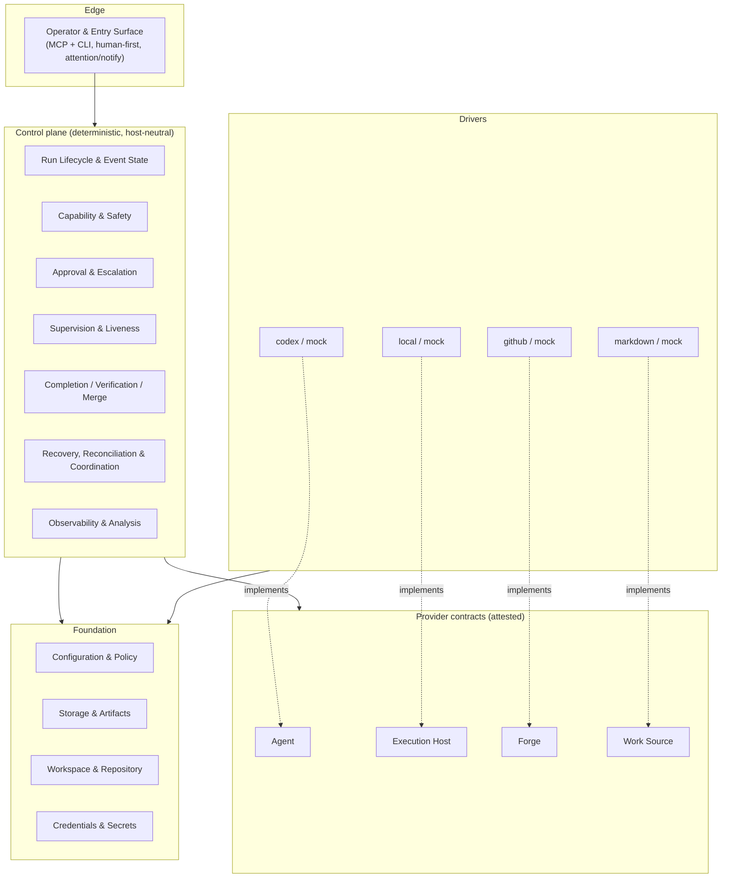
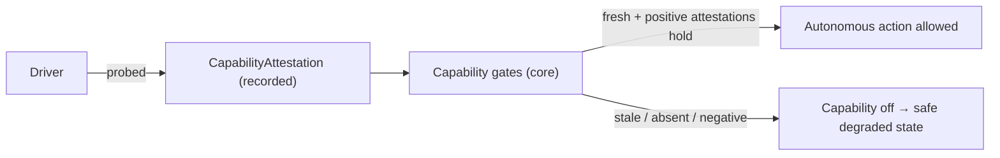

# High-level architecture

The system design every domain builds on: the **layers**, the **Dependency Rule**, the **capability
attestation** model, the **seam boundaries**, and the **domain map**. Domain charters refine their
slice; none may violate what is here.

## 1. Layers

Four layers; dependencies point **downward and inward only** (see the Dependency Rule).



- **Edge** — how work is driven. Human-first operator surface (MCP + CLI), inbound control and
  outbound attention (parked-approval alerts); external triggers later. Holds no run logic.
- **Control plane** — the deterministic core. Owns run state, gating, adjudication, supervision,
  completion/merge decisions, recovery, coordination, and analysis. Depends only on the contracts and
  foundation. Knows nothing about Codex or GitHub.
- **Provider contracts** — the four seams (Agent, Execution Host, Forge, Work Source) plus the
  attestation model.
- **Drivers** — concrete adapters implementing a contract. **All host/tool-specific risk lives here.**
- **Foundation** — depended-upon by everything, depends on nothing above.

## 2. The Dependency Rule (the SOLID guardrail)

> **Edge → Control plane → Contracts.** Drivers → Contracts. Everything → Foundation.
> Nothing depends on a concrete driver. Contracts never depend on the core.

| Allowed | Forbidden |
|---|---|
| Edge calls the control plane | Control plane importing a concrete driver |
| Control plane depends on a contract (abstraction) | Any module depending on Codex/GitHub specifics outside its driver |
| A driver implements a contract | A contract depending on the core |
| Anything depends on Foundation | Foundation depending on a layer above |

A domain design that violates this rule fails review.

## 3. Capability attestation (the "earn autonomy" mechanism)

The core does not trust what a driver *claims* — it gates on what a driver can *prove*. At launch (and
on a freshness key) each driver is **probed**, and the result is recorded as a **`CapabilityAttestation`**
event:

```
CapabilityAttestation {
  capability, probeMethod, result (positive|negative), evidenceRef,
  scope, expiry, driverVersion, platform, freshnessKey, at
}
```



- Examples of attested guarantees: Execution Host `canKill` / `containmentStrength` /
  **egress confinement (with negative probes)**; Agent `canRelayApproval` / `emitsStructuredToolExit`;
  Forge `supportsMergeQueue` / `supportsThreadResolution`; Work Source `supportsClaim` /
  `supportsStatusWrite`.
- A capability that cannot be **freshly and positively** attested is treated as **absent** — the
  dependent autonomous power stays off. Self-report is never sufficient. (Mechanics: Capability & Safety.)

## 4. Run sequence (end to end, happy path)

```mermaid
sequenceDiagram
  actor H as Operator
  participant CP as Control plane
  participant WS as Work Source
  participant EH as Execution Host
  participant AG as Agent
  participant FG as Forge
  H->>CP: start run (or trigger)
  CP->>WS: next eligible task → claim + snapshot
  CP->>EH: provision workspace; spawn worker (contained)
  CP->>AG: drive worker over the host process
  AG-->>CP: progress / approval requests
  CP-->>AG: scoped grant (or park → resume)
  AG-->>CP: code edited + committed locally
  CP->>EH: runner-owned verify (capture cmd/exit/output)
  CP->>FG: push branch + open PR (runner credentials)
  CP->>FG: gather evidence (CI / reviews / threads / protection)
  CP->>CP: completion + merge gates (evidence + policy + attested caps)
  CP->>FG: merge (only if all gates pass)
  CP->>WS: write task status (done / blocked)
  CP-->>H: settle + analysis
```

The worker only edits and commits locally; the runner owns push, PR, verify, and merge. Every step is
an appended event; projections derive from the log. Any gate that cannot prove its guarantees stops the
run in a named recoverable state.

## 5. Cross-cutting invariants

- **Seam boundaries (hard lines).** **Workspace & Repository** = local git only (worktree/branch/
  working-tree + local git evidence). **Forge** = remote + credentialed ops (push, PR, checks, reviews,
  merge). **Execution Host** = process execution + containment. **Agent** = the model/protocol. No seam
  reaches into another's job.
- **Worker / runner boundary.** The worker is the sole *implementer* (edits + local commits). The runner
  owns the credentialed, irreversible boundary (push, PR, verify, merge). The worker never holds Forge
  credentials.
- **Ownership is multi-dimensional.** "Owned" means the process/containment, protocol handle, session
  linkage, any pending approval, the event writer, lifecycle timers, and recovery authority are all held.
- **Two authorities.** Task status is the Work Source's; run activity is the event log's.
- **Fail closed.** Missing capability or unknown external state → a named degraded/blocking state.
- **Evidence over prose.** A worker claim never satisfies a gate by itself.

## 6. Domain map

16 domains across the four layers. The full catalog — responsibilities, dependencies, and the suggested
build order — is the single source in **[domains/README.md](domains/README.md)**; at a glance:

- **Edge:** Operator & Entry Surface (`edge-01`)
- **Core:** Run Lifecycle & Event State (`core-01`), Capability & Safety (`core-02`), Approval &
  Escalation (`core-03`), Supervision & Liveness (`core-04`), Completion/Verification/Merge (`core-05`),
  Recovery, Reconciliation & Coordination (`core-06`), Observability & Analysis (`core-07`)
- **Providers (seams):** Agent Execution (`prov-01`), Forge/Collaboration (`prov-02`), Work Source
  (`prov-03`), Execution Host (`prov-04`)
- **Foundation:** Configuration & Policy (`fnd-01`), Storage & Artifacts (`fnd-02`), Workspace &
  Repository (`fnd-03`), Credentials & Secrets (`fnd-04`)
