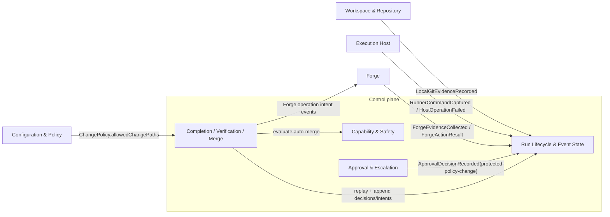
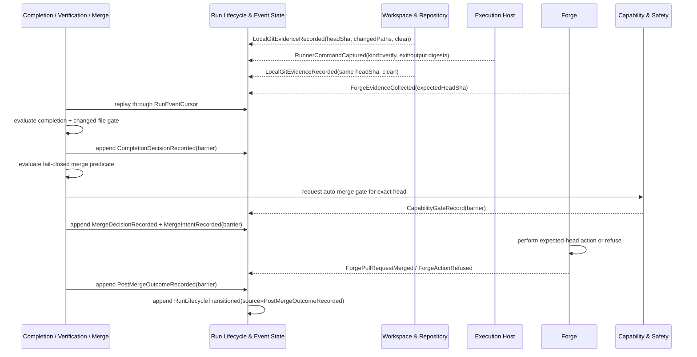

# Completion, Verification & Merge - design

## 1. Purpose & boundaries

Completion, Verification & Merge decides whether a Run's candidate head is complete and whether the
runner may ask the Forge to push, open/update a PR, publish blocker evidence, update the branch,
enqueue, or merge. The decision is evidence + policy only: worker prose is a hint and never a gate
input by itself.

Out of scope: raw local git inspection, runner-owned command execution, Forge reads/writes, task
status writes, recovery action selection, and concrete Driver behavior. Workspace & Repository,
Execution Host, Forge, and Capability & Safety record their own evidence; core-05 evaluates committed
evidence and appends decision/intent events. Owned requirements: FR-6, FR-7, NFR-SAFE, NFR-DET, and
NFR-TEST.

## 2. Required reading

Read: `AGENTS.md`, the standard kit-vnext docs, the domain template, this charter, approved
`core-01`/`core-02` subfiles, approved Approval & Escalation contracts for
`ApprovalDecisionRecorded`, approved Forge design, approved Execution Host contract, approved
Configuration & Policy material for `ChangePolicy`, and approved Workspace & Repository design. No
`core-04`/`core-06`/`core-07` drafts were read or used.

## 3. Context diagram



Dependency Rule statement: core-05 depends on core-01/core-02 contracts, provider contracts, and
Workspace & Repository evidence. The changed-file gate additionally consumes fnd-01 `ChangePolicy`
and core-03 protected-policy approval records; it does not depend on concrete Drivers, Work Source,
or later sibling drafts.

## 4. Design

The evidence model, changed-file gate, decision states, merge predicate, post-merge outcome mapping,
and blocker PR rules are in [Evidence model and predicates](design/evidence-model-and-predicates.md).

- Every decision is evaluated from a core-01 replay ending at a specific `RunEventCursor`; evidence
  refs cite committed event id, sequence, payload digest, and exact `headSha`.
- The candidate head is the single latest usable `LocalGitEvidence.headSha`; missing, ambiguous, or
  dirty Workspace evidence fails closed before any Forge write.
- Verification is fresh only when a runner-owned `verify` command capture is bracketed by pre- and
  post-command local git evidence for the same clean head; host uncertainty is
  `verification-uncertain`.
- Forge evidence is usable only when PR head, branch head, action-observed head, and `expectedHeadSha`
  all equal the candidate head.
- The changed-file anti-gaming gate compares Workspace `changedPaths` against
  `ProtectedPolicySnapshotRecorded` and the fnd-01 resolved task/change allowlist. Protected policy
  changes require core-03 `ApprovalDecisionRecorded` approval for
  `ApprovalSubject = "protected-policy-change"` and fresh verification under the valid policy;
  outside-allowlist paths fail closed.
- Completion and merge are separate decisions. `completion-verified` means the candidate head has
  independent local and verification evidence; `merge-ready` additionally requires fresh Forge
  evidence, required checks, review/thread state, protection/rulesets, branch/head freshness, policy,
  and an allowed `auto-merge` `CapabilityGateRecord`.
- After a Forge merge action returns, core-05 records a post-merge outcome fact. Core-01 owns the
  lifecycle transition that cites that fact: exact-head merged settles to `completed`; recoverable
  refusal returns to `merge_waiting`; durable policy/evidence blockers record `blocked`; invariant or
  integrity violations record `failed`.
- Blocker-evidence PRs require a safe exact head and runner push/PR policy; they publish blocker
  states and never imply Task completion, queue, or merge.

## 5. Contracts & interfaces

```ts
interface CompletionMergeEvaluator {
  evaluateCompletion(input: {
    runId: string; evaluatedThrough: RunEventCursor; policyRef: string; evaluatedAt: string;
  }, replay: RunReplay, projections: RunProjections): CompletionDecisionPayload;

  evaluateMerge(input: {
    runId: string; completionEventId: string; policyRef: string; evaluatedAt: string;
  }, replay: RunReplay, projections: RunProjections): MergeDecisionPayload;
}
```

Consumed: core-01 `RunEventLog`, `RunWriter`, `RunReplay`, `RunProjections`, `RunEventCursor`, and
lifecycle states; core-02 `CapabilityGateRecord`; core-03 `ApprovalDecisionRecorded` for
protected-policy changes; fnd-01 `ChangePolicy.allowedChangePaths`; Workspace
`LocalGitEvidenceRecorded`; Execution Host `RunnerCommandCaptured` and `HostOperationFailed`; Forge
evidence/action events. Core-05 emits intent events; Forge performs
push/PR/comment/update/enqueue/merge operations and may refuse them by
exact-head checks.

## 6. Events & data

Emitted with `domain = "core-05"`:

- `ProtectedPolicySnapshotRecorded` (`barrier`): policy digest, base `baseSha`, verifier command, and
  protected path-set digests.
- `CompletionDecisionRecorded` (`barrier`): completion state, exact `headSha`, replay cursor, cited
  evidence refs, and failure reason.
- `MergeDecisionRecorded` (`barrier`): merge state, exact `headSha`, gates, Forge refs, and capability
  gate ref.
- `ForgeOperationIntentRecorded` (`barrier`): `push-branch`, `upsert-pr`,
  `publish-blocker-evidence`, or `update-branch`, with `expectedHeadSha`.
- `MergeIntentRecorded` (`barrier`): `enqueue` or `merge`, with `expectedHeadSha`, policy ref, gate
  event id, and merge decision event id.
- `PostMergeOutcomeRecorded` (`barrier`): Forge merge result classification, exact head evidence,
  source action event id, and the lifecycle target core-01 may record.

Consumed events are listed above and expanded in the subfile. Core-05 may contribute read models for
latest completion/merge decision by Run, but they are projections over the Event log only.

## 7. Behavior diagram



## 8. Failure & degraded modes

Named fail-closed states include `verification-uncertain`, `workspace-dirty`, `head-ambiguous`,
`changed-file-policy-absent`, `changed-files-outside-allowlist`,
`protected-policy-change-unapproved`, `merge-required-check-missing`,
`merge-protection-snapshot-stale`, `merge-branch-not-fresh`, `merge-forge-unavailable`,
`post-merge-outcome-ambiguous`, `event-log-unwritable`, and `merge-intent-unwritable`.

Capability gates treat every degraded mode as absent autonomy. Lifecycle consequences use core-01
legal transitions: park when Operator input can repair the evidence, block when a required guarantee
is unavailable, fail only when evidence classifies an unrecoverable condition.

## 9. Testing strategy

NFR-TEST: core-05 tests use an in-memory core-01 Run log plus mock Workspace, Execution Host, Forge,
and Capability & Safety payloads. No real process, filesystem, local git, network, Agent, Work
Source, or concrete Driver is used.

Required tests: replay determinism; property tests that merge is allowed only when every predicate is
true; table tests for every state and post-merge lifecycle target; adversarial mocks for missing
checks, stale protection, dirty worktree, changed files outside allowlist, ambiguous head, unwritable
event log, Forge degraded evidence, verification uncertainty, self-report-only worker claims, and
ambiguous post-merge Forge results; freshness tests for head changes.

This satisfies FR-6, FR-7, NFR-SAFE, NFR-DET, and NFR-TEST through independent evidence, gated Forge
intents, named fail-closed states, pure replay/cursor decisions, and mocks only.

## 10. Open questions

- Trusted-check source configuration remains open in Forge; until resolved, required checks come from
  Forge protection/ruleset evidence plus existing merge-policy `requiredEvidence`.
- Protected-policy-change approval is owned by core-03: a committed `ApprovalDecisionRecorded` for
  `ApprovalSubject = "protected-policy-change"` is required. If absent, protected policy changes fail
  closed as `protected-policy-change-unapproved`.
- The task/change allowlist is owned by fnd-01 resolved policy (`ChangePolicy.allowedChangePaths`).
  If absent, the gate returns `changed-file-policy-absent`.

## 11. Definition of done

- [x] All sections complete; guidance notes removed.
- [x] Files are focused; detailed predicate material is split into one cohesive subfile.
- [x] Complies with the Dependency Rule; dependencies listed and justified.
- [x] Uses glossary vocabulary.
- [x] States the FR/NFR ids satisfied; shows how NFR-TEST is met.
- [x] Failure/degraded modes defined (fail-closed).
- [x] Provider-domain validation is not applicable to this core domain.
- [x] Diagrams present and consistent with architecture.md naming.
- [x] Open questions captured, not silently resolved.
